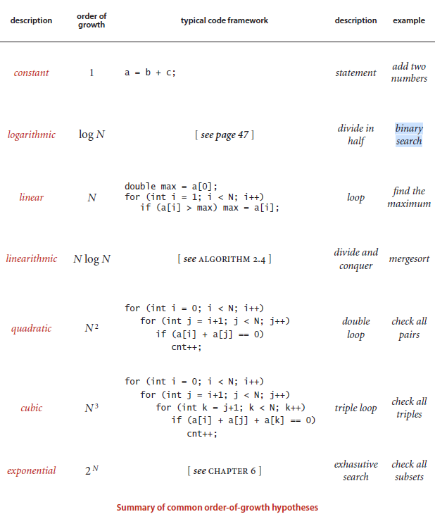
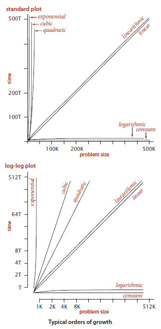

# Algorithms

# Table of contents
* [Fundamentals](#Fundamentals)
  * [Analysis of Algorithms](#Analysis-of-Algorithms)

* [Setup](#setup)


# Fundamentals

## Analysis of Algorithms

### Order-of-growth classifications
We use just a few structural primitives (statements,
conditionals, loops, nesting, and method calls) to implement algorithms, so very
often the order of growth of the cost is one of just a few functions of the problem size N.
These functions are summarized in the table on the facing page, along with the names
that we use to refer to them, typical code that leads to each function, and examples.

**Constant.** A program whose running time’s order of growth is constant executes a
fixed number of operations to finish its job; consequently its running time does not
depend on N. Most Java operations take constant time.

**Logarithmic.** A program whose running time’s order of growth is logarithmic is barely
slower than a constant-time program. The classic example of a program whose running
time is logarithmic in the problem size is binary search (see BinarySearch on page 47).
The base of the logarithm is not relevant with respect to the order of growth (since all
logarithms with a constant base are related by a constant factor), so we use log N when
referring to order of growth.

**Linear.** Programs that spend a constant amount of time processing each piece of input
data, or that are based on a single for loop, are quite common. The order of growth of
such a program is said to be linear —its running time is proportional to N.

**Linearithmic.** We use the term linearithmic to describe programs whose running time
for a problem of size N has order of growth N log N. Again, the base of the logarithm
is not relevant with respect to the order of growth. The prototypical examples of linearithmic
algorithms are Merge.sort() (see Algorithm 2.4) and Quick.sort() (see
Algorithm 2.5).

**Quadratic.** A typical program whose running time has order of growth N 2 has
two nested for loops, used for some calculation involving all pairs of N elements.
The elementary sorting algorithms Selection.sort() (see Algorithm 2.1) and
Insertion.sort() (see Algorithm 2.2) are prototypes of the programs in this
classification.

**Cubic.** A typical program whose running time has order of growth N 3 has three nested
for loops, used for some calculation involving all triples of N elements. Our example
for this section, ThreeSum, is a prototype.

**Exponential.** In ChAPter 6 (but not until then!) we will consider programs whose
running times are proportional to 2N or higher. Generally, we use the term exponential
to refer to algorithms whose order of growth is b N for any constant b > 1, even though
different values of b lead to vastly different running times. Exponential algorithms are
extremely slow—you will never run one of them to completion for a large problem.
Still, exponential algorithms play a critical role in the theory of algorithms because
there exists a large class of problems for which it seems that an exponential algorithm
is the best possible choice.

```
O(2n) This time complexity often indicates that the algorithm iterates through
all subsets of the input elements. For example, the subsets of {1,2,3} are ;,
{1}, {2}, {3}, {1,2}, {1,3}, {2,3} and {1,2,3}.

O(n!) This time complexity often indicates that the algorithm iterates through
all permutations of the input elements. For example, the permutations of
{1,2,3} are (1,2,3), (1,3,2), (2,1,3), (2,3,1), (3,1,2) and (3,2,1).
```

```
An algorithm is polynomial if its time complexity is at most O(nk) where k is
a constant. All the above time complexities except O(2n) and O(n!) are polynomial.
In practice, the constant k is usually small, and therefore a polynomial time
complexity roughly means that the algorithm is efficient.
```



