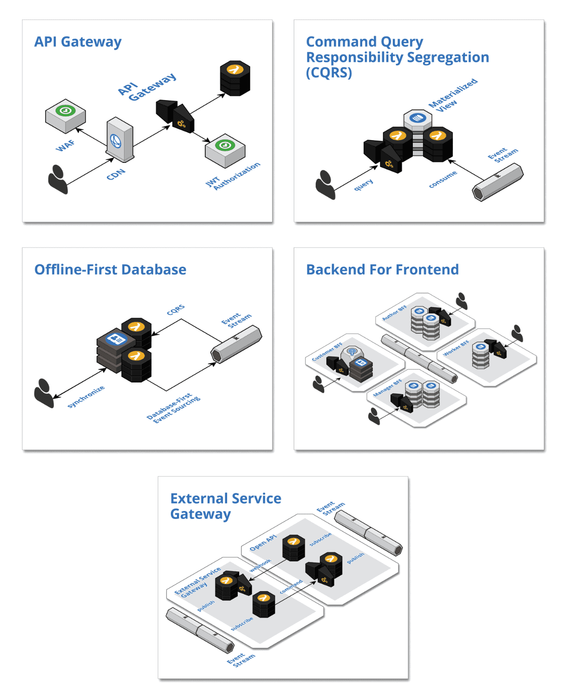

# Cloud Native Development Patterns and Best Practices

# Table of contents
* [Understanding Cloud Native Concepts](#Understanding-Cloud-Native-Concepts)
* [The Anatomy of Cloud Native Systems](#The-Anatomy-of-Cloud-Native-Systems)
    
* [Setup](#setup)

# Understanding Cloud Native Concepts
The promise of cloud-native is speed, safety, and scalability.

Our definition of cloud-native is focused on your context. You need an architecture that will grow with you and not weigh you down now.

This confidence is derived from the knowledge that **cloud-native systems** are powered by ...... so that they remain responsive in the face of failures 
* disposable infrastructure
* composed of bounded isolated components 
* scale globally

Cloud-native teams embrace 
* disposable architecture
* leverage value-added cloud services 
* welcome polyglot cloud 
to provide the strong foundation that enables them to take control of the full-stack, focus on the value proposition, and drive cultural change from the bottom up by earning trust through successful execution.

## Defining cloud-native
Cloud-native embodies the following concepts:
* Powered by disposable infrastructure
* Composed of bounded, isolated components
* Scales globally
* Embraces disposable architecture
* Leverages value-added could services
* Welcomes polygot cloud
* Empowers self-sufficient, full-stack teams
* Drives cultural changes

Of course you are asking, "Where are the containers?" and "What about microservices?" They are in there, but those are implementation details.

This definition of cloud-native should still stand regardless of the implementation details. 

## Powered by disposable infrastructure
Making the classic mistake called **lift and shift**. (But God forbid we terminate one of those instances because there were still lots of manual steps involved in hooking a new instance up to all the other resources, such as load balancers, elastic block storage, the database, and more)

First **Disposing of cloud resources is hard, because it takes a great deal of forethought** 
When we hear about the cloud we hear about how easy it is to create resources, but we don't hear about how easy it is to dispose of resources.
We don't hear about it because it is not easy to dispose of resources.
Traditional data center applications are designed to run on **snowflake** machines that are rarely, if ever, retired.

Second **the machine images and the containers that we hear about are just the tips of the iceberg.**
There are so many more pieces of infrastructure, such as load balancers, databases, DNS, CDN, block storage, blob storage, certificates, virtual private cloud, routing tables, NAT instances, jump hosts, internet gateways, and so on. All of these resources must be created, managed, monitored, understood as dependencies, and, to varying degrees, disposable. Do not assume that you will only need to automate the AMIs and containers.

**The bottom line is: if we can create a resource on demand, we should be able to destroy it on demand as well, and then rinse and repeat.**
**This notion of disposable infrastructure is the fundamental concept that powers cloud-native**

**The infrastructure becomes immutable because there is no longer a need to make manual changes.**

**Disposable infrastructure facilitates team scale and efficiency.**

It lays the groundwork for scalability and elasticity, but to fully achieve this a system must be architected as a composition of bounded and isolated components

## Composed of bounded, isolated components
Automation and disposable infrastructure help minimize the potential for these errors and they allow us to rapidly recover from such errors, but they cannot eliminate these errors. Thus, cloud-native systems must be resilient to human error.

To be resilient, we need to **isolate** the components from each other.

Isolation further instills confidence to innovate.

Bounded and isolated components achieve resilience through data replication. This, in turn, facilitates responsiveness, because components do not need to rely on synchronous inter-component communication. Instead, requests are serviced from local materialized views. Replication also facilitates scale, as load is spread across many independent data sources

## Scales globally

## Embraces disposable architecture
Independent **DURS** ultimately comes up in every discussion on cloud-native concepts; to independently 
* Deploy
* Update
* Replace
* Scale

It is essential that we leverage **disposable infrastructure** to independently deploy and scale **bounded isolated components**. 
In turn, **disposable architecture** builds on this foundation, takes the idea of disposability and replacement to the next level, and drives business value further. At this higher level, we are driving a wedge in monolithic thinking at the business level.

**Disposable architecture (aka the Big R (Redeploy)) is the antithesis of monolithic thinking.**

In business terms, each experiment is the cost of information.

In his book, Domain Driven Design: Tackling Complexity in the Heart of Software (http://dddcommunity.org/book/evans_2003/), Eric Evans discusses the idea of the **breakthrough**. Teams continuously and iteratively refactor towards deeper insight with the objective of reaching a model that properly reflects the domain.
A breakthrough is when the team realizes that there is a deep design flaw in the model that must be corrected. But breakthroughs typically require a high degree of refactoring.

**Breakthroughs are the objective of disposable architecture.**

With disposable architecture, we can make small incremental investments to garner the knowledge necessary to glean the optimal solution. These breakthroughs may require completely reworking a component, but that initial work was just the cost of acquiring the information and knowledge that led to the breakthrough.

## Leverages value-added cloud services
For all my customers, and I'll assert for most companies, data is the value proposition.

By leveraging the value-added services of our cloud provider, we cut months, if not more, off our ramp-up time and minimize our **operational risk**.

This concept is also the most alienated, because of the fear of vendor lock-in. But vendor lock-in is monolithic thinking. In cloud-native systems, we make decisions on a component-by-component basis. We embrace disposable architecture and leverage value-added cloud services to increase our velocity, increase our knowledge, and minimize our risk.

## Welcomes polyglot cloud
The willingness to welcome polyglot cloud is a true measure of cloud-native maturity.

* Polyglot programming
* Polyglot persistence - use the storage mechanism that best suits the requirements of the specific component.
* Polyglot cloud - choose the cloud provider that is best on a component-by-component basis

It is important to make a **distinction** between **polyglot cloud** and another common term, **multi-cloud**.
Polyglot cloud and multi-cloud are different.

**Multi-cloud is the idea that you can write your cloud-native system once and run it on multiple cloud providers**, either concurrently for redundancy or in an effort to be provider-agnostic.

Essentially, multi-cloud is characteristic of the monolithic, all or nothing thinking of the past. Polyglot cloud focuses instead on the promise of cloud-native.

## Empowers self-sufficient, full-stack teams
An infrastructure resource is just another **functional domain** that happens to be a **technical domain**. In the cloud, these resources are API-driven. 

The cloud works on a shared responsibility model.

Cloud-native systems are composed of bounded isolated components. These components own all their resources. As such, self-sufficient, full-stack teams must own the components and their resources. 

Self-sufficient, full-stack teams own one or more components for the entirety of each component's full life cycle. This is often referred to as the you build it, you run it mentality.

Self-sufficient, full-stack teams are at liberty to continuously deliver innovation at their own pace, they are on the hook to deliver safely, and companies can scale by adding more teams.

## Drives cultural change
We still have celebrations. We have them when we complete a feature release. But a release is now just a marketing event; it is not a development event. 

They are milestones that we work towards. We have completely **decoupled deployment from release**. **Components are deployed to production with the completion of every task**. **A release is made up of a large number of small task scoped deployments**. The last task deployment of a release could very well have happened weeks before we flipped the feature on for general availability.

Ultimately, cultural change comes down to trust. Trust is earned.

# The Anatomy of Cloud Native Systems
In our definition, cloud-native is powered by disposable infrastructure, composed of bounded isolated components, scales globally, and leverages value-added cloud services. 

    The cloud is the database
    Reactive architecture
    Turning the database inside out
    Bulkheads
    Event streaming
    Polyglot persistence
    Cloud-native databases
    Cloud-native patterns
    Decomposition strategies for bounded isolated components

## The cloud is the database

## Reactive Manifesto
* responsive
* resilient
* elastic
* message driven
  
The magic lies in how we achieve resilience, because the responsiveness and elasticity of a system are a function of how it achieves its resilience. It is important to recognize that the message-driven property is the means to achieve the other properties.

## Event streaming
Event streaming is our message-driven, publish, and subscribe mechanism for asynchronous inter-component communication.

Consumers are only coupled to the **event type definitions**.

There are a two, separate but related, aspects of event streaming that make it stand out from traditional messaging systems: **scale** and **eventual consistency**.

**Event streaming belongs to the dumb pipes, smart endpoints generation.**

Event streams have a single responsibility, to receive and durably store events, lots of events, at massive scale. An event stream is an append-only, sharded database that maintains an ordered log of events and scales horizontally to accommodate massive volumes. It is important to note that an event stream is a modern, sharded database.

and thus design systems around eventual consistency and session consistency. Embracing eventual consistency is a significant advancement for our industry. Event streaming and eventual consistency are interdependent. Eventual consistency is simply a reality of asynchronous messaging and event streaming is the mechanism for implementing eventual consistency.

## Foundation patterns
These patterns provide the foundation for reactive, asynchronous inter-component communication in cloud-native systems.

**Cloud Native Databases Per Component**: Leverage one or more fully managed cloud-native databases that are not shared across components and react to emitted events to trigger intra-component processing logic.

**Event Streaming**: Leverage a fully managed streaming service to implement all inter-component communication asynchronously whereby upstream components delegate processing to downstream components by publishing domain events that are consumed downstream.

**Event Sourcing**: Communicate and persist the change in state of domain entities as a series of atomically produced immutable domain events, using Event-First or Database-First techniques, to drive asynchronous inter-component communication and facilitate event processing logic.

**Data Lake**: Collect, store, and index all events in their raw format in perpetuity with complete fidelity and high durability to support auditing, replay, and analytics

**Stream Circuit Breaker**: Control the flow of events in stream processors so that failures do not inappropriately disrupt throughput, by delegating the handling of unrecoverable errors through fault events.

**Trilateral API**: Publish multiple interfaces for each component: a synchronous API for processing commands and queries, an asynchronous API for publishing events as the state of the component changes, and/or an asynchronous API for consuming the events emitted by other components

## Boundary patterns
The boundaries are where the system interacts with everything that is external to the system, including humans and other systems.

**API Gateway**: Leverage a fully managed API gateway to create a barrier at the boundaries of a cloud-native system by pushing cross-cutting concerns, such as security and caching, to the edge of the cloud where some load is absorbed before entering the interior of the system.

**Command Query Responsibility Segregation (CQRS)**: Consume state change events from upstream components and maintain materialized views that support queries used within a component.

**Offline-First Database**: Persist user data in local storage and synchronize with the cloud when connected so that client-side changes are published as events and cloud-side changes are retrieved from materialized views

**Backend For Frontend**: Create dedicated and self-sufficient backend components to support the features of user focused, frontend applications

**External Service Gateway**: Integrate with external systems by encapsulating the inbound and outbound inter-system communication within a bounded isolated component to provide an anti-corruption layer that acts as a bridge to exchange events between the systems

## Control patterns
These patterns provide the control flow for inter-component collaboration between the boundary components of cloud-native systems.

**Event Collaboration**: Publish domain events to trigger downstream commands and create a reactive chain of collaboration across multiple components

**Event Orchestration**: Leverage a mediator component to orchestrate collaboration between components without event type coupling

**Saga**: Trigger compensating transactions to undo changes in a multi-step flow when business rules are violated downstream