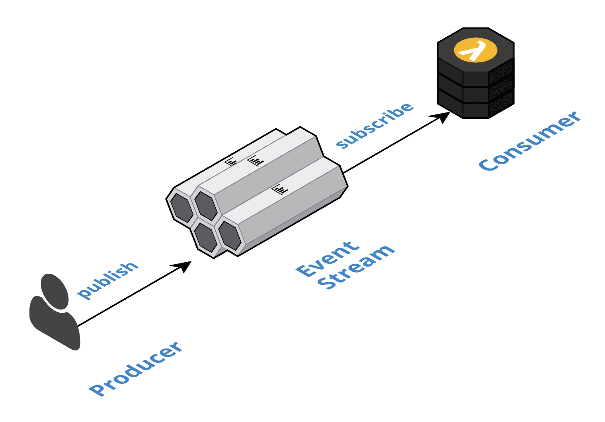

# Cloud Native Development Patterns and Best Practices

# Table of contents
* [Understanding Cloud Native Concepts](#Understanding-Cloud-Native-Concepts)
* [The Anatomy of Cloud Native Systems](#The-Anatomy-of-Cloud-Native-Systems)
    
* [Setup](#setup)

# Understanding Cloud Native Concepts
The promise of cloud-native is speed, safety, and scalability.

Our definition of cloud-native is focused on your context. You need an architecture that will grow with you and not weigh you down now.

This confidence is derived from the knowledge that **cloud-native systems** are powered by ...... so that they remain responsive in the face of failures 
* disposable infrastructure
* composed of bounded isolated components 
* scale globally

Cloud-native teams embrace 
* disposable architecture
* leverage value-added cloud services 
* welcome polyglot cloud 
to provide the strong foundation that enables them to take control of the full-stack, focus on the value proposition, and drive cultural change from the bottom up by earning trust through successful execution.

## Defining cloud-native
Cloud-native embodies the following concepts:
* Powered by disposable infrastructure
* Composed of bounded, isolated components
* Scales globally
* Embraces disposable architecture
* Leverages value-added could services
* Welcomes polygot cloud
* Empowers self-sufficient, full-stack teams
* Drives cultural changes

Of course you are asking, "Where are the containers?" and "What about microservices?" They are in there, but those are implementation details.

This definition of cloud-native should still stand regardless of the implementation details. 

## Powered by disposable infrastructure
Making the classic mistake called **lift and shift**. (But God forbid we terminate one of those instances because there were still lots of manual steps involved in hooking a new instance up to all the other resources, such as load balancers, elastic block storage, the database, and more)

First **Disposing of cloud resources is hard, because it takes a great deal of forethought** 
When we hear about the cloud we hear about how easy it is to create resources, but we don't hear about how easy it is to dispose of resources.
We don't hear about it because it is not easy to dispose of resources.
Traditional data center applications are designed to run on **snowflake** machines that are rarely, if ever, retired.

Second **the machine images and the containers that we hear about are just the tips of the iceberg.**
There are so many more pieces of infrastructure, such as load balancers, databases, DNS, CDN, block storage, blob storage, certificates, virtual private cloud, routing tables, NAT instances, jump hosts, internet gateways, and so on. All of these resources must be created, managed, monitored, understood as dependencies, and, to varying degrees, disposable. Do not assume that you will only need to automate the AMIs and containers.

**The bottom line is: if we can create a resource on demand, we should be able to destroy it on demand as well, and then rinse and repeat.**
**This notion of disposable infrastructure is the fundamental concept that powers cloud-native**

**The infrastructure becomes immutable because there is no longer a need to make manual changes.**

**Disposable infrastructure facilitates team scale and efficiency.**

It lays the groundwork for scalability and elasticity, but to fully achieve this a system must be architected as a composition of bounded and isolated components

## Composed of bounded, isolated components
Automation and disposable infrastructure help minimize the potential for these errors and they allow us to rapidly recover from such errors, but they cannot eliminate these errors. Thus, cloud-native systems must be resilient to human error.

To be resilient, we need to **isolate** the components from each other.

Isolation further instills confidence to innovate.

Bounded and isolated components achieve resilience through data replication. This, in turn, facilitates responsiveness, because components do not need to rely on synchronous inter-component communication. Instead, requests are serviced from local materialized views. Replication also facilitates scale, as load is spread across many independent data sources

## Scales globally

## Embraces disposable architecture
Independent **DURS** ultimately comes up in every discussion on cloud-native concepts; to independently 
* Deploy
* Update
* Replace
* Scale

It is essential that we leverage **disposable infrastructure** to independently deploy and scale **bounded isolated components**. 
In turn, **disposable architecture** builds on this foundation, takes the idea of disposability and replacement to the next level, and drives business value further. At this higher level, we are driving a wedge in monolithic thinking at the business level.

**Disposable architecture (aka the Big R (Redeploy)) is the antithesis of monolithic thinking.**

In business terms, each experiment is the cost of information.

In his book, Domain Driven Design: Tackling Complexity in the Heart of Software (http://dddcommunity.org/book/evans_2003/), Eric Evans discusses the idea of the **breakthrough**. Teams continuously and iteratively refactor towards deeper insight with the objective of reaching a model that properly reflects the domain.
A breakthrough is when the team realizes that there is a deep design flaw in the model that must be corrected. But breakthroughs typically require a high degree of refactoring.

**Breakthroughs are the objective of disposable architecture.**

With disposable architecture, we can make small incremental investments to garner the knowledge necessary to glean the optimal solution. These breakthroughs may require completely reworking a component, but that initial work was just the cost of acquiring the information and knowledge that led to the breakthrough.

## Leverages value-added cloud services
For all my customers, and I'll assert for most companies, data is the value proposition.

By leveraging the value-added services of our cloud provider, we cut months, if not more, off our ramp-up time and minimize our **operational risk**.

This concept is also the most alienated, because of the fear of vendor lock-in. But vendor lock-in is monolithic thinking. In cloud-native systems, we make decisions on a component-by-component basis. We embrace disposable architecture and leverage value-added cloud services to increase our velocity, increase our knowledge, and minimize our risk.

## Welcomes polyglot cloud
The willingness to welcome polyglot cloud is a true measure of cloud-native maturity.

* Polyglot programming
* Polyglot persistence - use the storage mechanism that best suits the requirements of the specific component.
* Polyglot cloud - choose the cloud provider that is best on a component-by-component basis

It is important to make a **distinction** between **polyglot cloud** and another common term, **multi-cloud**.
Polyglot cloud and multi-cloud are different.

**Multi-cloud is the idea that you can write your cloud-native system once and run it on multiple cloud providers**, either concurrently for redundancy or in an effort to be provider-agnostic.

Essentially, multi-cloud is characteristic of the monolithic, all or nothing thinking of the past. Polyglot cloud focuses instead on the promise of cloud-native.

## Empowers self-sufficient, full-stack teams
An infrastructure resource is just another **functional domain** that happens to be a **technical domain**. In the cloud, these resources are API-driven. 

The cloud works on a shared responsibility model.

Cloud-native systems are composed of bounded isolated components. These components own all their resources. As such, self-sufficient, full-stack teams must own the components and their resources. 

Self-sufficient, full-stack teams own one or more components for the entirety of each component's full life cycle. This is often referred to as the you build it, you run it mentality.

Self-sufficient, full-stack teams are at liberty to continuously deliver innovation at their own pace, they are on the hook to deliver safely, and companies can scale by adding more teams.

## Drives cultural change
We still have celebrations. We have them when we complete a feature release. But a release is now just a marketing event; it is not a development event. 

They are milestones that we work towards. We have completely **decoupled deployment from release**. **Components are deployed to production with the completion of every task**. **A release is made up of a large number of small task scoped deployments**. The last task deployment of a release could very well have happened weeks before we flipped the feature on for general availability.

Ultimately, cultural change comes down to trust. Trust is earned.

# The Anatomy of Cloud Native Systems
In our definition, cloud-native is powered by disposable infrastructure, composed of bounded isolated components, scales globally, and leverages value-added cloud services. 

    The cloud is the database
    Reactive architecture
    Turning the database inside out
    Bulkheads
    Event streaming
    Polyglot persistence
    Cloud-native databases
    Cloud-native patterns
    Decomposition strategies for bounded isolated components

## The cloud is the database

## Reactive Manifesto
* responsive
* resilient
* elastic
* message driven
  
The magic lies in how we achieve resilience, because the responsiveness and elasticity of a system are a function of how it achieves its resilience. It is important to recognize that the message-driven property is the means to achieve the other properties.

## Event streaming
Event streaming is our message-driven, publish, and subscribe mechanism for asynchronous inter-component communication.

Consumers are only coupled to the **event type definitions**.

There are a two, separate but related, aspects of event streaming that make it stand out from traditional messaging systems: **scale** and **eventual consistency**.

**Event streaming belongs to the dumb pipes, smart endpoints generation.**

Event streams have a single responsibility, to receive and durably store events, lots of events, at massive scale. An event stream is an append-only, sharded database that maintains an ordered log of events and scales horizontally to accommodate massive volumes. It is important to note that an event stream is a modern, sharded database.

and thus design systems around eventual consistency and session consistency. Embracing eventual consistency is a significant advancement for our industry. Event streaming and eventual consistency are interdependent. Eventual consistency is simply a reality of asynchronous messaging and event streaming is the mechanism for implementing eventual consistency.

## Foundation patterns
These patterns provide the foundation for reactive, asynchronous inter-component communication in cloud-native systems.

**Cloud Native Databases Per Component**: Leverage one or more fully managed cloud-native databases that are not shared across components and react to emitted events to trigger intra-component processing logic.

**Event Streaming**: Leverage a fully managed streaming service to implement all inter-component communication asynchronously whereby upstream components delegate processing to downstream components by publishing domain events that are consumed downstream.

**Event Sourcing**: Communicate and persist the change in state of domain entities as a series of atomically produced immutable domain events, using Event-First or Database-First techniques, to drive asynchronous inter-component communication and facilitate event processing logic.

**Data Lake**: Collect, store, and index all events in their raw format in perpetuity with complete fidelity and high durability to support auditing, replay, and analytics

**Stream Circuit Breaker**: Control the flow of events in stream processors so that failures do not inappropriately disrupt throughput, by delegating the handling of unrecoverable errors through fault events.

**Trilateral API**: Publish multiple interfaces for each component: a synchronous API for processing commands and queries, an asynchronous API for publishing events as the state of the component changes, and/or an asynchronous API for consuming the events emitted by other components

## Boundary patterns
The boundaries are where the system interacts with everything that is external to the system, including humans and other systems.

**API Gateway**: Leverage a fully managed API gateway to create a barrier at the boundaries of a cloud-native system by pushing cross-cutting concerns, such as security and caching, to the edge of the cloud where some load is absorbed before entering the interior of the system.

**Command Query Responsibility Segregation (CQRS)**: Consume state change events from upstream components and maintain materialized views that support queries used within a component.

**Offline-First Database**: Persist user data in local storage and synchronize with the cloud when connected so that client-side changes are published as events and cloud-side changes are retrieved from materialized views

**Backend For Frontend**: Create dedicated and self-sufficient backend components to support the features of user focused, frontend applications

**External Service Gateway**: Integrate with external systems by encapsulating the inbound and outbound inter-system communication within a bounded isolated component to provide an anti-corruption layer that acts as a bridge to exchange events between the systems

## Control patterns
These patterns provide the control flow for inter-component collaboration between the boundary components of cloud-native systems.

**Event Collaboration**: Publish domain events to trigger downstream commands and create a reactive chain of collaboration across multiple components

**Event Orchestration**: Leverage a mediator component to orchestrate collaboration between components without event type coupling

**Saga**: Trigger compensating transactions to undo changes in a multi-step flow when business rules are violated downstream

## Bounded isolated components
common strategies for decomposing cloud-native systems into bounded isolated components across both functional and technical dimensions.

## Bounded context
Bounded contexts are a core concept in **Domain Driven Design (DDD)**. Domain Driven Design embraces the fact that there is no single unified model.
Large models are decomposed into multiple bounded contexts with well-defined interrelationships. Each bounded context is internally consistent, such that no terms have multiple meanings. When concepts do overlap between bounded contexts, these relationships can be depicted with a context map. **Domain events** are used to communicate between the different contexts

Each context has its own definition of a Customer entity and a Product entity and each definition is unique to its context. The only thing that would need to be consistent across the contexts is the identifiers of the instances of these entities as depicted by the interrelationship.

We will integrate the contexts via the domain events.

## Technical isolation
* regions and availability zones
* cloud accounts and providers
* deployment units and resource management
* data isolation (database - shared monolithic databases => no bulkhead for data)
  * if we have no isolation at the persistence layer then we effectively have no isolation at the component layer. Instead, each component must have its own isolated databases.

## Summary
In this chapter, we learned that cloud-native systems are built on the principles of Reactive architecture. We use asynchronous, message-driven, inter-component communication to build resilient components that are responsive and elastic. Event streaming is the mechanism for inter-component communication. Components publish domain events to notify the system of their state changes. Other components consume these events to trigger their behavior and cache pertinent information in materialized views. These materialized views make components responsive by providing a dedicated cache that is continuously warmed. They act as bulkheads to make components resilient to failures in upstream components, because the latest known state is available in local storage.

# Foundation Patterns
Ultimately, we create proper functional and technical bulkheads

We will discuss the patterns that provide the foundation for creating bounded isolated components. We eliminate all synchronous inter-component communication and build our foundation on asynchronous inter-component communication, replication, and eventual consistency. We will cover the following foundation patterns:

    Cloud-Native Databases Per Component
    Event Streaming
    Event Sourcing
    Data Lake
    Stream Circuit Breaker
    Trilateral API

## Cloud-Native Databases Per Component
Leverage one or more fully managed cloud-native databases that are not shared across components and react to emitted events to trigger intra-component processing logic.

Each database is dedicated to a specific component and not shared across components. Use the change-data-capture and life cycle management features and react to the emitted events to trigger intra-component processing logic. Use the regional replication features to create multi-regional deployments, as needed.

The primary benefit of this solution is that proper data level bulkheads are achieved in a realistic and cost-effective manner.

One drawback of this solution is that these services tend to be the source of regional outages.

**Change data capture (CDC)** is one of the most important features provided by these databases. As we will see in the **Event Sourcing** pattern, this feature is critical in implementing transactionally sound eventual consistency across components.

Query limitations are a perceived drawback of this solution. We are not able to join data across components because they are in different databases. Now, even within a component, each table is isolated and cannot be joined

The disposable nature of cloud infrastructure, and specifically cloud-native databases, enables us to take this isolation to the most fine-grained level. This is where the Event Sourcing and CQRS patterns come into play. In those patterns, we will be discussing how they come together with the Event Streaming pattern and eventual consistency to create materialized views that not only overcome this perceived query limitation through the **pre-calculation of joins**, but actually result in a more responsive, resilient, and elastic solution. I mentioned previously that this is where much of the rewiring of our engineering brains is needed.

Cloud-native databases free us from the limitations of database connection pools, but they introduce **capacity throttling**.

And finally, the most commonly perceived drawback of this solution, vendor lock-in, brings us around full circle to the primary benefit of the solution.

Vendor lock-in is rooted in monolithic thinking and that we need to embrace disposable architecture, which is afforded to us by disposable infrastructure and bounded isolated components.

In the **Data Lake pattern**, we will discuss how events can be replayed to seed the data in new and improved implementations of components and thus help alleviate concerns over disposable architecture.

## Event Streaming
Leverage a fully managed streaming service to implement all inter-component communication asynchronously, whereby upstream components delegate processing to downstream components by publishing domain events that are consumed downstream.

Stream processing has become the de facto standard in the cloud for implementing this message-driven inter-component communication.

To create responsive, resilient, isolated components our primary objective is to eliminate all synchronous inter-component communication. 

Instead, we strive to limit synchronous communication to only intra-component communication with cloud-native databases and to the cloud-native streaming service.

eventual consistency is achieved by publishing data change events.

It must be recognized that an event streaming system is an append-only, distributed, sharded database.
One thing that is different is that a database is owned by a single component, whereas an event stream is shared between components

Event Stream services are typically regional and do not support regional replication.
This is actually a good thing, as a replicated event would ultimately be processed in multiple regions and most likely produce unintended results. It is the results of event processing that we want to replicate and this replication is handled per each cloud-native database as appropriate.

It needs reiterating that while producers are not coupled to specific consumers, the consumers are coupled to the event definitions.

However, cloud-streaming services are priced and provisioned based on throughput, not on cluster size

## Event Sourcing

Communicate and persist the change in state of domain entities as a series of atomically produced immutable domain events, using Event-First or Database-First techniques, to drive asynchronous inter-component communication and facilitate event processing logic.

Event streaming is the mechanism for implementing eventual consistency.

In an eventually consistent system, we need an approach to atomically publish events to the stream as the state in the database changes, without the aid of 2PC. We also need an historical record of all the events in the system for auditing, compensation, replay, and resubmission. Furthermore, in high volume, highly contentious systems, we need an approach for atomically persisting state changes.

Traditionally, this CRUD interaction only stores the current state of the data and thus the history or audit trail of the data is lost.
Traditional event sourcing solutions persist the data as a series of data change events. This requires the system to recalculate the current state before presenting the data to the user, which is inefficient. Alternatively, the system can use the CQRS pattern to persist the current state in a materialized view as well, which can overly complicate the implementation of usually straightforward CRUD implementations

The ACID 2.0 transaction model (Associative, Commutative, Idempotent, and Distributed) recognizes these realities and can be combined with event sourcing in downstream components to implement logic that is tolerant of these conditions.

## Data Lake
Collect, store, and index all events in their raw format in perpetuity with complete fidelity and high durability to support auditing, replay, and analytics.

As the system of truth, it is also critical that the data is stored securely and that the data is cataloged, indexed, and searchable. The data lake is the source of knowledge that can be leveraged to replay events to repair components, populate new components, and support data science activities

When replaying or resubmitting events, there are various considerations to keep in mind. First, replaying or resubmitting an event is not the same as publishing an event. When we publish an event, it is broadcast to all consumers. When we replay or resubmit an event, we are sending the event to a very specific consumer. When we replay an event, we need to consider the side effects of replaying the event.
The bottom line in all cases is to strive for idempotence and understand the impacts and side effects of replay and resubmission.

## Stream Circuit Breaker
Control the flow of events in stream processors so that failures do not inappropriately disrupt throughput by delegating the handling of unrecoverable errors through fault events.

Delegate events with unrecoverable errors to another component for handling so that they do not block legitimate events from processing. Publish these errors as fault events, along with the effected events and the stream processor information, so that the events can be resubmitted when appropriate.
Provide the necessary utilities to resubmit the effected events from the data lake to the component that emitted the fault event.

Implement the stream processor logic so that it is tolerant of events that are received out of order and idempotent when it receives and processes events more than once

The iterator age is the metric that provides us this information. It is a measure of how long a processor is leaving events on the stream before successfully processing them.

Therefore, we need to implement stream processors to be idempotent and order agnostic.

Our objective is to limit synchronous communication to the cloud-native resources within a component. These resources have high availability standards, but they also implement throttling.

Leverage batch or bulk APIs whenever possible to minimize the number of network calls and thus improve throughput. However, these APIs can be more complicated to use if they allow the individual items in the batch to succeed or fail on their own. In these cases, it is necessary to check the status of each item and only retry those that failed. This can significantly increase the complexity of the code.

## Trilateral API
Publish multiple interfaces for each component: a synchronous API for processing commands and queries, an asynchronous API for publishing events as the state of the component changes, and/or an asynchronous API for consuming the events emitted by other components.

CQRS separates reads and writes into different models, using commands to update data, and queries to read data.

We are building reactive, cloud-native systems composed of bounded isolated components which rely on event streaming for inter-component communication. Therefore, a **large portion of the system functionality does not communicate over RESTful interfaces**.

We need to recognize and acknowledge that reactive, cloud-native systems are different and require a different way of thinking about systems. We no longer communicate via just a synchronous API, such as REST and/or GraphQL. We now have an asynchronous API for publishing events and another asynchronous API for consuming events, as well. We actually strive to eliminate any inter-component communication via a synchronous API. As we will discuss in Chapter 4, Boundary Patterns, we are limiting the use of synchronous APIs to the interactions with a frontend and with external systems.

Bounded isolated components are loosely coupled in that they are unaware of their actual upstream and downstream counterparts, but these components are still dependent on the formats of the messages they exchange.

The primary benefit of this solution is that it helps teams recognize the first order importance of asynchronous inter-component communication in cloud-native systems.

It is hard to perform integration and end-to-end testing on distributed systems because so many components have to be coordinated. It is hard to automate test asynchronous systems, regardless of size, because the tests have to poll for messages within a reasonable amount of time. Thus, testing asynchronous distributed systems is extremely difficult when employing traditional testing techniques. In Chapter 7, Testing, we will discuss how consumer-driven contract testing addresses this complexity, with what I refer to as transitive integration and end-to-end testing, without the need for all components running at the same time.

## Summary

With Event Sourcing, we communicate state changes between components as a series of atomically produced immutable events and the data lake collects, stores, and indexes all events in perpetuity with complete fidelity and high durability.
These events act as the source of record and support the replay and resubmission of events, to repair existing components, populate new components, and support data science activities. The Stream Circuit Breaker pattern leverages functional reactive programming to control the flow of events in stream processors and achieves fault tolerance by delegating unrecoverable errors for resolution so that failures do not inappropriately disrupt throughput. Finally, in the Trilateral API pattern, we discussed the need to publish multiple interfaces for each component, which highlights that cloud-native components have more than just synchronous APIs and facilitates understanding of the system as a whole.

# Boundary Patterns
The boundaries are where the system interacts with everything that is external to the system, including humans and other systems.

    API Gateway
    Command Query Responsibility Segregation
    Offline-First Database
    Backend For Frontend
    External Service Gateway

## API Gateway
Leverage a fully managed API gateway to create a barrier at the boundaries of a cloud-native system by pushing **cross-cutting concerns**, such as **security** and **caching**, to the edge of the cloud where some load is absorbed before entering the interior of the system.

We strive to limit synchronous communication to only the intra-component cloud-native databases and to the cloud-native streaming service. Yet, sooner or later, we have to implement synchronous communication at the boundaries of the system.

First and foremost, these public endpoints must be secured.

This reverse proxy layer should run on its own separately scalable infrastructure and support regional load-balancing and regional failover.

Throttling and Access Token Authorization are essential features. Deliver your endpoints through your cloud provider's Content Delivery Network (CDN) for additional security and performance benefits. Add a Web Application Firewall (WAF) for additional security features as needed.

Security is performed at the edge of the cloud. We typically only consider CDNs for their ability to cache static content at the edge. However, cloud providers recommend the use of their CDNs for all traffic: PUT, POST, DELETE, GET, and so forth, because network level Distributed Denial of Service (DDOS) attacks are handled by the CDN at the edge before they penetrate an availability zone and your system. Thus we limit the attack surface of the system by passing all traffic through the CDN. The API gateway itself provides throttling to protect the system at the application level

Other features, such as complex routing, transformation, fan-out, fan-in, and the like, should be avoided, as coding in the API gateway ought to be considered an anti-pattern.

## Command Query Responsibility Segregation (CQRS)
https://docs.microsoft.com/en-us/azure/architecture/patterns/cqrs

https://microservices.io/patterns/data/cqrs.html

Consume state change events from upstream components and maintain materialized views that support queries used within a component.

Segregate upstream producer (that is, command) components from downstream consumer (that is, query) components by eliminating all synchronous inter-component communication. 

Materialized views are highly responsive. They are tuned to exactly the needs of the component and deployed using the most appropriate polyglot persistence. The performance of queries is not impacted by the calculations for joining data from multiple events because the calculations are only performed when the data changes and the result is stored in the view. A materialized view acts as a local cache that is always hot and always up to date with the last known values.

Materialized views are the primary facilitator of global scalability.

We are in essence scaling by replicating data at the fine-grained level of individual query definitions. This is actually pretty amazing when you stop and think about it, especially considering it is also cost effective. Each query definition leverages the most appropriate database type and has its own dedicated capacity that is not shared across components. It is updated with changes in near real time and its joins are pre-calculated, and it is further replicated across regions for optimized latency and regional failover.

All the expressiveness of joins and groups should be pre-calculated.

## Offline-first database
Persist user data in local storage and synchronize with the cloud when connected so that client-side changes are published as events and cloud-side changes are retrieved from materialized views.

## Backend For Frontend
Create dedicated and self-sufficient backend components to support the features of user-focused frontend applications.

This BFF component must be self-sufficient in that it employs the CQRS pattern to create materialized views for all upstream dependencies and produces events to all downstream dependencies following the Event Sourcing pattern.

## External Service Gateway
Integrate with external systems by encapsulating the inbound and outbound inter-system communication within a bounded isolated component to provide an anti-corruption layer that acts as a bridge to exchange events between the systems.

External systems provide an Open API for inbound and outbound communication with other systems.

Treat external systems like any other bounded isolated component. Create a component for each external system that acts as a bidirectional bridge for transmitting events between the systems.

# Control patterns

    Event collaboration
    Event orchestration
    Saga

##  Event collaboration
Publish **domain events** to trigger **downstream commands** and create a reactive chain of collaboration across multiple components.

Redesign the user experience to be eventually consistent. Replace synchronous inter-component communication with asynchronous inter-component communication by using the event stream to publish events which trigger downstream commands. Upstream components apply the Database-First variant of the Event Sourcing pattern to publish domain events that reflect changes in their state. Downstream components react to the domain events by performing a command and publishing a domain event to reflect the outcome of the command.

##  Event orchestration
Leverage a mediator component to orchestrate collaboration between components without **event type coupling**.

Raw Event Collaboration explicitly couples consumer components to specific event types.

However, raw Event Collaboration becomes less manageable, as the number of collaborations increases, as the complexity of collaborations increase, and as the number of event types increases.

Create a component for each business process to act as a mediator between the collaborator components and orchestrate the collaboration flow across those components. Each component defines the events it will consume and publish independently of any business processes. The mediator maps and translates the published events of upstream components to the consumed events of downstream components. These mappings and translations are encapsulated in the mediator as a set of rules, which define the transitions in the collaboration flow.

The primary benefit of this solution, over and above raw Event Collaboration, is that the collaborator components are completely decoupled.

## Saga
Trigger compensating transactions to undo changes in a multi-step flow when business rules are violated downstream.

Use compensating transactions to undo changes in a multi-step business process. Upstream components will publish domain events as they complete their steps to move a business process forward. A downstream component will publish an appropriate violation event when its business rules are violated to inform the upstream components that the process cannot proceed forward to completion. The upstream components react to the violation event by performing compensating transactions to undo the changes of the previous steps in the collaboration. The upstream components will, in turn, produce their own domain events to indicate the reversal has occurred, which may in turn trigger additional compensations. This cycle will continue until the system is eventually consistent.

It is important to distinguish between business rule violations and error handling. The Stream Circuit Breaker pattern is responsible for error handling, while the Saga pattern is responsible for business rule violations. In essence, the objective of the Stream Circuit Breaker pattern is to keep events flowing forward, versus the objective of the Saga pattern, which is focused on reversing the effects of previous events.

## Summary
In this chapter, we discussed the control patterns of reactive, cloud-native systems. The Event Collaboration pattern replaces synchronous communication with asynchronous domain events, which successively trigger commands in downstream components, to resiliently choreograph long-running collaborations between boundary components. In the Event Orchestration pattern, we improve on the Event Collaboration pattern by creating mediator components to orchestrate the collaboration between decoupled boundary components. Finally, in the Saga pattern, we provide a long-running transaction mechanism based on compensation to undo the successful steps in these collaborations when later steps encounter business rule violations.

# Deployment

    Decoupling deployment from release
    Multi-level roadmaps
    Task branch workflow
    Modern deployment pipelines
    Zero-downtime deployment
    Multi-regional deployment
    Feature flags
    Versioning
    Trilateral API per containers

