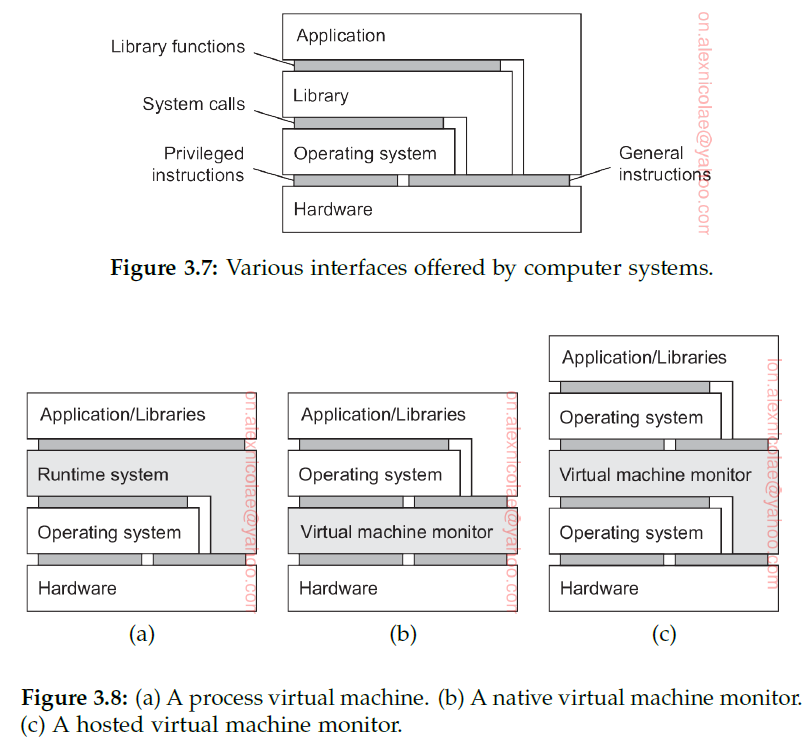

# Distributed Systems

# Table of contents
* [Introduction](#introduction)
  * [1.1 What is a distributed system?](#1.1-What-is-a-distributed-system?)
  * [1.2 Design goals](#1.2-Design-goals)
  * [1.3 Types of distributed systems](#1.3-Types-of-distributed-systems)
* [Architectures](#architectures)
  * [2.1 Architectural styles](#2.1-Architectural-styles)
  * [2.2 Middleware organization](#2.2-Middleware-organization)
  * [2.3 System architecture](#2.3-System-architecture)
* [Processes](#Processes)
  * [3.1 Threads](#3.1-Threads)
* [Communication](#Communication)
* [Naming](#Naming)
  * [Names, identifiers, and addresses](#Names,-identifiers,-and-addresses)
  * [Flat naming](#Flat-naming)
  * [Structured naming](#Structured-naming)
  * [Attribute based naming](#Attribute-based-naming)
* [Coordination](#Coordination)

# Introduction

## 1.1 What is a distributed system?

**"A distributed system is a collection of autonomous computing elements
that appears to its users as a single coherent system."**

### Characteristic 1: Collection of autonomous computing elements

A fundamental principle is that nodes can act independently from each other.
(global clock/synchronization/coordination/group membership/open group/closed group)
overlay network (Structured overlay/Unstructured overlay)

### Characteristic 2: Single coherent system
distribution transparency

### Middleware and distributed systems
To assist the development of distributed applications, distributed systems are
often organized to have a separate layer of software that is logically placed on
top of the respective operating systems of the computers that are part of the
system.


The distributed system provides the means for components of a single distributed application to communicate with each
other, but also to let different applications communicate. At the same time, it hides, as best and reasonably as possible, the differences in hardware and
operating systems from each application.</br>
In a sense, middleware is the same to a distributed system as what an operating system is to a computer: a manager of resources offering its applications
to efficiently share and deploy those resources across a network.
Next to resource management, it offers services that can also be found in most operating systems, including:
* Facilities for inter-application communication.
* Security services.
* Accounting services.
* Masking of and recovery from failures.</br>
Typical  middleware services:
* Communication - Remote Procedure Call (RPC)
* Transactions
* Service composition
* Reliability

## 1.2 Design goals
* make resources easily accessible
* hide the fact that resources are distributed across a network
* it should be open
* it should be scalable

### Supporting resource sharing
make it easy for users to access and share remote resources. (collaborate and exchange information)</br>
file-sharing peer-to-peer networks like BitTorrent.
### Making distribution transparent
hide the fact that its processes and resources are physically distributed across multiple computers possibly separated by large distances.</br>


### Being open
An open distributed system is essentially a system that offers components that can easily be used by, or integrated into other systems.
#### Interoperability, composability, and extensibility
To be open means that components should adhere to standard rules that describe the **syntax** and **semantics** of what those components have to offer.
A general approach is to define services through **interfaces** using an **Interface Definition Language (IDL)**.
Interface definitions written in an IDL nearly always capture only the syntax of services(function names,type of parameters,return values).
The hard part is specifying precisely what those services do (specifications), that is, the semantics of interfaces.</br>

Proper specifications are **complete** and **neutral**.Complete means that everything that is necessary to make an implementation has indeed been specified.
Just as important is the fact that specifications do not prescribe what an implementation should look like; they should be neutral.</br>

**Completeness** and **neutrality** are important for **interoperability** and **portability**.
Interoperability characterizes the extent by which two implementations of systems or components from different manufacturers can co-exist and work together by merely relying
on each other’s services as specified by a common standard. Portability characterizes to what extent an application developed for a distributed system A can be executed, 
without modification, on a different distributed system B that implements the same interfaces as A. Also, it should be easy to add new components or
replace existing ones without affecting those components that stay in place **extensible**.

### Being Scalable
Scalability dimensions:
* **Size scalability**: A system can be scalable with respect to its size, meaning that we can easily add more users and resources to the system without  any noticeable loss of performance.
* **Geographical scalability**: is one in which the users and resources may lie far apart, but the fact that communication delays may be significant is hardly noticed
* **Administrative scalability**: is one that can still be managed even if it spans many independent administrative organizations. 

#### Size scalability
#### Geographical scalability
One of the main reasons why is difficult to scale distributed systems designed for local-area networks is that may of them are based on **synchronous communication**.
This approach generally works fine in LANs where communication between two machines is often at worst a few hundred microseconds.
However, in a wide-area system, we need to take into account that interprocess communication may be hundreds of milliseconds, three orders of magnitude slower

Communication in wide-area networks is inherently much less reliable than in local-area networks.In addition, we also need to deal with limited bandwidth

Wide-area systems generally have only very limited facilities for multipoint communication. In contrast, local-area networks often support efficient broadcasting mechanisms.
Such mechanisms have proven to be extremely useful for discovering components and services, which is essential from a management point of view. In wide-area systems, we need to develop
separate services, such as naming and directory services to which queries can be sent.

#### Administrative scalability
Across multiple, independent administrative domains. A major problem that needs to be solved is that of conflicting policies with respect to resource usage (and payment), management, and security.

To illustrate, for many years scientists have been looking for solutions to share their (often expensive) equipment in what is known as a **computational grid**. In these grids, a global distributed system is constructed as a federation
of local distributed systems, allowing a program running on a computer at organization A to directly access resources at organization B.

If a distributed system expands to another domain, two types of security measures need to be taken:
* the distributed system has to protect itself against malicious attacks from the new domain
* the new domain has to protect itself against malicious attacks from the distributed system

As a counterexample of distributed systems spanning multiple administrative domains that apparently do not suffer from administrative scalability problems, consider modern **file-sharing peer-to-peer networks**.
Oher examples - Skype/Spotify. What these distributed systems have in common is that **end users**, and not administrative entities, collaborate to keep the system up and running

#### Scaling techniques
* **scaling up**
* **scaling out** - _hiding communication latencies_, _distribution of work_, _replication_

##### Hiding communication latencies
Applicable in the case of geographical scalability. Idea: "try to avoid waiting for responses to remote-service requests as much as possible".
Essentially, this means constructing the requesting application in such a way that it uses only **asynchronous communication**.

In such cases (interactive apps/filling informs), a much better solution is to reduce the overall communication, for example, by moving part of the computation that is normally done at the server to the client process requesting the service.

##### Partitioning and distribution
taking a component, splitting it into smaller parts, and subsequently spreading those parts across the system.
Eg: Internet Domain Name System (DNS). The DNS name space is hierarchically organized into a tree of domains, which are divided into nonoverlapping zones
How the naming service, as provided by DNS, is distributed across several machines, thus avoiding that a single server has to deal with all requests for name resolution.

##### Replication
increases availability/helps to balance the load between components leading to better performance/geographical location

**Catching** is a special form of replication in the proximity of the client accessing that resource.

Catching/replication drawback that may adversely affect scalability. many copies -> **consistency problems**.
Replication therefore often requires some global synchronization mechanism.

### Pitfalls
Distributed systems differ from traditional software because components are dispersed across a network.</br>
False assumptions:
* The network is reliable
* The network is secure
* The network is homogeneous
* The topology does not change
* Latency is zero
* Bandwidth is infinite
* Transport cost is zero
* There is one administrator </br>
Reliable networks simply do not exist and lead to the impossibility of achieving failure transparency.<\br>
When discussing replication for solving scalability problems, we are essentially tackling latency and bandwidth problems.

## 1.3 Types of distributed systems
We make a distinction between 
* distributed computing systems
* distributed information systems
* pervasive systems (which are naturally distributed)

### High performance distributed computing
* Cluster computing - similar underlying hardware, closely connected by means of a high-speed local-area network. Same OS
* Grid computing - federation of computer systems (fall under a different administrative domain) and may be different when it comes to hardware/software/network topology.

From the perspective of grid computing, a next logical step is to simply _outsource_ the entire infrastructure that is needed for compute-intensive applications.
In essence, this is what **cloud computing** is all about: providing the facilities to dynamically construct an infrastructure and compose what
is needed from available services. Unlike grid computing, which is strongly associated with high-performance computing, cloud computing is much more
than just providing lots of resources.

#### Note - Parallel processing
High-performance computing more or less started with the introduction of **multiprocessor machines**. In this case, multiple CPUs are organized in such a way
that they all have access to the same physical memory.</br>
In contrast, in a **multicomputer system** several computers are connected through a network and there is no sharing of main memory.


This shift also meant that many programs had to make use of message passing instead of modifying shared data as a means of communication and synchronization between threads
Unfortunately, message-passing models have proven to be much more difficult and error-prone compared to the shared-memory programming models.

#### Cluster computing
It became financially and technically attractive to build a supercomputer using off-the-shelf technology by simply hooking up a collection of relatively simple computers in a high-speed network.
In virtually all cases, cluster computing is used for **parallel programming in which a single** (compute intensive) **program is run in parallel on multiple machines**.


Each cluster consists of a collection of compute nodes that are controlled and accessed by means of a single master node. The master typically
handles the allocation of nodes to a particular parallel program, maintains a batch queue of submitted jobs, and provides an interface for the users of
the system. As such, the master actually runs the middleware needed for the execution of programs and management of the cluster, while the compute
nodes are equipped with a standard operating system extended with typical middleware functions for communication, storage, fault tolerance, and so on.
Apart from the master node, the compute nodes are thus seen to be highly identical.

#### Grid computing
A characteristic feature of traditional **cluster computing is its homogeneity**.</br>
In grid computing systems: no assumptions are made concerning similarity of hardware, operating systems, networks, administrative domains, security policies, etc.</br>
A key issue in a grid-computing system is that resources from different organizations are brought together to allow the collaboration of a group of
people from different institutions, indeed forming a federation of systems. Such a collaboration is realized in the form of a **virtual organization**.</br>
Given its nature, much of the software for realizing grid computing evolves around providing access to resources from different administrative domains,
and to only those users and applications that belong to a specific virtual organization. For this reason, focus is often on architectural issues.


* fabric layer - interfaces to local resources at a specific site. (query the state and capabilities of a resource + resource management (locking resources))
* connectivity layer - communication protocols for supporting grid transactions that span the usage of multiple resources(protocols to transfer data/ access resources)
* resource layer - is responsible for managing a single resource - it uses the connectivity layer and calls directly the fabric layer interfaces 
* collective layer - handles access to multiple resources (resource discovery/allocation/scheduling of tasks/data replication)
* application layer - apps that operate within a virtual org</br>
Typically the collective, connectivity, and resource layer form the heart of what could be called a grid middleware layer.
These layers jointly provide access to and management of resources that are potentially dispersed across multiple sites.

#### Cloud computing
**utility computing** by which a customer could upload tasks to a data center and be charged on a per-resource basis. Utility
computing formed the basis for what is now called **cloud computing**.</br>
Cloud computing is characterized by an easily usable and accessible pool of virtualized resources.The link to utility computing is formed by the fact that cloud
computing is generally based on a pay-per-use model in which guarantees are offered by means of customized service level agreements (SLAs).


Clouds are organized in 4 layers:
* Hardware - at data center level
* Infrastructure - it deploys virtualization techniques (virtual storage and computing resources)
* Platform - 
* Application</br>
Cloud-computing providers offer these layers to their customers through various interfaces
* IaaS (hardware/infrastructure layer)
* PaaS (platform layer)
* SaaS (app layer)

### Distributed information systems
It is found in organizations that were confronted with a wealth of networked applications (servers+databases), but for which interoperability turned out to be a painful experience. Many of the existing
middleware solutions are the result of working with an infrastructure in which it was easier to integrate applications into an enterprise-wide information system.</br>
We can distinguish several levels at which integration can take place. Integration at the lowest level allows clients to wrap a number of requests, possibly for different
servers, into a single larger request and have it executed as a distributed transaction. The key idea is that all, or none of the requests are executed.</br>

As applications became more sophisticated and were gradually separated into independent components (notably distinguishing database components
from processing components), it became clear that integration should also take place by letting applications communicate directly with each other. This
has now lead to a huge industry that concentrates on Enterprise Application Integration (EAI).

#### Distributed transaction processing
we concentrate on database applications. operations on a database are carried out in the form of **transactions**. Programming
using transactions requires special primitives that must either be supplied by the underlying distributed system or by the language runtime
system. In a mail system, there might be primitives to send, receive, and forward mail.</br>
Ordinary statements, procedure calls, and so on, are also allowed inside a transaction. In particular, **remote procedure calls**
(**RPC**s), that is, procedure calls to remote servers, are often also encapsulated in a transaction, leading to what is known as a **transactional RPC**.


In distributed systems, transactions are often constructed as a number of subtransactions, jointly forming a **nested transaction**.
The top-level transaction may fork off children that run in parallel with one another, on different machines, to gain performance or simplify programming.
Each of these children may also execute one or more subtransactions, or fork off its own children.


Nested transactions are important in distributed systems, for they provide a natural way of distributing a transaction across multiple machines. They
follow a logical division of the work of the original transaction.</br>
In the early days of enterprise middleware systems, the component that handled distributed (or nested) transactions formed the core for integrating
applications at the server or database level. This component was called a **transaction processing monitor** or **TP monitor** for short. Its main task was
to allow an application to access multiple server/databases by offering it a transactional programming model, as shown in Figure 1.12. Essentially, the TP
monitor coordinated the commitment of subtransactions following a standard protocol known as **distributed commit**.


An important observation is that applications wanting to coordinate several subtransactions into a single transaction did not have to implement this
coordination themselves. This is exactly where middleware comes into play: it implements services that are useful for many applications avoiding that
such services have to be reimplemented over and over again by application developers

#### Enterprise application integration
The more applications became decoupled from the databases they were built upon, the more evident it became that facilities were needed
to integrate applications independently from their databases. In particular, application components should be able to communicate directly with each other
and not merely by means of the request/reply behavior that was supported by transaction processing systems.</br>
The main idea was that existing applications could directly exchange information.


Several types of communication middleware exist. With remote procedure calls (RPC), an application component can effectively send a request to another
application component by doing a local procedure call, which results in the request being packaged as a message and sent to the callee. Likewise, the
result will be sent back and returned to the application as the result of the procedure call.
As the popularity of object technology increased, techniques were developed to allow calls to remote objects, leading to what is known as **remote method invocations (RMI)**.
An RMI is essentially the same as an RPC, except that it **operates on objects instead of functions**.</br>
RPC and RMI have the disadvantage that the caller and callee both need to be up and running at the time of communication. In addition, they need
to know exactly how to refer to each other. This tight coupling is often experienced as a serious drawback, and has lead to what is known as **message-oriented
middleware**, or simply **MOM**. In this case, applications send messages to logical contact points, often described by means of a subject. Likewise,
applications can indicate their interest for a specific type of message, after which the communication middleware will take care that those messages are
delivered to those applications. These so-called **publish/subscribe** systems form an important and expanding class of distributed systems.

##### Enterprise application integration - on integrating apps
Supporting enterprise application integration is an important goal for many middleware products.
* File transfer (drawback - file format and layout, file management, update propagation-notification of clients aka trigger)
* Shared database (better than file transfer. drawback - design common data schema, many reads/updates leads to performance bottleneck)
* Remote procedure call 
  * In such cases it is not really the change of data that is important, but the execution of a series of actions)
  * In essence, an RPC allows an application A to make use of the information available only to application B, without giving A direct access  to that information
* Messaging
  * A main drawback of RPCs is that caller and callee need to be up and running at the same time in order for the call to succeed. However, in
    many scenarios this simultaneous activity is often difficult or impossible to guarantee.</br>
  
Middleware (in the form of a distributed system), however, can significantly help in integration by providing the right facilities such as support for RPCs or messaging.

### Pervasive systems
The distributed systems discussed so far are largely characterized by their stability: nodes are fixed and have a more or less permanent and high-quality
connection to a network.</br>
However, matters have changed since the introduction of mobile and embedded computing devices, leading to what are generally referred to as **pervasive systems**.
As its name suggests, pervasive systems are intended to naturally blend into our environment.</br>
What makes them unique in comparison to the computing and information systems described so far, is that the separation between users and system
components is much more blurred. There is often no single dedicated interface, such as a screen/keyboard combination. Instead, a pervasive system is often
equipped with many **sensors** that pick up various aspects of a user’s behavior. Likewise, it may have a myriad of **actuators** to provide information and
feedback, often even purposefully aiming to steer behavior.</br>
Three different types of pervasive systems:
* Ubiquitous computing systems (present, appearing, or found everywhere.)
* Mobile systems
* sensor networks

#### Ubiquitous computing systems
In a ubiquitous computing system we go one step further: the system is pervasive and continuously present. The latter means that a user will be continuously
interacting with the system, often not even being aware that interaction is taking place.</br>
Core requirements for a ubiquitous computing system:
* (Distribution) Devices are networked, distributed, and accessible in a transparent manner
* (Interaction) Interaction between users and devices is highly unobtrusive
* (Context awareness) The system is aware of a user’s context in order to optimize interaction
* (Autonomy) Devices operate autonomously without human intervention, and are thus highly self-managed
* (Intelligence) The system as a whole can handle a wide range of dynamic actions and interactions

# Architectures
Make a distinction between, on the one hand, the **logical organization** of the collection of software components, and on the other hand the actual **physical realization**.</br>
The organization of distributed systems is mostly about the software components that constitute the system. These **software architectures** tell us
how the various software components are to be organized and how they should interact.</br>
An important goal of distributed systems is to separate applications from underlying platforms by providing a **middleware layer**. Adopting such a layer
is an important architectural decision, and its main purpose is to provide distribution transparency.</br>
The actual realization of a distributed system requires that we instantiate and place software components on real machines.
The final instantiation of a software architecture is also referred to as a **system architecture**.

## 2.1 Architectural styles
Considering the logical organization of a distributed system into software components, also referred to as its **software architecture**.</br>
An **architectural style** is important. Such a style is formulated in terms of components, the way that components are connected to each other, the data exchanged between components, and finally
how these elements are jointly configured into a system.</br> 
A **component** is a modular unit with well-defined required and provided **interfaces** that is _replaceable_ within its environment.</br>
A **connector**, which is generally described as a mechanism that mediates communication, coordination, or cooperation among components.(flow of control and data between components)</br>
Using components and connectors, we can come to various configurations, which, in turn, have been classified into architectural styles:
* Layered architectures
* Object-based architectures
* Resource-centered architectures
* Event-based architectures

### Layered architectures
The basic idea for the layered style is simple: components are organized in a layered fashion where a component at layer Lj can make a **downcall** to
a component at a lower-level layer Li (with i < j) and generally expects a response. Only in exceptional cases will an **upcall** be made to a higher-level component.


Figure 2.1(a) shows a standard organization in which only downcalls to the next lower layer are made. This organization is commonly deployed in the case of **network communication**.</br>
Finally, a special situation is shown in Figure 2.1(c). In some cases, it is convenient to have a lower layer do an upcall to its next higher layer. A typical example is when an operating system signals the occurrence of an
event, to which end it calls a user-defined operation for which an application had previously passed a reference (typically referred to as a handle).

#### Layered communication protocols
A well-known and ubiquitously applied layered architecture is that of so called **communication-protocol stacks**.</br>
In communication-protocol stacks, each layer implements one or several **communication services** allowing data to be sent from a destination to one
or several targets. To this end, each layer offers an interface specifying the functions that can be called.


#### Application layering
Logical layering of applications:
* The application-interface level
* The processing level
* The data level

### Object-based and service-oriented architectures
In essence, each object corresponds to what we have defined as a component, and these components are connected through a procedure call mechanism.
In the case of distributed systems, a procedure call can also take place over a network, that is, the calling object need not be executed on the same machine as the called object.</br>


Object-based architectures are attractive because they provide a natural way of encapsulating data (called an object’s state) and the operations that can
be performed on that data (which are referred to as an object’s methods) into a single entity. The **interface** offered by an object conceals implementation
details, essentially meaning that we, in principle, can consider an object completely independent of its environment.</br>
This separation between interfaces and the objects implementing these interfaces allows us to place an interface at one machine, while the object itself
resides on another machine. This organization, which is shown in Figure 2.6 is commonly referred to as a **distributed object**.


When a client **binds** to a distributed object, an implementation of the object’s interface, called a **proxy**, is then loaded into the client’s address space.
A proxy is analogous to a client stub in RPC systems. The only thing it does is marshal method invocations into messages and unmarshal reply messages
to return the result of the method invocation to the client. The actual object resides at a server machine, where it offers the same interface as it does on the client machine.</br>
A characteristic, but somewhat counterintuitive feature of most distributed objects is that their state is not distributed: it resides at a single machine.
Only the interfaces implemented by the object are made available on other machines. Such objects are also referred to as **remote objects**.
One could argue that object-based architectures form the foundation of encapsulating services into independent units. **Encapsulation** is the keyword
here: the service as a whole is realized as a self-contained entity, although it can possibly make use of other services. By clearly separating various services
such that they can operate independently, we are paving the road toward **service-oriented architectures**, generally abbreviated as **SOA**s.</br>
In a service-oriented architecture, a distributed application or system is essentially constructed as a composition of many different services.</br>
The problem of developing a distributed system is partly one of **service composition**.

### Resource-based architectures
One of the problems with **service composition** is that connecting various components can easily turn into an **integration** nightmare.</br>
As an alternative, one can also view a distributed system as a huge **collection of resources** that are individually managed by components.
This approach has now been widely adopted for the Web and is known as **Representational State Transfer (REST)** Characteristics:
* Resources are identified through a single naming scheme
* All services offer the same interface, consisting of at most four operation
* Messages sent to or from a service are fully self-described
* After executing and operation at a service, that component forgets everything about the caller (**stateless execution**)
* 


The RESTful architecture has become popular because of its simplicity. whether RESTful services are better than where services are specified by means of **service-specific interfaces**. 
The simplicity of RESTful architectures can easily prohibit easy solutions to intricate communication schemes. One example is where distributed transactions are needed, which generally requires that services keep track of
the state of execution. On the other hand, there are many examples in which RESTful architectures perfectly match a simple integration scheme of services,yet where the myriad of service interfaces will complicate matters.

### Publish-subscribe architectures
Architecture in which dependencies between processes become as loose as possible.
Architecture in which there is a strong separation between **processing** and **coordination**.
The idea is to view a system as a collection of autonomously operating processes. In this model, **coordination** encompasses
the **communication** and **cooperation** between processes.


Shared data spaces are often combined with event-based coordination: a process subscribes to certain tuples by providing a search pattern; when a
process inserts a tuple into the data space, matching subscribers are notified. In both cases, we are dealing with a publish-subscribe architecture.


We have also shown an abstraction of the mechanism by which publishers and subscribers are matched, known as an **event bus**.</br>
An important aspect of publish-subscribe systems is that communication takes place by describing the events that a subscriber is interested in. As a consequence, naming plays a crucial role.


Clearly, in publish-subscribe systems such as these, the crucial issue is the efficient and scalable implementation of matching subscriptions to notifications.


## 2.2 Middleware organization
Actual organization of middleware, that is, independent of the overall organization of a distributed system or application.
There are two important types of **design patterns** that are often applied to the organization of middleware: **wrappers** and **interceptors**.
Each targets different problems, yet addresses the same goal for middleware: **achieving openness**.

### Wrappers
Enterprise application integration could be established through middleware as a communication facilitator, but there we still implicitly assumed that, in the end, components could be accessed through their native interfaces.</br>
A wrapper or adapter is a special component that offers an interface acceptable to a client application, of which the functions are transformed into those available at the component. In essence, it solves the problem of **incompatible interfaces**.</br>

Again, facilitating a reduction of the number of wrappers is typically done through middleware. One way of doing this is implementing a so called
**broker**, which is logically a centralized component that handles all the accesses between different applications. An often-used type is a **message broker**
In the case of a message broker, applications simply send requests to the broker containing information on what they need. The broker, having knowledge of all relevant
applications, contacts the appropriate applications, possibly combines and transforms the responses and returns the result to the initial application.


### Interceptors
Conceptually, an **interceptor** is nothing but a software construct that will break the usual flow of control and allow other (application specific) code to be executed.
Interceptors are a primary means for adapting middleware to the specific needs of an application.</br>
To make matters concrete, consider interception as supported in many object-based distributed systems.


### Modifiable middleware
What wrappers and interceptors offer are means to extend and adapt the middleware. The need for adaptation comes from the fact that the environment
in which distributed applications are executed changes continuously. Changes include those resulting from mobility, a strong variance in the quality-ofservice
of networks, failing hardware, and battery drainage, amongst others. Rather than making applications responsible for reacting to changes, this task
is placed in the middleware. Moreover, as the size of a distributed system increases, changing its parts can rarely be done by temporarily shutting it
down. What is needed is being able to make changes on-the-fly.

## 2.3 System architecture
How many distributed systems are actually organized by considering where software components are placed.</br>
Deciding on software components, their interaction, and their placement leads to an instance of a software architecture, also known as a **system architecture**.</br>

### Centralized organizations
Thinking in terms of **clients** that request services from servers helps understanding and managing the complexity of distributed systems.

#### Simple client-server architecture
This client-server interaction, also known as request-reply behavior is shown in Figure 2.15 in the form of a message sequence chart.


Communication between a client and a server can be implemented by means of a simple connectionless protocol when the underlying network is
fairly reliable as in many local-area networks.</br>
Using a **connectionless** protocol has the obvious advantage of being efficient.As long as messages do not get lost or corrupted, the request/reply protocol just sketched works fine.</br>
When an operation can be repeated multiple times without harm, it is said to be idempotent.</br>
As an alternative, many client-server systems use a reliable **connection oriented** protocol. Although this solution is not entirely appropriate in a local-area network due to relatively low performance, it works perfectly fine
in wide-area systems in which communication is inherently unreliable.(reliable TCP/IP connections).In this case, whenever a client requests a service, it firstsets up a connection to the server before sending the request. The server generally uses that same connection to send the reply message, after which
the connection is torn down. The trouble may be that setting up and tearing down a connection is relatively costly, especially when the request and reply messages are small. </br>

#### Multitiered architectures
The distinction into three logical levels as discussed so far, suggests a number of possibilities for physically distributing a client-server application across several machines.
We make a distinction between only two kinds of machines: **client machines** and **server machines**, leading to what is also referred to as a **(physically) two-tiered architecture**.


When distinguishing only client and server machines as we did so far, we miss the point that a server may sometimes need to act as a client, as shown
in Figure 2.17, leading to a **(physically) three-tiered architecture**.</br>
These organizations are used where the client machine is a PC or workstation, connected through a network to a distributed file system or database. Essentially, most of the
application is running on the client machine, but all operations on files or database entries go to the server. For example, many banking applications
run on an end-user’s machine where the user prepares transactions and such.


In this architecture, traditionally programs that form part of the processing layer are executed by a separate server, but may additionally be partly
distributed across the client and server machines. A typical example of where a three-tiered architecture is used is in transaction processing. A separate
process, called the **transaction processing monitor**, coordinates all transactions across possibly different data servers.</br>
Another, but very different example were we often see a three-tiered architecture is in the organization of Web sites. In this case, a Web server acts
as an entry point to a site, passing requests to an application server where the actual processing takes place. This application server, in turn, interacts with a
database server. For example, an application server may be responsible for running the code to inspect the available inventory of some goods as offered
by an electronic bookstore. To do so, it may need to interact with a database containing the raw inventory data.

### Decentralized organizations: peer-to-peer systems
In many business environments, distributed processing is equivalent to organizing a client-server application
as a multitiered architecture. We refer to this type of distribution as **vertical distribution**. The characteristic feature of vertical distribution is that it is
achieved by placing logically different components on different machines.</br>
In modern architectures, it is often the distribution of the clients and the servers that counts, which we refer to as **horizontal distribution**. In this type of distribution, a client or server may be physically split up into
logically equivalent parts, but each part is operating on its own share of the complete data set, thus balancing the load. In this section we will take a look at a class of modern system architectures that support horizontal distribution,
known as **peer-to-peer systems**.</br>
From a high-level perspective, the processes that constitute a peer-to-peer system are all equal. This means that the functions that need to be carried out are represented by every process that constitutes the distributed system.
As a consequence, much of the interaction between processes is symmetric: each process will act as a client and a server at the same time (which is also referred to as acting as a **servant**).</br>
Given this symmetric behavior, peer-to-peer architectures evolve around the question how to organize the processes in an **overlay network** a network in which the nodes are formed by the processes and the links
represent the possible communication channels.A node may not be able to communicate directly with an arbitrary other node, but is required to send messages through the available communication channels. Two types of overlay networks exist: those that are structured and those that are not.</br>

#### Structured peer-to-peer systems
As its name suggests, in a structured peer-to-peer system the nodes (i.e., processes) are organized in an overlay that adheres to a specific, deterministic
topology: a ring, a binary tree, a grid, etc. This topology is used to efficiently look up data. Characteristic for structured peer-to-peer systems, is that they
are generally based on using a so-called semantic-free index. What this means is that each data item that is to be maintained by the system, is uniquely
associated with a key, and that this key is subsequently used as an index. To this end, it is common to use a hash function, so that we get:</br>
_key(data item) = hash(data item’s value).</br>_
The peer-to-peer system as a whole is now responsible for storing (key,value) pairs. To this end, each node is assigned an identifier from the same set
of all possible hash values, and each node is made responsible for storing data associated with a specific subset of keys. In essence, the system is
thus seen to implement a **distributed hash table**, generally abbreviated to a **DHT**</br>
Following this approach now reduces the essence of structured peer-to-peer systems to being able to look up a data item by means of its key. That
is, the system provides an efficient implementation of a function **lookup** that maps a key to an **existing** node:</br>
_existing node:existing node = lookup(key)</br>_
This is where the topology of a structured peer-to-peer system plays a crucial role. Any node can be asked to look up a given key, which then boils down to
efficiently routing that lookup request to the node responsible for storing the data associated with the given key.

#### Unstructured peer-to-peer systems
Structured peer-to-peer systems attempt to maintain a specific, deterministic overlay network. In contrast, in an unstructured peer-to-peer system each
node maintains an ad hoc list of neighbors. The resulting overlay resembles what is known as a **random graph**.</br>
In an unstructured peer-to-peer system, when a node joins it often contacts a well-known node to obtain a starting list of other peers in the system. This
list can then be used to find more peers, and perhaps ignore others, and so on. In practice, a node generally changes its local list almost continuously.</br>
Unlike structured peer-to-peer systems, looking up data cannot follow a predetermined route when lists of neighbors are constructed in an ad hoc
fashion. Instead, in an unstructured peer-to-peer systems we really need to resort to _searching_ for data. Let us look at two
extremes and consider the case in which we are requested to search for specific data.
* Flooding: an issuing node u simply passes a request for a data item to all its neighbors.
* Random walks: an issuing node u can simply try to find a data item by asking a randomly chosen neighbor

#### Hierarchically organized peer-to-peer networks
Notably in unstructured peer-to-peer systems, locating relevant data items can become problematic as the network grows. The reason for this scalability
problem is simple: as there is no deterministic way of routing a lookup request to a specific data item, essentially the only technique a node can resort to is
searching for the request by means of flooding or randomly walking through the network. As an alternative many peer-to-peer systems have proposed to make use of special nodes that maintain an index of data items. </br>
There are other situations in which abandoning the symmetric nature of peer-to-peer systems is sensible. Consider a collaboration of nodes that
offer resources to each other. For example, in a collaborative content delivery network (CDN), nodes may offer storage for hosting copies ofWeb documents
allowing Web clients to access pages nearby, and thus to access them quickly. What is needed is a means to find out where documents can be stored best.
In that case, making use of a **broker** that collects data on resource usage and availability for a number of nodes that are in each other’s proximity will allow
to quickly select a node with sufficient resources.</br>
Nodes such as those maintaining an index or acting as a broker are generally referred to as **super peers**. As the name suggests, super peers are often
also organized in a peer-to-peer network, leading to a hierarchical organization.(fig 2.20) In this organization, every regular
peer, now referred to as a **weak peer**, is connected as a client to a super peer.
All communication from and to a weak peer proceeds through that peer’s associated super peer.</br>
In many cases, the association between a weak peer and its super peer is fixed: whenever a weak peer joins the network, it attaches to one of the
super peers and remains attached until it leaves the network. Obviously, it is expected that super peers are long-lived processes with high availability.


As we have seen, peer-to-peer networks offer a flexible means for nodes to join and leave the network. However, with super-peer networks a new
problem is introduced, namely how to select the nodes that are eligible to become super peer.</br>
Initial Skype arch.

### Hybrid Architectures
Distributed systems in which client-server solutions are combined with decentralized architectures.

#### Edge-server systems
These systems are deployed on the Internet where servers are placed “at the edge” of the network.
This edge is formed by the boundary between enterprise networks and the actual Internet, for example, as provided by an **Internet Service Provider (ISP)**.
Likewise, where end users at home connect to the Internet through their ISP, the ISP can be considered as residing at the edge of the Internet.


This concept of edge-server systems is now often taken a step further: taking cloud computing as implemented in a data center as the core, additional
servers at the edge of the network are used to assist in computations and storage, essentially leading to distributed cloud systems.

#### Collaborative distributed systems
Hybrid structures are notably deployed in collaborative distributed systems. The main issue in many of these systems is to first get started, for which often
a traditional client-server scheme is deployed. Once a node has joined the system, it can use a fully decentralized scheme for collaboration.

To make matters concrete, let us consider the widely popular **BitTorrent file-sharing system**.BitTorrent is a peer-to-peer file downloading system
The basic idea is that when an end user is looking for a file, he downloads chunks of the file from other users until the downloaded chunks can be assembled together yielding the complete file. An important design goal was to ensure collaboration.
In most file-sharing systems, a significant fraction of participants merely download files but otherwise contribute close to nothing a phenomenon referred to as **free
riding**. To prevent this situation, in BitTorrent a file can be downloaded only when the downloading client is providing content to someone else.


To download a file, a user needs to access a global directory, which is generally just one of a few well-known Web sites. Such a directory contains
references to what are called torrent files. A **torrent file** contains the information that is needed to download a specific file. In particular, it contains a link
to what is known as a **tracker**, which is a server that is keeping an accurate account of active nodes that have (chunks of) the requested file.

# Processes
https://www.cs.uic.edu/~jbell/CourseNotes/OperatingSystems/3_Processes.html
The concept of a process originates from the field of operating systems where it is generally defined as a program in execution.

As it turns out, threads play a crucial role in obtaining performance
in multicore and multiprocessor environments, but also help in structuring
clients and servers. There are many cases where we see threads being replaced
by processes and using the underlying operating system for guaranteeing
protection and facilitating communication. Nevertheless, when performance
is at stake, threads continue to play an important role.

An important issue, especially in wide-area distributed systems, is moving
processes between different machines. Process migration or more specifically,
code migration, can help in achieving scalability, but can also help to dynamically
configure clients and servers.

## Threads

Instead, it turns out that having a finer granularity in the form of multiple threads of control per process makes it much easier to build distributed applications
and to get better performance.

### Introduction to threads
To understand the role of threads in distributed systems, it is important to understand
what a process is, and how processes and threads relate. To execute
a program, an operating system creates a number of **virtual processors**, each
one for running a different program. To keep track of these virtual processors,
the operating system has a **process table**, containing entries to store CPU
register values, memory maps, open files, accounting information, privileges,
etc. Jointly, these entries form a **process context**.

A **process context** can be viewed as the software analog of the hardware’s
**processor context**. The latter consists of the minimal information that is
automatically stored by the hardware to handle an interrupt, and to later
return to where the CPU left off. The processor context contains at least the
program counter, but sometimes also other register values such as the stack
pointer.

**A process** is often defined as a program in execution, that is, a program
that is currently being executed on one of the operating system’s virtual
processors. An important issue is that the operating system takes great care
to ensure that independent processes cannot maliciously or inadvertently
affect the correctness of each other’s behavior. In other words, the fact
that multiple processes may be concurrently sharing the same CPU and
other hardware resources is made transparent. Usually, the operating system
requires hardware support to enforce this separation.

This **concurrency transparency** comes at a price. For example, each time a
process is created, the operating system must create a complete independent
address space. Allocation can mean initializing memory segments by, for
example, zeroing a data segment, copying the associated program into a text
segment, and setting up a stack for temporary data. Likewise, switching the
CPU between two processes may require some effort as well. Apart from
saving the data as currently stored in various registers (including the program
counter and stack pointer), the operating system will also have to modify
registers of the memory management unit (MMU) and invalidate address
translation caches such as in the translation lookaside buffer (TLB). In addition,
if the operating system supports more processes than it can simultaneously
hold in main memory, it may have to swap processes between main memory
and disk before the actual switch can take place.

Like a process, a thread executes its own piece of code, independently
from other threads. However, in contrast to processes, no attempt is made
to achieve a high degree of concurrency transparency if this would result in
performance degradation. **Therefore, a thread system generally maintains only
the minimum information to allow a CPU to be shared by several threads**. In
particular, a **thread context** often consists of nothing more than the processor
context, along with some other information for thread management. For
example, a thread system may keep track of the fact that a thread is currently
blocked on a mutex variable, so as not to select it for execution. Information
that is not strictly necessary to manage multiple threads is generally ignored.
For this reason, protecting data against inappropriate access by threads within
a single process is left entirely to application developers. We thus see that a
processor context is contained in a thread context, and that, in turn, a thread
context is contained in a process context.

### Thread usage in nondistributed systems
The most important benefit comes from the fact that in a single-threaded
process, whenever a blocking system call is executed, the process as a whole is
blocked.

Another advantage of multithreading is that it becomes possible to exploit
parallelism when executing the program on a multiprocessor or multicore
system.

Multithreading is also useful in the context of large applications. Such
applications are often developed as a collection of cooperating programs,
each to be executed by a separate process. This approach is typical for a
Unix environment. Cooperation between programs is implemented by means
of **interprocess communication (IPC)** mechanisms. For Unix systems, these
mechanisms typically include (named) pipes, message queues, and shared
memory segments.

The major drawback of all IPC mechanisms is that communication often requires relatively extensive context switching.

Because IPC requires kernel intervention, a process will generally first
have to switch from user mode to kernel mode, shown as S1 in Figure 3.1.
This requires changing the memory map in the MMU, as well as flushing the
TLB. Within the kernel, a process context switch takes place (S2 in the figure),
after which the other party can be activated by switching from kernel mode to
user mode again


Instead of using processes, an application can also be constructed such
that different parts are executed by separate threads. Communication between
those parts is entirely dealt with by using shared data. Thread switching can
sometimes be done entirely in user space, although in other implementations,
the kernel is aware of threads and schedules them. The effect can be a dramatic
improvement in performance.

### Thread implementation

Threads are often provided in the form of a **thread package**. Such a package
contains operations to create and destroy threads as well as operations on
synchronization variables such as mutexes and condition variables. There are
basically two approaches to implement a thread package. The first approach
is to construct a **thread library that is executed entirely in user space**. The
second approach is to **have the kernel be aware of threads and schedule them**.

A **user-level thread library** has a number of advantages. First, it is cheap
to create and destroy threads. Because all thread administration is kept in the
user’s address space, the price of creating a thread is primarily determined
by the cost for allocating memory to set up a thread stack. Analogously,
destroying a thread mainly involves freeing memory for the stack, which is
no longer used. Both operations are cheap.

A second advantage of user-level threads is that switching thread context
can often be done in just a few instructions. Basically, only the values of
the CPU registers need to be stored and subsequently reloaded with the
previously stored values of the thread to which it is being switched. There is
no need to change memory maps, flush the TLB, do CPU accounting, and so
on. Switching thread context is done when two threads need to synchronize,
for example, when entering a section of shared data.

A major drawback of user-level threads comes from deploying the **many-to-
one threading model**: multiple threads are mapped to a single schedulable
entity. As a consequence, the invocation of a blocking system call will immediately
block the entire process to which the thread belongs, and thus also all the
other threads in that process. As we explained, threads are particularly useful
to structure large applications into parts that could be logically executed at
the same time. In that case, blocking on I/O should not prevent other parts to
be executed in the meantime. For such applications, user-level threads are of
no help.

These problems can be mostly circumvented by implementing threads in
the operating system’s kernel, leading to what is known as the **one-to-one
threading model** in which every thread is a schedulable entity. The price to
pay is that every thread operation (creation, deletion, synchronization, etc.),
will have to be carried out by the kernel, requiring a system call. Switching
thread contexts may now become as expensive as switching process contexts.
However, in light of the fact that the performance of context switching is generally
dictated by ineffective use of memory caches, and not by the distinction
between the many-to-one or one-to-one threading model, many operating
systems now offer the latter model, if only for its simplicity.

Using processes instead of threads has
the important advantage of separating the data space: each process works on
its own part of data and is protected from interference from others through
the operating system.Using processes, data spaces, in the end, are protected by
hardware support. If a process attempts to access data outside its allocated
memory, the hardware will raise an exception, which is then further processed
by the operating system. No such support is available for threads concurrently
operating within the same process.

### Threads in distributed systems
#### Multithreaded clients
#### Multithreaded servers

## Virtualization

This separation between having a single CPU and being able to pretend
there are more can be extended to other resources as well, leading to what
is known as resource virtualization.

### Principle of virtualization
**In its essence, virtualization deals with extending or replacing an existing interface so as to mimic the behavior of another system**


#### Virtualization and distributed systems

One of the most important reasons for introducing virtualization back in the
1970s, was to allow legacy software to run on expensive mainframe hardware.
The software not only included various applications, but in fact also the
operating systems they were developed for.

However, matters have changed again since the
late 1990s. First, while hardware and low-level systems software change
reasonably fast, software at higher levels of abstraction (e.g., middleware and
applications), are often much more stable. In other words, we are facing
the situation that legacy software cannot be maintained in the same pace as
the platforms it relies on. Virtualization can help here by porting the legacy
interfaces to the new platforms and thus immediately opening up the latter
for large classes of existing programs.

Virtualization can help a lot: the diversity of platforms and
machines can be reduced by essentially letting each application run on its
own virtual machine, possibly including the related libraries and operating
system, which, in turn, run on a common platform.

These arguments are still valid, and indeed,
**portability** is perhaps the most important reason why virtualization plays
such a key role in many distributed systems.

#### Types of virtualization
To understand the differences in virtualization, it is important to realize that
computer systems generally offer four different types of interfaces, at three
different levels:

1. An interface between the hardware and software, referred to as the instruction
   set architecture (ISA), forming the set of machine instructions.
   This set is divided into two subsets:
   • Privileged instructions, which are allowed to be executed only by
   the operating system.
   • General instructions, which can be executed by any program.
2. An interface consisting of system calls as offered by an operating system.
3. An interface consisting of library calls, generally forming what is known
   as an application programming interface (API). In many cases, the
   aforementioned system calls are hidden by an API.



Virtualization can take place in two different ways. First, we can build a
runtime system that essentially provides an abstract instruction set that is to
be used for executing applications.
This type of virtualization, shown in Figure 3.8(a), **process virtual machine**, stressing that virtualization **is only for a single process**.

An alternative approach toward virtualization, shown in Figure 3.8(b),
is to provide a system that is implemented as a layer shielding the original
hardware, but offering the complete instruction set of that same (or other
hardware) as an interface. This leads to what is known as a **native virtual
machine monitor**. It is called native because it is implemented directly on
top of the underlying hardware. Note that the interface offered by a virtual
machine monitor can be offered simultaneously to different programs. As
a result, it is now possible to have multiple, and **different guest operating
systems run independently and concurrently on the same platform**.

A native virtual machine monitor will have to provide and regulate access
to various resources, like external storage and networks. Like any operating
system, this implies that it will have to implement device drivers for those
resources. Rather than doing all this effort anew, a **hosted virtual machine
monitor** will run on top of a trusted **host operating system** as shown in
Figure 3.8(c). In this case, the virtual machine monitor can make use of existing
facilities provided by that host operating system. It will generally have to be
given special privileges instead of running as a user-level application. Using
a hosted virtual machine monitor is highly popular in modern distributed
systems such as data centers and clouds.

Virtual machines are becoming increasingly important in the context of reliability and security for
(distributed) systems. As they allow for the isolation of a complete application and its environment, a failure caused by an error or security attack need no
longer affect a complete machine. In addition, as we also mentioned before, portability is greatly improved as virtual machines provide a further decoupling
between hardware and software, allowing a complete environment to be moved from one machine to another.

### Application of virtual machines to distributed systems
From the perspective of distributed systems, the most important application of virtualization lies in cloud computing.

• Infrastructure-as-a-Service (IaaS) covering the basic infrastructure
• Platform-as-a-Service (PaaS) covering system-level services
• Software-as-a-Service (SaaS) containing actual applications

Virtualization plays a key role in IaaS. Instead of renting out a physical
machine, a cloud provider will rent out a virtual machine (monitor) that
may, or may not, be sharing a physical machine with other customers. The
beauty of virtualization is that it allows for almost complete isolation between
customers, who will indeed have the illusion that they have just rented a
dedicated physical machine.

## Clients

### Networked user interfaces

## Servers

### General design issues

#### Concurrent versus iterative servers
In the case of an **iterative server**,
the server itself handles the request and, if necessary, returns a response to the
requesting client. A **concurrent server** does not handle the request itself, but
passes it to a separate thread or another process, after which it immediately
waits for the next incoming request.

#### Contacting a server: end points
In all cases, clients send requests to an end point, also called a port, at the machine where the server is running. Each server listens to a specific end point.


For example, the inetd daemon in Unix listens to a number of well-known ports for Internet services. When a request comes in, the daemon forks a process to handle it.

#### Interrupting a server
A much better approach for handling communication interrupts is to develop the client and server such that it is possible to send **out-of-band** data, which is data that is to be processed by the server before any other data
from that client. One solution is to let the server listen to a separate control end point to which the client sends out-of-band data, while at the same time
listening (with a lower priority) to the end point through which the normal data passes.

#### Stateless versus stateful servers

### Object servers

# Communication
Communication in distributed systems has traditionally always been based on low-level message passing as offered by the underlying network. Expressing communication
through message passing is harder than using primitives based on shared memory, as available for nondistributed platforms.

## Foundations

### Layered Protocols
Due to the absence of shared memory, all communication in distributed systems is based on sending and receiving (low level) messages.

#### The OSI reference model
It should be emphasized that the protocols that were developed as part of the OSI model were never widely used and are essentially dead.

Standard rules that govern the format, contents, and meaning of the messages sent and received.These rules are formalized in what are called **communication protocols**.


**Physical layer** Deals with standardizing how two computers are connected
and how 0s and 1s are represented.
**Data link layer** Provides the means to detect and possibly correct transmission
errors, as well as protocols to keep a sender and receiver in the
same pace.
**Network layer** Contains the protocols for routing a message through a computer
network, as well as protocols for handling congestion.
**Transport layer** Mainly contains protocols for directly supporting applications,
such as those that establish reliable communication, or support
real-time streaming of data.
**Session layer** Provides support for sessions between applications.
**Presentation layer** Prescribes how data is represented in a way that is independent
of the hosts on which communicating applications are running.
**Application layer** Essentially, everything else: e-mail protocols, Web access
protocols, file-transfer protocols, and so on.

#### Middleware protocols
Middleware is an application that logically lives (mostly) in the OSI application layer, but which contains many general-purpose protocols that warrant their
own layers, independent of other, more specific applications. Let us briefly look at some examples.

The Domain Name System (DNS).In terms of the OSI reference model, DNS is an application and therefore is logically placed in the application layer

These protocol examples are not directly tied to communication, yet there
are also many middleware communication protocols. For example, with
a so-called remote procedure call, a process is offered a facility to locally
call a procedure that is effectively implemented on a remote machine. This
communication service belongs to one of the oldest types of middleware
services and is used for realizing access transparency.

#### Types of Communication
high-level middleware communication services

## Remote procedure call
The idea behind RPC is to make a remote procedure call look as much as
possible like a local one. In other words, we want RPC to be transparent—the
calling procedure should not be aware that the called procedure is executing
on a different machine or vice versa.


1. The client procedure calls the client stub in the normal way.
2. The client stub builds a message and calls the local operating system.
3. The client’s OS sends the message to the remote OS.
4. The remote OS gives the message to the server stub.
5. The server stub unpacks the parameter(s) and calls the server.
6. The server does the work and returns the result to the stub.
7. The server stub packs the result in a message and calls its local OS.
8. The server’s OS sends the message to the client’s OS.
9. The client’s OS gives the message to the client stub.
10. The stub unpacks the result and returns it to the client.

### Parameter passing
Packing parameters into a message is called parameter marshaling.

The Intel format is called **little endian** and the (older) ARM
format is called **big endian**. Byte ordering is also important for networking:
also here we can witness that machines may use a different ordering when
transmitting (and thus receiving) bits and bytes. However, big endian is what
is normally used for transferring bytes across a network.

Marshaling and unmarshaling is all about this transformation to neutral
formats and forms an essential part of remote procedure calls.
We now come to a difficult problem: How are pointers, or in general,
references passed?

The problem with pointers and references as discussed so far, is that
they make only locally sense: they refer to memory locations that have
meaning only to the calling process.

### RPC-based application support

From what we have explained so far, it is clear that hiding a remote procedure
call requires that the caller and the callee agree on the format of the messages
they exchange and that they follow the same steps when it comes to, for
example, passing complex data structures.

There are at least two ways in which RPC-based application development can
be supported.

The first one is to let a developer specify exactly what needs
to be called remotely, from which complete client-side and server-side stubs
can be generated.

A second approach is to embed remote procedure calling
as part of a programming-language environment.

#### Stub generation
Defining the message format is one aspect of an RPC protocol, but it
is not sufficient. What we also need is the client and the server to agree
on the representation of simple data structures, such as integers, characters,
Booleans, etc. For example, the protocol could prescribe that integers are
represented in two’s complement, characters in 16-bit Unicode, and floats in
the IEEE standard #754 format, with everything stored in little endian. With
this additional information, messages can be unambiguously interpreted

With the encoding rules now pinned down to the last bit, the only thing
that remains to be done is that the caller and callee agree on the actual
exchange of messages. For example, it may be decided to use a connectionoriented
transport service such as TCP/IP. An alternative is to use an unreliable
datagram service and let the client and server implement an error control
scheme as part of the RPC protocol. In practice, several variants exist, and it
is up to the developer to indicate the preferred underlying communication
service.

#### Language-based support
A well-known example in which remote procedure calling is fully embedded
is Java, where an RPC is referred to as a remote method invocation
(RMI). In essence, a client being executed by its own (Java) virtual machine
can invoke a method of an object managed by another virtual machine

## Message-oriented communication
Remote procedure calls and remote object invocations contribute to hiding
communication in distributed systems, that is, they enhance **access transparency**.

Likewise, the inherent synchronous nature of RPCs, by which a client is blocked until
its request has been processed, may need to be replaced by something else.

### Simple transient messaging with sockets
Many distributed systems and applications are built directly on top of the
simple message-oriented model offered by the transport layer.

To better understand and appreciate the message-oriented systems as part of middleware
solutions, we first discuss messaging through transport-level sockets.

As an example, we briefly discuss the **socket interface** as introduced in the 1970s in Berkeley
Unix, and which has been adopted as a POSIX standard.

Conceptually, a **socket** is a communication end point to which an application can write data that are to be sent out over the underlying network, and
from which incoming data can be read. A socket forms an abstraction over theactual port that is used by the local operating system for a specific transport
protocol. In the following text, we concentrate on the socket operations for TCP.


Servers generally execute the first four operations, normally in the order given.


### Advanced transient messaging
The standard socket-based approach toward transient messaging is very basic and as such, rather brittle: a mistake is easily made. Furthermore, sockets
essentially support only TCP or UDP, meaning that any extra facility for messaging needs to be implemented separately by an application programmer.
In practice, we do often need more advanced approaches for message-oriented communication to make network programming easier, to expand beyond the
functionality offered by existing networking protocols, to make better use of local resources, and so on.

#### Using messaging patterns: ZeroMQ
One approach toward making network programming easier is based on the observation that many messaging applications, or their components, can be effectively organized according to a few simple communication patterns. By
subsequently providing enhancements to sockets for each of these patterns, it may become easier to develop a networked, distributed application.

Like in the Berkeley approach, ZeroMQ also provides sockets through which all communication takes place. Actual message transmission generally
takes place over TCP connections, and like TCP, all communication is essentially connection-oriented, meaning that a connection will first be set up
between a sender and receiver before message transmission can take place. However, setting up, and maintaining connections is kept mostly under the
hood: an application programmer need not bother with those issues. To further simplify matters, a socket may be bound to multiple addresses, effectively
allowing a server to handle messages from very different sources through a single interface. For example, a server can listen to multiple ports
using a single blocking receive operation. ZeroMQ sockets can thus support **many-to-one communication** instead of just **one-to-one communication** as is the
case with standard Berkeley sockets. To complete the story: ZeroMQ sockets also support one-to-many communication, i.e., multicasting.

Essential to ZeroMQ is that communication is asynchronous: a sender will normally continue after having submitted a message to the underlying communication
subsystem. An interesting side effect of combining asynchronous with connection-oriented communication, is that a process can request a connection
setup, and subsequently send a message even if the recipient is not yet up-and-running and ready to accept incoming connection requests, let alone
incoming messages. What happens, of course, is that a connection request and subsequent messages are queued at the sender’s side, while a separate thread
as part of ZeroMQ’s library will take care that eventually the connection is set up and messages are transmitted to the recipient.

Simplifying matters, ZeroMQ establishes a higher level of abstraction in socket-based communication by **pairing sockets**: a specific type of socket used
for sending messages is paired with a corresponding socket type for receiving messages. Each pair of socket types corresponds to a communication pattern.

The three most important communication patterns supported by ZeroMQ are **request-reply**, **publish-subscribe**, and **pipeline**.

The **request-reply pattern** is used in traditional client-server communication, like the ones normally used for remote procedure calls. A client
application uses a **request socket** (of type REQ) to send a request message to a server and expects the latter to respond with an appropriate response.
The server is assumed to use a **reply socket** (of type REP). The request-reply pattern simplifies matters for developers by avoiding the need to call the
listen operation, as well as the accept operation. Moreover, when a server receives a message, a subsequent call to send is automatically targeted toward
the original sender. Likewise, when a client calls the recv operation (for receiving a message) after having sent a message, ZeroMQ assumes the client is
waiting for a response from the original recipient.

In the case of a **publish-subscribe pattern**, clients subscribe to specific messages that are published by servers.
In its simplest form, this pattern establishes multicasting messages from a server to several clients. The server is assumed to use a socket of type PUB,
while each client must use SUB type sockets. Each client socket is connected to the socket of the server. By default, a client subscribes to no specific message.
This means that as long as no explicit subscription is provided, a client will not receive a message published by the server.

Finally, the **pipeline pattern** is characterized by the fact that a process wants to **push out** its results, assuming that there are other processes that
want to **pull in** those results. The essence of the pipeline pattern is that a pushing process does not really care which other process pulls in its results:
the first available one will do just fine. Likewise, any process pulling in results from multiple other processes will do so from the first pushing process
making its results available. The intention of the pipeline pattern is thus seen to keep as many processes working as possible, pushing results through a
pipeline of processes as quickly as possible.

#### The Message-Passing Interface (MPI)
Sockets were deemed insufficient for two reasons. First, they were at the **wrong level of abstraction**
by supporting only simple send and receive operations. Second, sockets had been designed to communicate across networks using general-purpose
**protocol stacks such as TCP/IP**. They were not considered suitable for the proprietary protocols developed for high-speed interconnection networks,
such as those used in high-performance server clusters. Those protocols required an interface that could handle more advanced features, such as
different forms of buffering and synchronization.

The need to be hardware and platform independent eventually lead to the definition of a standard for message passing, simply called the **Message-
Passing Interface** or MPI. MPI is designed for parallel applications and as such is tailored to transient communication. It makes direct use of the
underlying network. Also, it assumes that serious failures such as process crashes or network partitions are fatal and do not require automatic recovery.

MPI assumes communication takes place within a known group of processes. Each group is assigned an identifier. Each process within a group is
also assigned a (local) identifier. A (groupID, processID) pair therefore uniquely identifies the source or destination of a message, and is used instead of a
transport-level address. There may be several, possibly overlapping groups of processes involved in a computation and that are all executing at the same
time.

### Message-oriented persistent communication
We now come to an important class of message-oriented middleware services, generally known as message-queuing systems, or just Message-Oriented
Middleware (MOM).

Message-queuing systems provide extensive support for persistent asynchronous communication. The essence of these systems is that
they offer intermediate-term storage capacity for messages, without requiring either the sender or receiver to be active during message transmission. An
important difference with sockets and MPI is that message-queuing systems are typically targeted to support message transfers that are allowed to take
minutes instead of seconds or milliseconds.

#### Message-queuing model
The basic idea behind a message-queuing system is that applications communicate
by inserting messages in specific queues. These messages are forwarded
over a series of communication servers and are eventually delivered to the
destination, even if it was down when the message was sent. In practice, most
communication servers are directly connected to each other. In other words, a
message **is generally transferred directly to a destination server**. In principle,
each application has its own private queue to which other applications can
send messages. A queue can be read only by its associated application, but it
is also possible for multiple applications to share a single queue.

An important aspect of message-queuing systems is that a sender is generally
given only the guarantees that its message will eventually be inserted
in the recipient’s queue. No guarantees are given about when, or even if
the message will actually be read, which is completely determined by the
behavior of the recipient.

These semantics permit communication to be loosely coupled in time.
There is thus no need for the receiver to be executing when a message is being
sent to its queue. Likewise, there is no need for the sender to be executing
at the moment its message is picked up by the receiver. The sender and
receiver can execute completely independently of each other. In fact, once a
message has been deposited in a queue, it will remain there until it is removed,
irrespective of whether its sender or receiver is executing.


Messages can, in principle, contain any data. The only important aspect
from the perspective of middleware is that messages are properly addressed.
In practice, addressing is done by providing a systemwide unique name of the
destination queue. In some cases, message size may be limited, although it is
also possible that the underlying system takes care of fragmenting and assembling
large messages in a way that is completely transparent to applications.


#### General architecture of a message-queuing system
Queues are managed by **queue managers**. **A queue manager
is either a separate process, or is implemented by means of a library that is
linked with an application**. Secondly, as a rule of thumb, an application can
**put messages only into a local queue**. Likewise, getting a message is possible
by **extracting it from a local queue only**. As a consequence, if a queue manager
QMA handling the queues for an application A runs as a separate process,
both processes QMA and A will generally be placed on the same machine, or
at worst on the same LAN. Also note that if all queue managers are linked
into their respective applications, we can no longer speak of a persistent
asynchronous messaging system.

If applications can put messages only into local queues, then clearly each
message will have to carry information concerning its destination. It is the
queue manager’s task to make sure that a message reaches its destination.
This brings us to a number of issues.


In the first place, we need to consider how the destination queue is addressed.
Obviously, to enhance location transparency, it is preferable that
queues have logical, location-independent names. Assuming that a queue manager
is implemented as a separate process, using logical names implies that
each name should be associated with a **contact address**, such as a (host,port)-
pair, and that the name-to-address mapping is readily available to a queue
manager.

A second issue that we need to consider is how the name-to-address
mapping is actually made available to a queue manager. A common approach
is to simply implement the mapping as a lookup table and copy that table
to all managers.

This brings us to a third issue, related to the problems of efficiently
maintaining name-to-address mappings.
In practice, there are often special queue
managers that operate as routers: they forward incoming messages to other
queue managers. In this way, a message-queuing system may gradually grow
into a complete, application-level, overlay network.

#### Message brokers
An important application area of message-queuing systems is integrating
existing and new applications into a single, coherent distributed information
system. If we assume that communication with an application takes place
through messages, then integration requires that applications can understand
the messages they receive.

The problem with this approach is that each time an application A is
added to the system having its own messaging protocol, then for each other
application B that is to communicate with A we will need to provide the means
for converting their respective messages. In a system with N applications, we
will thus need N  N messaging protocol converters.

An alternative is to agree on a common messaging protocol, as is done
with traditional network protocols. Unfortunately, this approach will generally
not work for message-queuing systems. The problem is the level of abstraction
at which these systems operate.

Given these problems, the general approach is to learn to live with differences,
and try to provide the means to make conversions as simple as possible.
In message-queuing systems, conversions are handled by special nodes in a
queuing network, known as **message brokers**. A message broker acts as an
application-level gateway in a message-queuing system. Its main purpose is to
convert incoming messages so that they can be understood by the destination
application. Note that to a message-queuing system, a message broker is just
another application. In other words, a message broker
is generally not considered to be an integral part of the queuing system.


A message broker can be as simple as a reformatter for messages.

In a more advanced setting, a message broker may act as an applicationlevel
gateway, in which information on the messaging protocol of several
applications has been encoded. In general, for each pair of applications, we
will have a separate subprogram capable of converting messages between the
two applications.

Finally, note that in many cases a message broker is used for advanced
enterprise application integration (EAI).In
this case, rather than (only) converting messages, a broker is responsible for
matching applications based on the messages that are being exchanged. In
such a publish-subscribe model, applications send messages in the form of
publishing. In particular, they may publish a message on topic X, which is then
sent to the broker. Applications that have stated their interest in messages
on topic X, that is, who have subscribed to those messages, will then receive
these messages from the broker. More advanced forms of mediation are also
possible.

At the heart of a message broker lies a repository of rules for transforming
a message of one type to another. The problem is defining the rules and developing the plugins.

## Multicast communication
An important topic in communication in distributed systems is the support for
sending data to multiple receivers, also known as multicast communication.
For many years, this topic has belonged to the domain of network protocols,
where numerous proposals for network-level and transport-level solutions
have been implemented and evaluated.
In practice, this involved a huge management effort, in
many cases requiring human intervention. In addition, as long as there is
no convergence of proposals, ISPs have shown to be reluctant to support
multicasting.

With the advent of peer-to-peer technology, and notably structured overlay
management, it became easier to set up communication paths. As peer-to-peer
solutions are typically deployed at the application layer, various applicationlevel
multicasting techniques have been introduced.

### Application-level tree-based multicasting
The basic idea in application-level multicasting is that nodes organize into
an overlay network, which is then used to disseminate information to its
members. An important observation is that **network routers are not involved
in group membership**. As a consequence, the connections between nodes in
the overlay network may cross several physical links, and as such, routing
messages within the overlay may not be optimal in comparison to what could
have been achieved by network-level routing.

A crucial design issue is the construction of the overlay network:
* nodes may organize themselves directly into a tree,  meaning that there is a unique (overlay) path between every pair of nodes.
* nodes organize into a mesh network in which  every node will have multiple neighbors and, in general, there exist multiple  paths between every pair of nodes

The main difference between the two is that the latter generally provides higher robustness: if a connection breaks
(e.g., because a node fails), there will still be an opportunity to disseminate information without having to immediately reorganize the entire overlay
network.

#### Performance issues in overlays
From the high-level description given above, it should be clear that although building a tree by itself is not that difficult once we have organized the nodes
into an overlay, building an efficient tree may be a different story.


The quality of an application-level multicast tree is generally measured by three different metrics: **link stress**, **stretch**, and **tree cost**.

To simplify matters somewhat, assume that a multicast group has an associated and well-known node that keeps track of the nodes that have joined
the tree. When a new node issues a join request, it contacts this **rendezvous node** to obtain a (potentially partial) list of members. The goal is to select
the best member that can operate as the new node’s parent in the tree.

### Flooding-based multicasting
So far, we have assumed that when a message is to be multicast, it is to be received by every node in the overlay network. Strictly speaking, this
corresponds to **broadcasting**. In general, multicasting refers to sending a message to a subset of all the nodes, that is, a specific **group of nodes**. A
key design issue when it comes to multicasting is to minimize the use of intermediate nodes for which the message is not intended. To make this clear,
if the overlay is organized as a multi-level tree, yet only the leaf nodes are the ones who should receive a multicast message, then clearly there may be quite
some nodes who need to store and subsequently forward a message that is not meant for them.

One simple way to avoid such inefficiency, is to construct an overlay network per **multicast group**. As a consequence, multicasting a message m to a
group G is the same as broadcasting m to G. The drawback of this solution is that a node belonging to several groups, will, in principle, need to maintain a
separate list of its neighbors for each group of which it is a member.

If we assume that an overlay corresponds to a multicast group, and thus
that we need to broadcast a message, a naive way of doing so is to apply
**flooding**. In this case, each node simply forwards a message m to each of its
neighbors, except to the one from which it received m. Furthermore, if a node
keeps track of the messages it received and forwarded, it can simply ignore
duplicates. We will roughly see twice as many messages being sent as there
are links in the overlay network, making flooding quite inefficient.

When dealing with a structured overlay, that is, one having a more or less
deterministic topology, designing efficient flooding schemes is simpler.

### Gossip-based data dissemination
An important technique for disseminating information is to rely on **epidemic
behavior**, also referred to as **gossiping**. Observing how diseases spread
among people, researchers have since long investigated whether simple techniques
could be developed for spreading information in very large-scale
distributed systems. The main goal of these epidemic protocols is to rapidly
propagate information among a large collection of nodes using only local information.
In other words, there is no central component by which information
dissemination is coordinated.

#### Information dissemination models

Using the terminology from epidemics, a node that is part of a distributed
system is called **infected** if it holds data that it is willing to spread to other
nodes. A node that has not yet seen this data is called **susceptible**. Finally, an
updated node that is not willing or able to spread its data is said to have been
**removed**.

A popular propagation model is that of **anti-entropy**. In this model, a
node P picks another node Q at random, and subsequently exchanges updates
with Q. There are three approaches to exchanging updates:
1. P only pulls in new updates from Q
2. P only pushes its own updates to Q
3. P and Q send updates to each other (i.e., a push-pull approach)

When it comes to rapidly spreading updates, only pushing updates turns
out to be a bad choice. Intuitively, this can be understood as follows. First,
note that in a pure push-based approach, updates can be propagated only by
infected nodes. However, if many nodes are infected, the probability of each
one selecting a susceptible node is relatively small. Consequently, chances are
that a particular node remains susceptible for a long period simply because it
is not selected by an infected node.
In contrast, the pull-based approach works much better when many nodes
are infected. In that case, spreading updates is essentially triggered by susceptible
nodes. Chances are big that such a node will contact an infected one to
subsequently pull in the updates and become infected as well.
If only a single node is infected, updates will rapidly spread across all
nodes using either form of anti-entropy, although push-pull remains the best strategy.
Define a **round** as spanning a period in which
every node will have taken the initiative once to exchange updates with
a randomly chosen other node. It can then be shown that the number of
rounds to propagate a single update to all nodes takes O(log(N)), where N
is the number of nodes in the system. This indicates indeed that propagating
updates is fast, but above all scalable.

One specific variant of epidemic protocols is called **rumor spreading**. It
works as follows. If node P has just been updated for data item x, it contacts
an arbitrary other node Q and tries to push the update to Q. However, it is
possible that Q was already updated by another node. In that case, P may
lose interest in spreading the update any further, say with probability pstop. In
other words, it then becomes removed.

Rumor spreading turns out to be an excellent way of rapidly spreading
news. However, it cannot guarantee that all nodes will actually be updated.

One of the main advantages of epidemic algorithms is their scalability, due
to the fact that the number of synchronizations between processes is relatively
small compared to other propagation methods. For wide-area systems, Lin
and Marzullo [1999] have shown that it makes sense to take the actual network
topology into account to achieve better results. In that case, nodes that are
connected to only a few other nodes are contacted with a relatively high
probability. The underlying assumption is that such nodes form a bridge to
other remote parts of the network; therefore, they should be contacted as soon
as possible. This approach is referred to as **directional gossiping** and comes
in different variants.

This problem touches upon an important assumption that most epidemic
solutions make, namely that a node can randomly select any other node to
gossip with. This implies that, in principle, the complete set of nodes should
be known to each member. In a large system, this assumption can never hold
and special measures will need to be taken to mimic such properties.

#### Removing data

Epidemic algorithms are extremely good for spreading updates. However,
they have a rather strange side-effect: spreading the deletion of a data item
is hard. The essence of the problem lies in the fact that deletion of a data
item destroys all information on that item. Consequently, when a data item
is simply removed from a node, that node will eventually receive old copies
of the data item and interpret those as updates on something it did not have
before.

The trick is to record the deletion of a data item as just another update, and
keep a record of that deletion. In this way, old copies will not be interpreted
as something new, but merely treated as versions that have been updated by
a delete operation. The recording of a deletion is done by spreading **death
certificates**.

Of course, the problem with death certificates is that they should eventually
be cleaned up, or otherwise each node will gradually build a huge local
database of historical information on deleted data items that is otherwise not
used. Demers et al. [1987] propose to use what are called dormant death
certificates. Each death certificate is timestamped when it is created. If it can
be assumed that updates propagate to all nodes within a known finite time,
then death certificates can be removed after this maximum propagation time
has elapsed.

However, to provide hard guarantees that deletions are indeed spread to
all nodes, only a very few nodes maintain dormant death certificates that are
never thrown away. Assume node P has such a certificate for data item x.
If by any chance an obsolete update for x reaches P, P will react by simply
spreading the death certificate for x again.

# Naming
**Name resolution** thus allows a process to access the named entity. To resolve names, it is necessary to implement a naming system.

## Names, identifiers, and addresses
**A name** in a distributed system is a string of bits or characters that is used to refer to **an entity**(processes, hosts, printers, disks, and files).

**To operate on an entity**, it is necessary to access it, for which we need an **access point**.
An access point is yet another, but special, kind of entity in a distributed system.
The **name** of an **access point** is called an **address**.

An address is thus just a special kind of name: it refers to an access point of an entity.

Therefore, it is much better to let a service be known by a separate name independent of the address of the associated server.

These examples illustrate that a name for an entity that is independent from its addresses is often much easier and more flexible to use. Such a name
is called **location independent**.

A true **identifier** is a name that has the following properties:
1. An identifier refers to at most one entity.
2. Each entity is referred to by at most one identifier.
3. An identifier always refers to the same entity (i.e., it is never reused).

**Addresses** and **identifiers** are two important types of names that are each used for very different purposes. In many computer systems, addresses and
identifiers are represented in **machine-readable form only**, that is, in the form of bit strings.
For example, an Ethernet address is essentially a random string of 48 bits. Likewise, memory addresses are typically represented as 32-bit or
64-bit strings.

Another important type of name is that which is tailored to be used by
humans, also referred to as **human-friendly names**. In contrast to addresses
and identifiers, a human-friendly name is generally represented as a character
string.

**Having names, identifiers, and addresses brings us to the central theme of this chapter: how do we resolve names and identifiers to addresses?**
It is important to realize that there is often a close relationship between name resolution in distributed systems and message routing
In principle, a naming system maintains a **name-to-address binding** which in its simplest form is just a table of (name, address) pairs.

## Flat naming
Above, we explained that **identifiers** are convenient to uniquely represent
entities. In many cases, identifiers are simply random bit strings, which we
conveniently refer to as unstructured, or flat names. An important property
of such a name is that it does not contain any information whatsoever on how
to locate the access point of its associated entity. In the following, we will take
a look at how flat names can be resolved, or, equivalently, how we can locate
an entity when given only its identifier.

### Simple solutions
We first consider two simple solutions for locating an entity: broadcasting and
forwarding pointers. Both solutions are mainly applicable only to local-area
networks.

#### Broadcasting
A message containing the identifier of the entity is broadcast to each machine and each machine is
requested to check whether it has that entity. Only the machines that can offer an access point for the entity send a reply message containing the address of
that access point.

This principle is used in the Internet **Address Resolution Protocol** (ARP)
to find the data-link address of a machine when given only an IP address [Plummer,
1982]. In essence, a machine broadcasts a packet on the local network
asking who is the owner of a given IP address. When the message arrives at
a machine, the receiver checks whether it should listen to the requested IP
address. If so, it sends a reply packet containing, for example, its Ethernet
address.

Broadcasting becomes inefficient when the network grows.
One possible solution is to switch to multicasting, by which only a restricted group of hosts receives the request. For example, Ethernet networks support data-link level
multicasting directly in hardware.

Multicasting can also be used to locate entities in point-to-point networks.
For example, the Internet supports network-level multicasting by allowing
hosts to join a specific multicast group. Such groups are identified by a
**multicast address**. When a host sends a message to a multicast address, the
network layer provides a best-effort service to deliver that message to all
group members.

#### Forwarding pointers
The principle is simple: when an entity
moves from A to B, it leaves behind in A a reference to its new location at B.
The main advantage of this approach is its simplicity: as soon as an entity has
been located, for example by using a traditional naming service, a client can
look up the current address by following the chain of forwarding pointers.

There are also drawbacks. First, if no special measures are taken, a chain
for a highly mobile entity can become so long that locating that entity is
prohibitively expensive. Second, all intermediate locations in a chain will have
to maintain their part of the chain of forwarding pointers as long as needed.
A third (and related) drawback is the vulnerability to broken links. As soon
as any forwarding pointer is lost, the entity can no longer be reached. An
important issue is, therefore, to keep chains relatively short, and to ensure
that forwarding pointers are robust.

### Home-based approaches
A popular approach to supporting mobile entities in large-scale networks is
to introduce a home location, which keeps track of the current location of an
entity. Special techniques may be applied to safeguard against network or
process failures. In practice, the home location is often chosen to be the place
where an entity was created.

The home-based approach is used as a fall-back mechanism for location
services based on forwarding pointers.

### Distributed hash tables
Let us now take a closer look at how to resolve an identifier to the address of the associated entity.

### Hierarchical approaches
In a hierarchical scheme, a network is divided into a collection of **domains**.
There is a single top-level domain that spans the entire network. Each domain
can be subdivided into multiple, smaller subdomains. A lowest-level domain,
called a **leaf domain**, typically corresponds to a local-area network in a
computer network or a cell in a mobile telephone network. The general
assumption is that within a smaller domain the average time it takes to
transfer a message from one node to another is less than in a large domain.


To keep track of the whereabouts of an entity, each entity currently located
in a domain D is represented by a **location record** in the directory node
dir(D)

## Structured naming
Flat names are good for machines, but are generally not very convenient
for humans to use. As an alternative, naming systems generally support
structured names that are composed from simple, human-readable names.
Not only file naming, but also host naming on the Internet follows this
approach.

### Name spaces
Names are commonly organized into what is called a **name space**.
Name spaces for structured names can be represented as a labeled, directed graph
with two types of nodes. A leaf node represents a named entity and has
the property that it has no outgoing edges. A **leaf node** generally stores
information on the entity it is representing–for example, its address–so that a
client can access it. Alternatively, it can store the state of that entity, such as in
the case of file systems in which a leaf node actually contains the complete
file it is representing. We return to the contents of nodes below.

In contrast to a leaf node, **a directory node** has a number of outgoing
edges, each labeled with a name, as shown in Figure 5.11 Each node in a
naming graph is considered as yet another entity in a distributed system,
and, in particular, has an associated identifier. A directory node stores a table
in which an outgoing edge is represented as a pair (node identifier, edge label).
Such a table is called a directory table.


The naming graph shown in Figure 5.11 has one node, namely n0, which
has only outgoing and no incoming edges. Such a node is called the **root
(node)** of the naming graph.
If the first node in a path name is the root of the naming graph, it is
called an **absolute path name**. Otherwise, it is called a **relative path name**.

There are many different ways to organize a name space. As we mentioned,
most name spaces have only a single root node. In many cases, a name space
is also strictly hierarchical in the sense that the naming graph is organized as
a tree. This means that each node except the root has exactly one incoming
edge; the root has no incoming edges. As a consequence, each node also has
exactly one associated (absolute) path name.

The naming graph shown in Figure 5.11 is an example of directed acyclic
graph. In such an organization, a node can have more than one incoming
edge, but the graph is not permitted to have a cycle. There are also name
spaces that do not have this restriction.

### Name Resolution
Name spaces offer a convenient mechanism for storing and retrieving information
about entities by means of names. More generally, given a path name,
it should be possible to look up any information stored in the node referred
to by that name. The process of looking up a name is called **name resolution**.

### The implementation of a name space
A name space forms the heart of a naming service, that is, a service that
allows users and processes to add, remove, and look up names. A naming
service is implemented by name servers.

#### Name space distribution
usually organized hierarchically. As before, assume such a name space has
only a single root node. To effectively implement such a name space, it
is convenient to partition it into logical layers.

The **global layer** is formed by highest-level nodes, that is, the root node
and other directory nodes logically close to the root, namely its children.
Nodes in the global layer are often characterized by their stability, in the
sense that directory tables are rarely changed. Such nodes may represent
organizations, or groups of organizations, for which names are stored in the
name space.

The **administrational layer** is formed by directory nodes that together are
managed within a single organization. A characteristic feature of the directory
nodes in the administrational layer is that they represent groups of entities
that belong to the same organization or administrational unit.

Finally, the **managerial layer** consists of nodes that may typically change
regularly

#### Example: The Domain Name System

#### Example: The Network File System

## Attribute based naming
Flat and structured names generally provide a unique and location-independent way of referring to entities.
However, location independence and human friendliness are not the only criterion for naming entities. In particular, as more information
is being made available it becomes important to effectively search for entities. This approach requires that a user can provide merely a description of what
he is looking for.

There are many ways in which descriptions can be provided, but a popular one in distributed systems is to describe an entity in terms of (attribute, value)
pairs, generally referred to as **attribute-based naming**.

In this approach, an entity is assumed to have an associated collection of attributes. Each
attribute says something about that entity. By specifying which values a
specific attribute should have, a user essentially constrains the set of entities
that he is interested in. It is up to the naming system to return one or more
entities that meet the user’s description.

### Directory services
Attribute-based naming systems are also known as **directory services**, whereas
systems that support structured naming are generally called **naming systems**.

### Hierarchical implementations: LDAP
A common approach to tackling distributed directory services is to combine
structured naming with attribute-based naming.

Many of these systems use, or rely on the **lightweight directory
access protocol** commonly referred simply as LDAP.

### Decentralized implementations

## Summary
Names are used to refer to entities. Essentially, there are three types of names.
* An **address** is the name of an access point associated with an entity, also simply called the address of an entity.
* An **identifier** is another type of name (each entity is referred to by exactly one identifier, an   identifier refers to only one entity, and is never assigned to another entity)
* Finally, human-friendly names are targeted to be used by humans and as such are represented as character strings

Given these types, we make a distinction between **flat naming**, **structured naming**, and **attribute-based naming**.

Systems for flat naming essentially need to resolve an identifier to the
address of its associated entity. This locating of an entity can be done in
different ways. The first approach is to use broadcasting or multicasting. The
identifier of the entity is broadcast to every process in the distributed system.
The process offering an access point for the entity responds by providing an
address for that access point. Obviously, this approach has limited scalability.

A second approach is to use forwarding pointers. Each time an entity
moves to a next location, it leaves behind a pointer telling where it will be
next. Locating the entity requires traversing the path of forwarding pointers.
To avoid large chains of pointers, it is important to reduce chains periodically

A third approach is to allocate a home to an entity. Each time an entity
moves to another location, it informs its home where it is. Locating an entity
proceeds by first asking its home for the current location.
A fourth approach is to organize all nodes into a structured peer-to-peer
system, and systematically assign nodes to entities taking their respective
identifiers into account. By subsequently devising a routing algorithm by
which lookup requests are moved toward the node responsible for a given
entity, efficient and robust name resolution is possible.

A fifth approach is to build a hierarchical search tree. The network is
divided into nonoverlapping domains. Domains can be grouped into higherlevel
(nonoverlapping) domains, and so on. There is a single top-level domain
that covers the entire network. Each domain at every level has an associated
directory node. If an entity is located in a domain D, the directory node of the
next higher-level domain will have a pointer to D. A lowest-level directory
node stores the address of the entity. The top-level directory node knows
about all entities.

Structured names are easily organized in a name space. A name space
can be represented by a naming graph in which a node represents a named
entity and the label on an edge represents the name under which that entity
is known. A node having multiple outgoing edges represents a collection of
entities and is also known as a context node or directory. Large-scale naming
graphs are often organized as rooted acyclic directed graphs.

Naming graphs are convenient to organize human-friendly names in a
structured way. An entity can be referred to by a path name. Name resolution
is the process of traversing the naming graph by looking up the components
of a path name, one at a time. A large-scale naming graph is implemented by
distributing its nodes across multiple name servers. When resolving a path
name by traversing the naming graph, name resolution continues at the next
name server as soon as a node is reached implemented by that server.

# Coordination
In this chapter, we mainly concentrate on how processes can synchronize and coordinate their actions.

Synchronization and coordination are two closely related phenomena. In
**process synchronization** we make sure that one process waits for another to
complete its operation. When dealing with **data synchronization**, the problem
is to ensure that two sets of data are the same. When it comes to **coordination**,
the goal is to manage the interactions and dependencies between activities
in a distributed system. From this perspective,
one could state that coordination encapsulates synchronization.

## Clock synchronization
The implications of the lack of global time

### Physical clocks
Nearly all computers have a circuit for keeping track of time. Despite the
widespread use of the word “clock” to refer to these devices, they are not
actually clocks in the usual sense. **Timer** is perhaps a better word. A computer
timer is usually a precisely machined quartz crystal. When kept under tension,
quartz crystals oscillate at a well-defined frequency that depends on the kind
of crystal, how it is cut, and the amount of tension. Associated with each
crystal are two registers, a **counter** and a **holding register**. Each oscillation of
the crystal decrements the counter by one. When the counter gets to zero, an
interrupt is generated and the counter is reloaded from the holding register.
In this way, it is possible to program a timer to generate an interrupt 60 times
a second, or at any other desired frequency. Each interrupt is called one **clock
tick**.

The basis for keeping global time is a called **Universal Coordinated Time**, but is abbreviated as UTC.

### Clock synchronization algorithms
All clocks are based on some harmonic oscillator: an object that resonates
at a certain frequency and from which we can subsequently derive time.
Atomic clocks are based on the transitions of the cesium 133 atom, which is
not only very high, but also very constant. Hardware clocks in most computers
use a crystal oscillator based on quartz, which is also capable of producing
a very high, stable frequency, although not as stable as that of atomic clocks.
A software clock in a computer is derived from that computer’s hardware
clock. In particular, the hardware clock is assumed to cause an interrupt f
times per second. When this timer goes off, the interrupt handler adds 1 to a
counter that keeps track of the number of ticks (interrupts) since some agreedupon
time in the past. This counter acts as a software clock C, resonating at
frequency F.

The whole idea of clock synchronization is that we keep clocks **precise**, referred
to as **internal synchronization** or **accurate**, known as **external synchronization**.

## Logical clocks
In a seminal paper, Lamport [1978] showed that although clock synchronization
is possible, it need not be absolute. If two processes do not interact,
it is not necessary that their clocks be synchronized because the lack of synchronization
would not be observable and thus could not cause problems.
Furthermore, he pointed out that what usually matters is not that all processes
agree on exactly what time it is, but rather that they agree on the order in which
events occur.

### Lamport’s logical clocks
To synchronize logical clocks, Lamport defined a relation called **happens-before**.

1. If a and b are events in the same process, and a occurs before b, then
   a -> b is true.
2. If a is the event of a message being sent by one process, and b is the
   event of the message being received by another process, then a -> b is
   also true. A message cannot be received before it is sent, or even at the
   same time it is sent, since it takes a finite, nonzero amount of time to
   arrive.

Happens-before is a transitive relation.

What we need is a way of measuring a notion of time such that for every event, a, we can assign it a time value C(a) on which all processes agree.
These time values must have the property that if a -> b, then C(a) < C(b).
In addition, the clock time, C, must always go forward (increasing), never
backward (decreasing). Corrections to time can be made by adding a positive
value, never by subtracting one.

Lamport proposed for assigning times to events (**event counters**).

The processes run on different machines, each with its own clock. For the sake of argument,
we assume that a clock is implemented as a software counter: the counter
is incremented by a specific value every T time units. However, the value
by which a clock is incremented differs per process. The clock in process
P1 is incremented by 6 units, 8 units in process P2, and 10 units in process
P3, respectively.


Lamport’s solution follows directly from the happens-before relation. Since
m3 left at 60, it must arrive at 61 or later. Therefore, each message carries the
sending time according to the sender’s clock. When a message arrives and
the receiver’s clock shows a value prior to the time the message was sent,
the receiver fast forwards its clock to be one more than the sending time.


To implement Lamport’s logical clocks, each process Pi maintains a local
counter Ci. These counters are updated according to the following steps
```
1. Before executing an event (i.e., sending a message over the network,
delivering a message to an application, or some other internal event), Pi
increments Ci: Ci   Ci + 1.
2. When process Pi sends a message m to process Pj, it sets m’s timestamp
ts(m) equal to Ci after having executed the previous step.
3. Upon the receipt of a message m, process Pj adjusts its own local counter
as Cj   maxfCj, ts(m)g after which it then executes the first step and
delivers the message to the application.
```

In some situations, an additional requirement is desirable: **no two events ever
occur at exactly the same time**. To achieve this goal, we also use the unique
process identifier to break ties and use tuples instead of only the counter’s
values. For example, an event at time 40 at process Pi will be timestamped as
h40, ii. If we also have an event h40, ji and i < j, then h40, ii < h40, ji.

#### Example: Total-ordered multicasting
The problem that we are faced with is that the two update operations
should have been performed in the same order at each copy. Although it
makes a difference whether the deposit is processed before the interest update
or the other way around, which order is followed is not important from a
consistency point of view. The important issue is that both copies should be
exactly the same. In general, situations such as these require a **total-ordered
multicast**, that is, a multicast operation by which all messages are delivered
in the same order to each receiver. Lamport’s logical clocks can be used to
implement total-ordered multicasts in a completely distributed fashion.

Consider a group of processes multicasting messages to each other. Each
message is always timestamped with the current (logical) time of its sender.
When a message is multicast, it is conceptually also sent to the sender. In
addition, we assume that messages from the same sender are received in the
order they were sent, and that no messages are lost.

When a process receives a message, it is put into a local queue, ordered
according to its timestamp. The receiver multicasts an acknowledgment to the
other processes. Note that if we follow Lamport’s algorithm for adjusting local
clocks, the timestamp of the received message is lower than the timestamp
of the acknowledgment. The interesting aspect of this approach is that all
processes will eventually have the same copy of the local queue (provided no
messages are removed).

A process can deliver a queued message to the application it is running
only when that message is at the head of the queue and has been acknowledged
by each other process. At that point, the message is removed from the
queue and handed over to the application; the associated acknowledgments
can simply be removed. Because each process has the same copy of the queue,
all messages are delivered in the same order everywhere. In other words, we
have established total-ordered multicasting.

### Vector clocks
Lamport’s logical clocks lead to a situation where all events in a distributed system are totally ordered with the property that if event a happened before
event b, then a will also be positioned in that ordering before b, that is, C(a) < C(b).

However, with Lamport clocks, nothing can be said about the relationship between two events a and b by merely comparing their time values C(a)
and C(b), respectively. In other words, if C(a) < C(b), then this does not necessarily imply that a indeed happened before b. Something more is needed
for that.
```
To explain, consider the messages as sent by the three processes shown
in Figure 6.12. Denote by Tsnd(mi) the logical time at which message mi was
sent, and likewise, by Trcv(mi) the time of its receipt. By construction, we
know that for each message Tsnd(mi) < Trcv(mi). But what can we conclude
in general from Trcv(mi) < Tsnd(mj) for different messages mi and mj?
```


```
In the case for which mi = m1 and mj = m3, we know that these values
correspond to events that took place at process P2, meaning that m3 was
indeed sent after the receipt of message m1. This may indicate that the
sending of message m3 depended on what was received through message m1.
At the same time, we also know that Trcv(m1) < Tsnd(m2). However, as far as
we can tell from Figure 6.12, the sending of m2 has nothing to do with the
receipt of m1.
```

The problem is that Lamport clocks do not capture **causality**. In practice,
causality is captured by means of **vector clocks**.

In fact, tracking causality is simple if we assign each event a unique
name such as the combination of a process ID and a locally incrementing
counter: pk is the kth event that happened at process P. The problem then
boils down to keeping track of **causal histories**. For example, if two local
events happened at process P, then the causal history H(p2) of event p2 is
fp1, p2g.

Now assume that process P sends a message to process Q (which is an
event at P and thus recorded as pk from some k), and that at the time of arrival
(and event for Q), the most recent causal history of Q was fq1g. To track
causality, P also sends its most recent causal history (assume it was {p1, p2},
extended with p3 expressing the sending of the message). Upon arrival, Q
records the event (q2), and merges the two causal histories into a new one:
{p1, p2, p3, q1, q2}.

Checking whether an event p causally precedes an event q can be done
by checking whether H(p) apartine H(q) (i.e., it should be a proper subset). In fact,
with our notation, it even suffices to check whether p exista H(q), assuming that
q is always the last local event in H(q).

## Mutual exclusion
Distributed mutual exclusion algorithms can be classified into **two different
categories**.

In **token-based solutions** mutual exclusion is achieved by passing
a special message between the processes, known as a **token**. There is only one
token available and who ever has that token is allowed to access the shared
resource. When finished, the token is passed on to a next process. If a process
having the token is not interested in accessing the resource, it passes it on.

Token-based solutions have a few important properties. First, depending
on how the processes are organized, they can fairly easily ensure that every
process will get a chance at accessing the resource. In other words, they avoid
**starvation**. Second, **deadlocks** by which several processes are indefinitely
waiting for each other to proceed, can easily be avoided, contributing to their
simplicity. The main drawback of token-based solutions is a rather serious
one: when the token is lost (e.g., because the process holding it crashed), an
intricate distributed procedure needs to be started to ensure that a new token
is created, but above all, that it is also the only token.

As an alternative, many distributed mutual exclusion algorithms follow
a **permission-based approach**. In this case, a process wanting to access the
resource first requires the permission from other processes.

### A centralized algorithm

A straightforward way to achieve mutual exclusion in a distributed system is
to simulate how it is done in a one-processor system. One process is elected
as the coordinator. Whenever a process wants to access a shared resource, it
sends a request message to the coordinator stating which resource it wants to
access and asking for permission. If no other process is currently accessing
that resource, the coordinator sends back a reply granting permission, as
shown in Figure 6.15(a). When the reply arrives, the requester can go ahead.
Now suppose that another process, P2 in Figure 6.15(b) asks for permission
to access the resource. The coordinator knows that a different process is
already at the resource, so it cannot grant permission. The exact method used
to deny permission is system dependent. In Figure 6.15(b) the coordinator just
refrains from replying, thus blocking process P2, which is waiting for a reply.
Alternatively, it could send a reply saying “permission denied.” Either way, it
queues the request from P2 for the time being and waits for more messages.


It is easy to see that the algorithm guarantees mutual exclusion: the
coordinator lets only one process at a time access the resource. It is also fair,
since requests are granted in the order in which they are received. No process
ever waits forever (no starvation). The scheme is easy to implement, too, and
requires only three messages per use of resource (request, grant, release). Its
simplicity makes it an attractive solution for many practical situations.

The centralized approach also has shortcomings. The coordinator is a
single point of failure, so if it crashes, the entire system may go down. If
processes normally block after making a request, they cannot distinguish a
dead coordinator from “permission denied” since in both cases no message
comes back. In addition, in a large system, a single coordinator can become a
performance bottleneck. Nevertheless, the benefits coming from its simplicity
outweigh in many cases the potential drawbacks.

### A distributed algorithm

The solution requires a total ordering of all events in the system. That is, for any pair of events, such
as messages, it must be unambiguous which one actually happened first.

When a process wants to access a shared resource, it builds a message containing the name of the resource, its process
number, and the current (logical) time. It then sends the message to all other processes, conceptually including itself. The sending of messages is assumed
to be reliable; that is, no message is lost.

When a process receives a request message from another process, the
action it takes depends on its own state with respect to the resource named in
the message. Three different cases have to be clearly distinguished:

```
• If the receiver is not accessing the resource and does not want to access
it, it sends back an OK message to the sender.
• If the receiver already has access to the resource, it simply does not reply.
Instead, it queues the request.
• If the receiver wants to access the resource as well but has not yet done
so, it compares the timestamp of the incoming message with the one
contained in the message that it has sent everyone. The lowest one wins.
If the incoming message has a lower timestamp, the receiver sends back
an OK message. If its own message has a lower timestamp, the receiver
queues the incoming request and sends nothing.
```


With this algorithm, mutual exclusion is guaranteed without deadlock or
starvation. If the total number of processes is N, then the number of messages
that a process needs to send and receive before it can enter its critical section
is 2 * (N - 1): N -1 request messages to all other processes, and subsequently
N - 1 OK messages, one from each other process.

Unfortunately, this algorithm has N points of failure. If any process
crashes, it will fail to respond to requests. This silence will be interpreted
(incorrectly) as denial of permission, thus blocking all subsequent attempts by
all processes to enter any of their respective critical regions. The algorithm can
be patched up as follows. When a request comes in, the receiver always sends
a reply, either granting or denying permission. Whenever either a request or a
reply is lost, the sender times out and keeps trying until either a reply comes
back or the sender concludes that the destination is dead. After a request is
denied, the sender should block waiting for a subsequent OK message.

Another problem with this algorithm is that either a multicast communication
primitive must be used, or each process must maintain the group
membership list itself, including processes entering the group, leaving the
group, and crashing. The method works best with small groups of processes
that never change their group memberships. Finally, note that all processes are
involved in all decisions concerning accessing the shared resource, which may
impose a burden on processes running on resource-constrained machines.

### A token-ring algorithm

In software, we construct an overlay network in the form of a logical ring in which each
process is assigned a position in the ring. All that matters is that each process
knows who is next in line after itself.

When the ring is initialized, process P0 is given a **token**. The token
circulates around the ring. Assuming there are N processes, the token is
passed from process Pk to process P(k+1) mod N in point-to-point messages.


When a process acquires the token from its neighbor, it checks to see if it
needs to access the shared resource. If so, the process goes ahead, does all the
work it needs to, and releases the resources. After it has finished, it passes
the token along the ring. It is not permitted to immediately enter the resource
again using the same token.

If a process is handed the token by its neighbor and is not interested in the
resource, it just passes the token along. As a consequence, when no processes
need the resource, the token just circulates around the ring.

This algorithm has its own problems. If the token is ever lost, for example,
because its holder crashes or due to a lost message containing the token, it
must be regenerated. In fact, detecting that it is lost may be difficult, since the
amount of time between successive appearances of the token on the network
is unbounded. The fact that the token has not been spotted for an hour does
not mean that it has been lost; somebody may still be using it.

The algorithm also runs into trouble if a process crashes, but recovery is
relatively easy. If we require a process receiving the token to acknowledge
receipt, a dead process will be detected when its neighbor tries to give it the
token and fails. At that point the dead process can be removed from the group,
and the token holder can throw the token over the head of the dead process to
the next member down the line, or the one after that, if necessary. Of course,
doing so requires that everyone maintains the current ring configuration.

## A decentralized algorithm
Use a voting algorithm. Each resource is assumed to be replicated N times. Every replica has its own coordinator for controlling the access by concurrent
processes.

However, whenever a process wants to access the resource, it will simply need to get a majority vote from m > N/2 coordinators. We assume that
when a coordinator does not give permission to access a resource (which it will do when it had granted permission to another process), it will tell the
requester.

The assumption is that when a coordinator crashes, it recovers quickly
but will have forgotten any vote it gave before it crashed. Another way of
viewing this is that a coordinator resets itself at arbitrary moments. The risk
that we are taking is that a reset will make the coordinator forget that it had
previously granted permission to some process to access the resource. As a
consequence, it may incorrectly grant this permission again to another process
after its recovery.

### Election algorithms
Many distributed algorithms require one process to act as coordinator, initiator, or otherwise perform some special role. In general, it does not matter which
process takes on this special responsibility, but one of them has to do it.

If all processes are exactly the same, with no distinguishing characteristics, there is no way to select one of them to be special. Consequently, we will
assume that each process P has a unique identifier id(P). In general, election algorithms attempt to locate the process with the highest identifier and
designate it as coordinator. The algorithms differ in the way they locate the coordinator.

Furthermore, we also assume that every process knows the identifier of every other process. In other words, each process has complete knowledge of
the process group in which a coordinator must be elected. What the processes do not know is which ones are currently up and which ones are currently
down. The goal of an election algorithm is to ensure that when an election starts, it concludes with all processes agreeing on who the new coordinator is
to be.

#### The bully algorithm
```
In the following, we consider N processes {P0, . . . , PN-1} and let id(Pk) = k. When any process notices that the coordinator
is no longer responding to requests, it initiates an election. A process, Pk, holds an election as follows:
1. Pk sends an ELECTION message to all processes with higher identifiers:Pk+1, Pk+2, . . . , PN-1.
2. If no one responds, Pk wins the election and becomes coordinator.
3. If one of the higher-ups answers, it takes over and Pk’s job is done.
```

At any moment, a process can get an ELECTION message from one of its
lower-numbered colleagues. When such a message arrives, the receiver sends
an OK message back to the sender to indicate that he is alive and will take
over. The receiver then holds an election, unless it is already holding one.
Eventually, all processes give up but one, and that one is the new coordinator.
It announces its victory by sending all processes a message telling them that
starting immediately it is the new coordinator.

If a process that was previously down comes back up, it holds an election. If it happens to be the highest-numbered process currently running, it will
win the election and take over the coordinator’s job. Thus the biggest guy in town always wins, hence the name “bully algorithm.”


#### A ring algorithm
Consider the following election algorithm that is based on the use of a (logical)
ring. Unlike some ring algorithms, this one does not use a token. We assume
that each process knows who its successor is. When any process notices that
the coordinator is not functioning, it builds an ELECTION message containing
its own process identifier and sends the message to its successor. If the
successor is down, the sender skips over the successor and goes to the next
member along the ring, or the one after that, until a running process is located.
At each step along the way, the sender adds its own identifier to the list in the
message effectively making itself a candidate to be elected as coordinator.

Eventually, the message gets back to the process that started it all. That process
recognizes this event when it receives an incoming message containing its
own identifier. At that point, the message type is changed to COORDINATOR
and circulated once again, this time to inform everyone else who the coordinator
is (the list member with the highest identifier) and who the members of
the new ring are. When this message has circulated once, it is removed and
everyone goes back to work.


## Distributed event matching
Event matching, or more precisely, notification
filtering, is at the heart of publish-subscribe systems. The problem boils down
to the following:

```
• A process specifies through a subscription S in which events it is interested.
• When a process publishes a notification N on the occurrence of an event,
the system needs to see if S matches N.
• In the case of a match, the system should send the notification N, possibly
including the data associated with the event that took place, to the subscriber.
```

As a consequence, we need to facilitate at least two things: (1) matching
subscriptions against events, and (2) notifying a subscriber in the case of a
match.

### Centralized implementations
A simple, naive implementation of event matching is to have a fully centralized
server that handles all subscriptions and notifications. In such a scheme, a
subscriber simply submits a subscription, which is subsequently stored. When
a publisher submits a notification, that notification is checked against each
and every subscription, and when a match is found, the notification is copied
and forwarded to the associated subscriber.

The idea of having a central server can be extended by distributing the
matching across multiple servers and dividing the work. The servers, generally
referred to as brokers, are organized into an overlay network. The issue
then becomes how to route notifications to the appropriate set of subscribers.
Following Baldoni et al. [2009], we distinguish three different classes: (1) **flooding**,
(2) **selective routing**, and (3) **gossip-based dissemination**. An extensive
survey on combining peer-to-peer networks and publish-subscribe systems is
provided by Kermarrec and Triantafillou [2013].

When systems become big, flooding is not the best way to go, if even
possible. Instead, routing notifications across the overlay network of brokers
may be necessary. This is typically the way to go in information-centric
networking, which makes use of name-based routing [Ahlgren et al., 2012;
Xylomenos et al., 2014]. Name-based routing is a special case of selective
notification routing.


## Gossip-based coordination

### Aggregation
We already mentioned spreading updates, which is perhaps the most widelydeployed
application. In the same light, gossiping can be used to discover
nodes that have a few outgoing wide-area links, to subsequently apply directional
gossiping.

# Consistency and replication
Data are generally replicated to enhance reliability or improve performance.

Consistency is only half of the story. We also need to consider how
consistency is actually implemented. There are essentially two, more or
less independent, issues we need to consider. First of all, we start with
concentrating on managing replicas, which takes into account not only the
placement of replica servers, but also how content is distributed to these
servers.

The second issue is how replicas are kept consistent.

## Introduction

There are two primary reasons for replicating data. First, data are replicated
to increase the reliability of a system.

The other reason for replicating data is performance.

In many cases, the only real solution is to relax the consistency constraints.
In other words, if we can relax the requirement that updates need to be
executed as atomic operations, we may be able to avoid (instantaneous) global
synchronizations, and may thus gain performance. The price paid is that
copies may not always be the same everywhere. As it turns out, to what
extent consistency can be relaxed depends highly on the access and update
patterns of the replicated data, as well as on the purpose for which those data
are used.

## Data-centric consistency models
Traditionally, consistency has been discussed in the context of read and write operations on shared data, available by means of (distributed) shared memory,
a (distributed) shared database, or a (distributed) file system. Here, we use the broader term **data store**.


A **consistency model** is essentially a contract between processes and the
data store. It says that if processes agree to obey certain rules, the store
promises to work correctly. Normally, a process that performs a read operation
on a data item, expects the operation to return a value that shows the results
of the last write operation on that data.

In the absence of a global clock, it is difficult to define precisely which
write operation is the last one. As an alternative, we need to provide other
definitions, leading to a range of consistency models.

### Continuous consistency
There is no such thing as a best solution to replicating data. Replicating data
poses consistency problems that cannot be solved efficiently in a general way.
Only if we loosen consistency can there be hope for attaining efficient solutions.
Unfortunately, there are also no general rules for loosening consistency: exactly
what can be tolerated is highly **dependent on applications**.

There are different ways for **applications** to specify what inconsistencies
they can tolerate.

Distinguishing three independent axes for defining inconsistencies:
* deviation in numerical values between replicas
* deviation in staleness between replicas
* deviation with respect to the ordering of update operations

These deviations as forming **continuous consistency** ranges.

Measuring inconsistency in terms of numerical deviations can be used
by applications for which the data have numerical semantics. One obvious
example is the replication of records containing stock market prices. In this
case, an application may specify that two copies should not deviate more than
$0.02, which would be an **absolute numerical deviation**. Alternatively, a **relative
numerical deviation** could be specified, stating that two copies should differ by
no more than, for example, 0.5%.

Staleness deviations relate to the last time a replica was updated. For some
applications, it can be tolerated that a replica provides old data as long as it is
not too old. For example, weather reports typically stay reasonably accurate
over some time, say a few hours.

Finally, there are classes of applications in which the ordering of updates
are allowed to be different at the various replicas, as long as the differences
remain bounded. One way of looking at these updates is that they are applied
tentatively to a local copy, awaiting global agreement from all replicas. As
a consequence, some updates may need to be rolled back and applied in a
different order before becoming permanent. Intuitively, ordering deviations
are much harder to grasp than the other two consistency metrics.

#### The notion of a conit
To define inconsistencies, Yu and Vahdat introduce a **consistency unit**, abbreviated
to **conit**. A conit specifies the unit over which consistency is to
be measured. For example, in our stock-exchange example, a conit could
be defined as a record representing a single stock. Another example is an
individual weather report.

### Consistent ordering of operations
