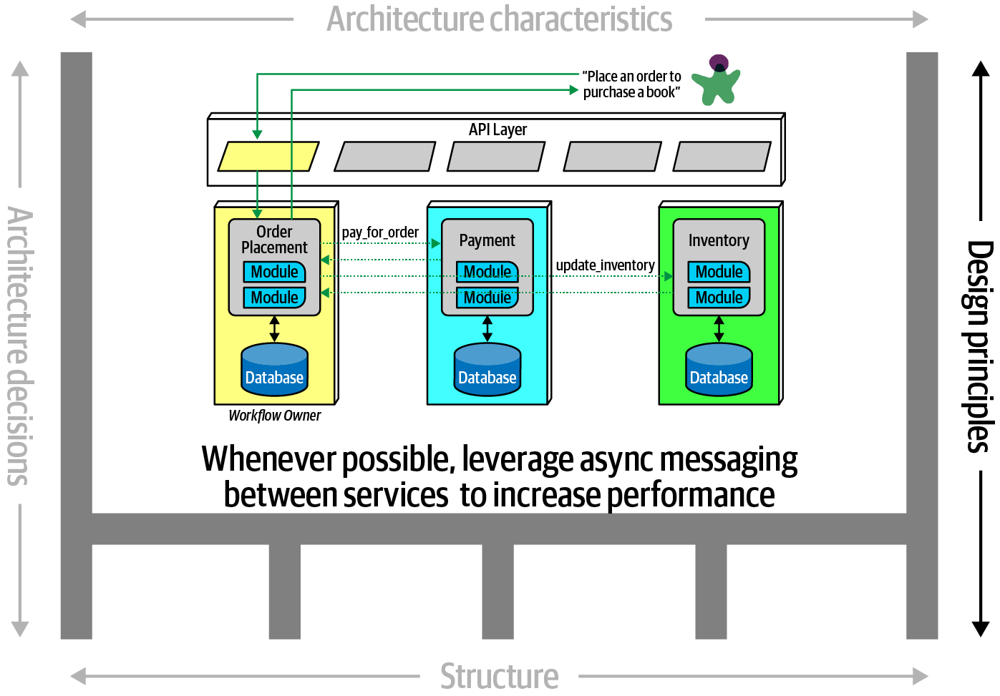
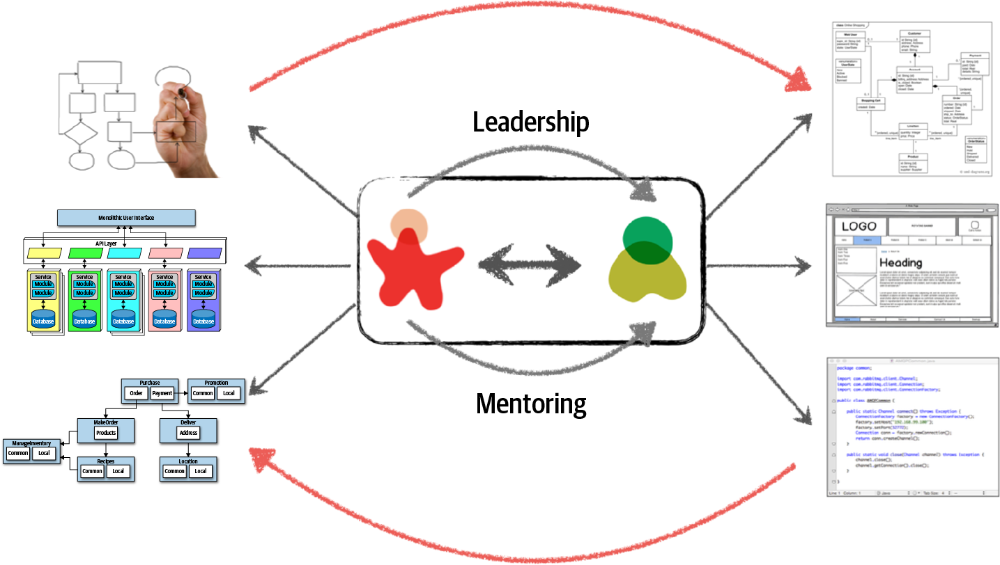
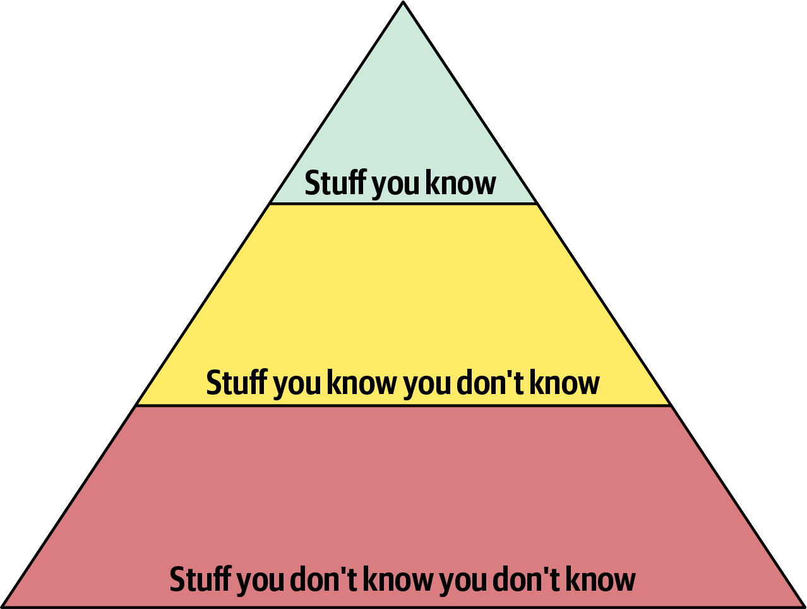
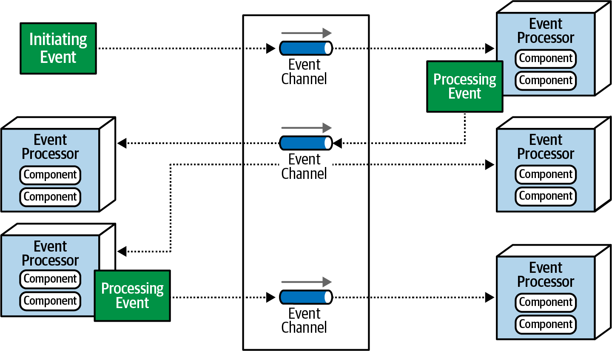
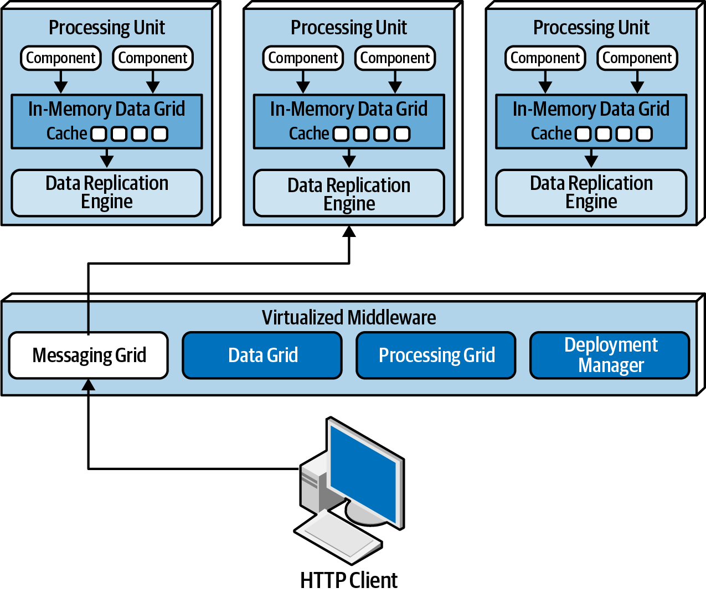

# Fundamentals of software architecture

# Table of contents
* [Chapter 1. Introduction](#Chapter-1.-Introduction)
* [Chapter 2. Architectural Thinking](#Chapter-2.-Architectural-Thinking)
    * [2.1 Architectural styles](#2.1-Architectural-styles)
    * [2.2 Middleware organization](#2.2-Middleware-organization)
    * [2.3 System architecture](#2.3-System-architecture)
* [Setup](#setup)

# Chapter 1. Introduction

Software architects must make decisions within this constantly changing ecosystem. 
When studying architecture, readers must keep in mind that, like much art, it can only be understood in context. Many of the decisions architects made were based on realities of the environment they found themselves in. For example, one of the major goals of late 20th-century architecture included making the most efficient use of shared resources, because all the infrastructure at the time was expensive and commercial: operating systems, application servers, database servers, and so on. 
Readers should keep in mind that all architectures are a product of their context. 

## Defining Software Architecture
Figure 1-2 illustrates a way to think about software architecture. In this definition, software architecture consists of the **structure** of the system (denoted as the heavy black lines supporting the architecture), combined with **architecture characteristics** (“-ilities”) the system must support, **architecture decisions**, and **finally design principles**.

The **structure** of the system, as illustrated in Figure 1-3, refers to the type of **architecture style (or styles)** the system is implemented in (such as microservices, layered, or microkernel). Describing an architecture solely by the structure does not wholly elucidate an architecture. For example, suppose an architect is asked to describe an architecture, and that architect responds “it’s a microservices architecture.” Here, the architect is only talking about the **structure** of the system, but not the **architecture** of the system. Knowledge of the architecture characteristics, architecture decisions, and design principles is also needed to fully understand the architecture of the system.

**Architecture characteristics** are another dimension of defining software architecture (see Figure 1-4). The **architecture characteristics** define the success criteria of a system, which is generally orthogonal to the functionality of the system. Notice that all of the characteristics listed do not require knowledge of the functionality of the system, yet they are required in order for the system to function properly. Architecture characteristics are so important that we’ve devoted several chapters in this book to understanding and defining them.

The next factor that defines software architecture is **architecture decisions**. **Architecture decisions define the rules for how a system should be constructed**. For example, an architect might make an architecture decision that only the business and services layers within a layered architecture can access the database (see Figure 1-5), restricting the presentation layer from making direct database calls. Architecture decisions form the constraints of the system and direct the development teams on what is and what isn’t allowed.

The last factor in the definition of architecture is **design principles**. A design principle differs from an architecture decision in that a design principle is a **guideline** rather **than a hard-and-fast rule**. For example, the design principle illustrated in Figure 1-6 states that the development **teams should leverage asynchronous messaging** between services within a microservices architecture to increase performance. An architecture decision (rule) could never cover every condition and option for communication between services, so a design principle can be used to provide guidance for the preferred method (in this case, asynchronous messaging) to allow the developer to choose a more appropriate communication protocol (such as REST or gRPC) given a specific circumstance.

## Expectations of an Architect
    Make architecture decisions

    Continually analyze the architecture

    Keep current with latest trends

    Ensure compliance with decisions

    Diverse exposure and experience

    Have business domain knowledge

    Possess interpersonal skills

    Understand and navigate politics

### Make Architecture Decisions
An architect is expected to define the architecture decisions and design principles used to **guide** technology decisions within the team, the department, or across the enterprise.

Guide is the key operative word in this first expectation. **An architect should guide rather than specify technology choices**. For example, an architect might make a decision to use React.js for frontend development. In this case, the architect is making a technical decision rather than an architectural decision or design principle that will help the development team make choices. An architect should instead instruct development teams to use a reactive-based framework for frontend web development, hence guiding the development team in making the choice between Angular, Elm, React.js, Vue, or any of the other reactive-based web frameworks.

The key to making effective architectural decisions is asking whether the architecture decision is helping to guide teams in making the right technical choice or whether the architecture decision makes the technical choice for them. That said, an architect on occasion might need to make specific technology decisions in order to preserve a particular architectural characteristic such as scalability, performance, or availability. In this case it would be still considered an architectural decision, even though it specifies a particular technology

### Continually Analyze the Architecture
An architect is expected to continually analyze the architecture and current technology environment and then recommend solutions for improvement.

This expectation of an architect refers to **architecture vitality**, which assesses how viable the architecture that was defined three or more years ago is today, given changes in both business and technology.

### Keep Current with Latest Trends
An architect is expected to keep current with the latest technology and industry trends.

### Ensure Compliance with Decisions
An architect is expected to ensure compliance with architecture decisions and design principles.

Ensuring compliance means that the architect is continually verifying that development teams are following the architecture decisions and design principles defined, documented, and communicated by the architect.

### Diverse Exposure and Experience
An architect is expected to have exposure to multiple and diverse technologies, frameworks, platforms, and environments.

A good way of mastering this expectation is to focus on technical breadth rather than technical depth.

### Have Business Domain Knowledge
Effective software architects understand not only technology but also the business domain of a problem space. 

## Intersection of Architecture and…
The scope of software architecture has grown over the last decade to encompass more and more responsibility and perspective. A decade ago, the typical relationship between architecture and operations was contractual and formal, with lots of bureaucracy. Most companies, trying to avoid the complexity of hosting their own **operations**, frequently outsourced operations to a third-party company, with contractual obligations for service-level agreements, such as uptime, scale, responsiveness, and a host of other important architectural characteristics.

### Engineering Practices
It is useful to separate software development **process** from **engineering practices**. By process, we mean how teams are formed and managed, how meetings are conducted, and workflow organization; it refers to the mechanics of how people organize and interact. Software engineering practices, on the other hand, refer to process-agnostic practices that have illustrated, repeatable benefit. For example, **continuous integration** is a proven engineering practice that doesn’t rely on a particular process.

The efforts to continue advancing the engineering side of software development continued with the book Continuous Delivery (Addison-Wesley Professional)—an updated version of many XP practices—and came to fruition in the DevOps movement. In many ways, the DevOps revolution occurred when operations adopted engineering practices originally espoused by XP (Extreme Programming (XP) ): automation, testing, declarative single source of truth, and others.

    All architectures become iterative because of unknown unknowns, Agile just recognizes this and does it sooner.

Thus, while process is mostly separate from architecture, an iterative process fits the nature of software architecture better.

New ways to think about the intersection of engineering practices and architecture, allowing better automation of architectural governance.
We describe architecture as the combination of requirements and additional concerns, as illustrated in Figure 1-7.

Building Evolutionary Architectures co-opts this idea to create **architectural fitness functions**: an objective integrity assessment of some architectural characteristic(s). This assessment may include a variety of mechanisms, such as metrics, unit tests, monitors, and chaos engineering. For example, an architect may identify page load time as an importance characteristic of the architecture. To allow the system to change without degrading performance, the architecture builds a fitness function as a test that measures page load time for each page and then runs the test as part of the continuous integration for the project. Thus, architects always know the status of critical parts of the architecture because they have a verification mechanism in the form of fitness functions for each part.

### Operations/DevOps

Several companies started experimenting with new forms of architecture that combine many operational concerns with the architecture.

### Process

Another axiom is that software architecture is mostly orthogonal to the software development process; the way that you build software (process) has little impact on the software architecture (structure).

## Laws of Software Architecture

    Everything in software architecture is a trade-off.

    First Law of Software Architecture

Nothing exists on a nice, clean spectrum for software architects. Every decision must take into account many opposing factors.

    If an architect thinks they have discovered something that isn’t a trade-off, more likely they just haven’t identified the trade-off yet.

    Corollary 1

We define software architecture in terms beyond structural scaffolding, incorporating principles, characteristics, and so on. Architecture is broader than just the combination of structural elements, reflected in our Second Law of Software Architecture:

    Why is more important than how.

    Second Law of Software Architecture

We captured how they solved the problem but not why the team made particular choices. An architect can look at an existing system they have no knowledge of and ascertain how the structure of the architecture works, but will struggle explaining why certain choices were made versus others.

# Chapter 2. Architectural Thinking
There are four main aspects of thinking like an architect. First, it’s understanding the difference between architecture and design and knowing how to collaborate with development teams to make architecture work. Second, it’s about having a wide breadth of technical knowledge while still maintaining a certain level of technical depth, allowing the architect to see solutions and possibilities that others do not see. Third, it’s about understanding, analyzing, and reconciling trade-offs between various solutions and technologies. Finally, it’s about understanding the importance of business drivers and how they translate to architectural concerns.

## Architecture Versus Design
Thinking like an architect is knowing the difference between architecture and design and seeing how the two integrate closely to form solutions to business and technical problems.

Consider Figure 2-1, which illustrates the traditional responsibilities an architect has, as compared to those of a developer. As shown in the diagram, an architect is responsible for things like analyzing business requirements to extract and define the architectural characteristics (“-ilities”), selecting which architecture patterns and styles would fit the problem domain, and creating components (the building blocks of the system). The artifacts created from these activities are then handed off to the development team, which is responsible for creating class diagrams for each component, creating user interface screens, and developing and testing source code.

As a matter of fact, this illustration shows exactly why architecture rarely works. Specifically, it is the unidirectional arrow passing though the virtual and physical barriers separating the architect from the developer that causes all of the problems associated with architecture. Decisions an architect makes sometimes never make it to the development teams, and decisions development teams make that change the architecture rarely get back to the architect. In this model the architect is disconnected from the development teams, and as such the architecture rarely provides what it was originally set out to do.

Forming a strong bidirectional relationship between architects and development teams. 
The architecture of today’s systems changes and evolves every iteration or phase of a project. A tight collaboration between the architect and the development team is essential for the success of any software project.

## Technical Breadth
Unlike a developer, who must have a significant amount of **technical depth** to perform their job, a software architect must have a significant amount of **technical breadth** to think like an architect and see things with an architecture point of view.

However, the stuff you know is also the stuff you must maintain—nothing is static in the software world.

As an architect, breadth is more important than depth. Because architects must make decisions that match capabilities to technical constraints, a broad understanding of a wide variety of solutions is valuable.

## Analyzing Trade-Offs
Thinking like an architect is all about seeing trade-offs in every solution, technical or otherwise, and analyzing those trade-offs to determine what is the best solution. 
Everything in architecture is a trade-off, which is why the famous answer to every architecture question in the universe is “it depends.”

"Programmers know the benefits of everything and the trade-offs of nothing. Architects need to understand both."

The point here is that everything in software architecture has a trade-off: an advantage and disadvantage. Thinking like an architect is analyzing these trade-offs, then asking “which is more important: extensibility or security?” The decision between different solutions will always depend on the business drivers, environment, and a host of other factors.

## Understanding Business Drivers
Thinking like an architect is understanding the **business drivers** that are required for the success of the system and translating those requirements into **architecture characteristics** (such as scalability, performance, and availability).

# Chapter 3. Modularity
"95% of the words [about software architecture] are spent extolling the benefits of “modularity” and that little, if anything, is said about how to achieve it."

Different platforms offer different **reuse mechanisms** for code, but all support some way of grouping related code together into **modules**.

Modularity is an organizing principle. If an architect designs a system without paying attention to how the pieces wire together, they end up creating a system that presents myriad difficulties. To use a physics analogy, software systems model complex systems, which tend toward entropy (or disorder). Energy must be added to a physical system to preserve order.

Preserving good modularity exemplifies our definition of an implicit architecture characteristic: virtually no project features a requirement that asks the architect to ensure good modular distinction and communication, yet sustainable code bases require order and consistency.

## Definition

The dictionary defines module as “each of a set of standardized parts or independent units that can be used to construct a more complex structure.” We use modularity to describe a logical grouping of related code, which could be a group of classes in an object-oriented language or functions in a structured or functional language. Most languages provide mechanisms for modularity (package in Java, namespace in .NET, and so on).

For discussions about architecture, we use modularity as a general term to denote a related grouping of code: classes, functions, or any other grouping. This doesn’t imply a physical separation, merely a logical one; the difference is sometimes important.
Thus, it is useful to talk about modularity as a concept separate from the physical separation forced or implied by a particular platform.

## Measuring Modularity
Given the importance of modularity to architects, they need tools to understand it. 
* cohesion
* coupling
* connascence

### Cohesion
Cohesion refers to what extent the parts of a module should be contained within the same module.
In other words, it is a measure of how related the parts are to one another. Ideally, a cohesive module is one where all the parts should be packaged together, because breaking them into smaller pieces would require coupling the parts together via calls between modules to achieve useful results.

    Attempting to divide a cohesive module would only result in increased coupling and decreased readability.

    Larry Constantine
Computer scientists have defined a range of cohesion measures, listed here from best to worst:
* Functional cohesion
* Sequential cohesion
* Communicational cohesion
* Procedural cohesion
* .....

### Coupling

### Connascence

    Two components are connascent if a change in one would require the other to be modified in order to maintain the overall correctness of the system.

    Meilir Page-Jones

#### Static connascence
refers to source-code-level coupling

#### Dynamic connascence
which analyzes calls at runtime

# Chapter 4. Architecture Characteristics Defined

Architects may collaborate on defining the domain or business requirements, but one key responsibility entails defining, discovering, and otherwise analyzing all the things the software must do that isn’t directly related to the domain functionality: architectural characteristics.

Many organizations describe these features of software with a variety of terms, including nonfunctional requirements, but we dislike that term because it is self-denigrating. Architects created that term to distinguish architecture characteristics from functional requirements, but naming something nonfunctional has a negative impact from a language standpoint.

An architecture characteristic meets three criteria:
* Specifies a nondomain design consideration
* Influences some structural aspect of the design
* Is critical or important to application success

* 

**Specifies a nondomain design consideration**: When designing an application, the requirements specify what the application should do; architecture characteristics specify operational and design criteria for success, concerning how to implement the requirements and why certain choices were made (eg: performance).

**Influences some structural aspect of the design**: The primary reason architects try to describe architecture characteristics on projects concerns design considerations: does this architecture characteristic require special structural consideration to succeed? (eg: payment processor)

**Critical or important to application success** Applications could support a huge number of architecture characteristics…but shouldn’t. Support for each architecture characteristic adds complexity to the design. Thus, a critical job for architects lies in choosing the fewest architecture characteristics rather than the most possible.

We further subdivide architecture characteristics into **implicit** versus **explicit** architecture characteristics. **Implicit** ones rarely appear in requirements, yet they’re necessary for project success. For example, availability, reliability, and security underpin virtually all applications, yet they’re rarely specified in design documents. **Explicit** architecture characteristics appear in requirements documents or other specific instructions.

## Architectural Characteristics (Partially) Listed

### Operational Architecture Characteristics
* Availability: How long the system will need to be available 
* Continuity: Disaster recovery capability
* Performance: Includes stress testing, peak analysis, analysis of the frequency of functions used, capacity required, and response times
* Recoverability: Business continuity requirements (e.g., in case of a disaster, how quickly is the system required to be on-line again?)
* Reliability/safety: Assess if the system needs to be fail-safe, or if it is mission critical in a way that affects lives. If it fails, will it cost the company large sums of money?
* Robustness: Ability to handle error and boundary conditions while running if the internet connection goes down or if there’s a power outage or hardware failure.
* Scalability: Ability for the system to perform and operate as the number of users or requests increases.

### Structural Architecture Characteristics
Architects must concern themselves with code structure.
* Configurability: Ability for the end users to easily change aspects of the software’s configuration (through usable interfaces).
* Extensibility: How important it is to plug new pieces of functionality in.
* Installability: Ease of system installation on all necessary platforms.
* Maintainability: How easy it is to apply changes and enhance the system?
* Supportability: What level of technical support is needed by the application? What level of logging and other facilities are required to debug errors in the system
* Upgradeability: Ability to easily/quickly upgrade from a previous version of this application/solution to a newer version on servers and clients.

### Cross-Cutting Architecture Characteristics
* Accessibility
* Authentication
* Authorization
* Privacy
* Security

# Chapter 5. Identifying Architectural Characteristics
An architect uncovers architecture characteristics in at least three ways by extracting from **domain concerns**, **requirements**, and **implicit domain knowledge**(covered in 4).

## Extracting Architecture Characteristics from Domain Concerns
One tip when collaborating with domain stakeholders to define the driving architecture characteristics is to work hard to keep the final list as short as possible.
A common **anti-pattern** in architecture entails trying to design a **generic architecture**, one that supports all the architecture characteristics.
Each architecture characteristic the architecture supports complicates the overall system design; supporting too many architecture characteristics leads to greater and greater complexity before the architect and developers have even started addressing the problem domain, the original motivation for writing the software.

Architects talk about scalability, interoperability, fault tolerance, learnability, and availability. Domain stakeholders talk about mergers and acquisitions, user satisfaction, time to market, and competitive advantage. 

## Extracting Architecture Characteristics from Requirements

# Chapter 8. Component-Based Thinking
We discussed modules as a collection of related code. However, architects typically think in terms of **components**, the **physical manifestation of a module**.
We call physical packaging of modules components. Most languages support physical packaging as well: jar files in Java, dll in .NET, gem in Ruby, and so on.

## Component Scope

Components form the fundamental modular building block in architecture, making them a critical consideration for architects. In fact, one of the primary decisions an architect must make concerns the top-level partitioning of components in the architecture.

## Architect Role
Typically, the architect defines, refines, manages, and governs components within an architecture.

Virtually all the details we cover in this book exist independently from whatever software development process teams use: architecture is independent from the development process.

An architect must identify components as one of the first tasks on a new project. But before an architect can identify components, they must know how to partition the architecture.

## Architecture Partitioning

Because **components represent a general containership mechanism**, an architect can build any type of partitioning they want. Several common styles exist, with different sets of trade-offs. We discuss architecture styles in depth in Part II. Here we discuss an important aspect of styles, the **top-level partitioning in an architecture**.

In Figure 8-3, one type of architecture familiar to many is the **layered monolith** (discussed in detail in Chapter 10). The other is an architecture style popularized by Simon Brown called a **modular monolith**, a single deployment unit associated with a database and **partitioned** around **domains** rather than **technical** capabilities.

The top-level partitioning is of particular interest to architects because it defines the fundamental architecture style and way of partitioning code.

* technical partitioning (eg: MCV)
* domain partitioning (Domain driven design)(The microservices architecture style)In a modular monolith, the architect partitions the architecture around domains or workflows rather than technical capabilities

One of the fundamental distinctions between different architecture patterns is what type of top-level partitioning each supports, which we cover for each individual pattern.

Architects using technical partitioning organize the components of the system by technical capabilities: presentation, business rules, persistence, and so on. Thus, one of the organizing principles of this architecture is separation of technical concerns. This in turn creates useful levels of decoupling: if the service layer is only connected to the persistence layer below and business rules layer above, then changes in persistence will only potentially affect those layers. This style of partitioning provides a decoupling technique, reducing rippling side effects on dependent components.

Neither of these styles is more correct than the other—refer to the First Law of Software Architecture. That said, we have observed a decided industry trend over the last few years toward domain partitioning for the monolithic and distributed (for example, microservices) architectures. However, it is one of the first decisions an architect must make.

# Chapter 9. Foundations
Architecture styles, sometimes called architecture patterns, describe a named relationship of components covering a variety of architecture characteristics.

An architecture style describes the topology, assumed and default architecture characteristics, both beneficial and detrimental.

## Monolithic Versus Distributed Architectures
Architecture styles can be classified into two main types:
* Monolithic (single deployment unit of all code) 
  * Layered architecture
  * Pipeline architecture
  * Microkernel architecture
* Distributed (multiple deployment units connected through remote access protocols).
  * Service-based architecture
  * Event-driven architecture
  * Space-based architecture
  * Service-oriented architecture
  * Microservices architecture

# Chapter 10. Layered Architecture Style
The layered architecture, also known as the n-tiered architecture style, is one of the most common architecture styles.
It is also a very natural way to develop applications due to Conway’s law.
The layered architecture style also falls into several architectural anti-patterns, including the **architecture by implication** anti-pattern and the **accidental architecture** anti-pattern.

## Topology
Components within the layered architecture style are organized into **logical horizontal layers**, with each layer performing a specific role within the application.

Figure 10-2 illustrates the various topology variants from a physical layering (deployment) perspective. _single deployment unit_

The layered architecture is a **technically partitioned architecture** (as opposed to a domain-partitioned architecture).As a result, any particular business domain is spread throughout all of the layers of the architecture.

## Layers of Isolation
Each layer in the layered architecture style can be either **closed or open**.

Which is better—open layers or closed layers? The answer to this question lies in a key concept known as **layers of isolation**.

**The layers of isolation concept** means that changes made in one layer of the architecture generally don’t impact or affect components in other layers, providing the contracts between those layers remain unchanged.

The layers of isolation concept also allows any layer in the architecture to be replaced without impacting any other layer.

## Adding Layers
While closed layers facilitate layers of isolation and therefore help isolate change within the architecture, there are times when it makes sense for certain layers to be open.

## Other Considerations
The layered architecture makes for a good starting point for most applications when it is not known yet exactly which architecture style will ultimately be used. 

One thing to watch out for with the layered architecture is the **architecture sinkhole anti-pattern**. This anti-pattern occurs when requests move from layer to layer as simple pass-through processing with no business logic performed within each layer.

## Architecture Characteristics Ratings

Overall cost and simplicity are the primary strengths of the layered architecture style.

Overall reliability rates medium (three stars) in this architecture style, mostly due to the lack of network traffic, bandwidth, and latency found in most distributed architectures.

Elasticity and scalability rate very low (one star) for the layered architecture, primarily due to monolithic deployments and the lack of architectural modularity.

Performance is always an interesting characteristic to rate for the layered architecture. We gave it only two stars because the architecture style simply does not lend itself to high-performance systems due to the lack of parallel processing, closed layering, and the sinkhole architecture anti-pattern.

# Chapter 11. Pipeline Architecture Style
Most developers know this architecture as this underlying principle behind Unix terminal shell languages, such as Bash and Zsh.

## Topology

The pipes and filters coordinate in a specific fashion, with pipes forming one-way communication between filters, usually in a point-to-point fashion.
* Pipes:  typically unidirectional and point-to-point (rather than broadcast)
* Filters: self-contained, independent from other filters, and generally stateless
  * Producer 
  * Transformer: Accepts input, optionally performs a transformation on some or all of the data, then forwards it to the outbound pipe. Functional advocates will recognize this feature as map
  * Tester
  * Consumer
  
The unidirectional nature and simplicity of each of the pipes and filters encourages compositional reuse.

ETL tools (extract, transform, and load) leverage the pipeline architecture as well for the flow and modification of data from one database or data source to another. Orchestrators and mediators such as Apache Camel utilize the pipeline architecture to pass information from one step in a business process to another.

## Architecture Characteristics Ratings
The pipeline architecture style is a technically partitioned architecture due to the partitioning of application logic into filter types (producer, tester, transformer, and consumer)

Overall cost and simplicity combined with modularity are the primary strengths of the pipeline architecture style.
Deployability and testability, while only around average, rate slightly higher than the layered architecture due to the level of modularity achieved through filters.

# Chapter 12. Microkernel Architecture Style
The microkernel architecture style (also referred to as the plug-in architecture). is a natural fit for **product-based applications**.

## Topology
The microkernel architecture style is a relatively simple monolithic architecture consisting of two architecture components: **a core system and plug-in components**.

## Core System
The **core system** is formally defined as the minimal functionality required to run the system. The Eclipse IDE is a good example of this.

Depending on the size and complexity, the core system can be implemented as a **layered architecture** or a **modular monolith**.

## Architecture Characteristics Ratings

# Chapter 13. Service-Based Architecture Style
Service-based architecture is a hybrid of the microservices architecture style and is considered one of the most pragmatic architecture styles, mostly due to its architectural flexibility.

## Topology
The basic topology of service-based architecture follows a distributed macro layered structure consisting of a separately deployed user interface, separately deployed remote coarse-grained services, and a monolithic database.
Services within this architecture style are typically coarse-grained “portions of an application” (usually called domain services) that are independent and separately deployed.

In most cases there is only a single instance of each domain service within a service-based architecture. However, based on scalability, fault tolerance, and throughput needs, multiple instances of a domain service can certainly exist. Multiple instances of a service usually require some sort of load-balancing capability between the user interface and the domain service so that the user interface can be directed to a healthy and available service instance.

One important aspect of service-based architecture is that it typically uses a centrally shared database. This allows services to leverage SQL queries and joins in the same way a traditional monolithic layered architecture would.

## Topology Variants
The single monolithic user interface can be broken apart into user interface domains, even to a level matching each domain service. 

Break apart a single monolithic database into separate databases, even going as far as domain-scoped databases matching each domain service (similar to microservices).

It is also possible to add an API layer consisting of a reverse proxy or gateway between the user interface and services

## Service Design and Granularity
Because domain services in a service-based architecture are generally coarse-grained, each domain service is typically designed using a layered architecture style consisting of an API facade layer, a business layer, and a persistence layer. Another popular design approach is to domain partition each domain service using sub-domains similar to the modular monolith architecture style.

Because domain services are coarse-grained, regular ACID (atomicity, consistency, isolation, durability) database transactions involving database commits and rollbacks are used to ensure database integrity within a single domain service. Highly distributed architectures like microservices, on the other hand, usually have fine-grained services and use a distributed transaction technique known as BASE transactions (basic availability, soft state, eventual consistency) that rely on eventual consistency and hence do not support the same level of database integrity as ACID transactions in a service-based architecture.

## Architecture Characteristics Ratings

Service-based architecture is also a natural fit when doing domain-driven design.
Service-based architecture preserves **ACID transactions** better than any other distributed architecture due to the coarse-grained nature of the domain services
Lastly, service-based architecture is a good choice for achieving a good level of architectural modularity without having to get tangled up in the complexities and pitfalls of granularity. As services become more fine-grained, issues surrounding orchestration and choreography start to appear.
As services become more fine-grained, both orchestration and choreography are necessary to tie the services together to complete the business transaction.

# Chapter 14. Event-Driven Architecture Style
The event-driven architecture style is a popular distributed asynchronous architecture style used to produce highly scalable and high-performance applications.

An event-based model, on the other hand, reacts to a particular situation and takes action based on that event. 

## Topology
* mediator topology - when require control over the workflow of an event process
* broker topology - whe require a high degree of responsiveness and dynamic control over the processing of an event

### Broker topology
There is no central event mediator. The message flow is distributed across the event processor components in a chain-like broadcasting fashion through a lightweight message broker.
This topology is useful when you have a relatively simple event processing flow and you do not need central event orchestration and coordination.
* an initiating event
* the event broker
* and event processor
* processing event

While performance, responsiveness, and scalability are all great benefits of the broker topology, there are also some negatives about it. First of all, there is no control over the overall workflow associated with the initiating event.
It is very dynamic based on various conditions, and no one in the system really knows when the business transaction of placing an order is actually complete. Error handling is also a big challenge with the broker topology. Because there is no mediator monitoring or controlling the business transaction, if a failure occurs (such as the Payment event processor crashing and not completing its assigned task), no one in the system is aware of that crash

The ability to restart a business transaction (**recoverability**) is also something not supported with the broker topology. 

### Mediator topology
Central to this topology is an event mediator, which manages and controls the workflow for initiating events that require the coordination of multiple event processors.

* an initiating event
* an event queue
* an event mediator
* event channels
* event processors

The event mediator only knows the steps involved in processing the event and therefore generates corresponding processing events that are sent to dedicated event channels (usually queues) in a point-to-point messaging fashion.
Event processors then listen to dedicated event channels, process the event, and usually respond back to the mediator that they have completed their work. Unlike the broker topology, event processors within the mediator topology do not advertise what they did to the rest of the system.

In most implementations of the mediator topology, there are multiple mediators, usually associated with a particular domain or grouping of events. This reduces the single point of failure issue associated with this topology and also increases overall throughput and performance.
For events requiring simple error handling and orchestration, a mediator such as Apache Camel, Mule ESB, or Spring Integration will usually suffice.

The mediator component has knowledge and control over the workflow, something the broker topology does not have. Because the mediator controls the workflow, it can maintain event state and manage error handling, recoverability, and restart capabilities.

In the mediator topology, processing occurrences such as place-order, send-email, and fulfill-order are commands (things that need to happen) as opposed to events (things that have already happened). Also, in the mediator topology, a command must be processed, whereas an event can be ignored in the broker topology.

While the mediator topology addresses the issues associated with the broker topology, there are some negatives associated with the mediator topology. First of all, it is very difficult to declaratively model the dynamic processing that occurs within a complex event flow.

Finally, event processors are not as highly decoupled in the mediator topology as with the broker topology, and performance is not as good due to the mediator controlling the processing of the event. 

The choice between the broker and mediator topology essentially comes down to a trade-off between workflow control and error handling capability versus high performance and scalability.

## Asynchronous Capabilities

The event-driven architecture style offers a unique characteristic over other architecture styles in that it relies solely on asynchronous communication for both fire-and-forget processing (no response required) as well as request/reply processing (response required from the event consumer). Asynchronous communication can be a powerful technique for increasing the overall responsiveness of a system.

The main issue with asynchronous communications is **error handling**. While **responsiveness** is significantly improved, it is difficult to address error conditions, adding to the complexity of the event-driven system. The next section addresses this issue with a pattern of reactive architecture called the **workflow event pattern**.

## Error handling

The **workflow event pattern** of **reactive architecture** is one way of addressing the issues associated with error handling in an asynchronous workflow. This pattern is a reactive architecture pattern that addresses both resiliency and responsiveness. In other words, the system can be resilient in terms of error handling without an impact to responsiveness.

The event producer asynchronously passes data through a message channel to the event consumer. If the event consumer experiences an error while processing the data, it immediately delegates that error to the workflow processor and moves on to the next message in the event queue. In this way, overall responsiveness is not impacted because the next message is immediately processed. 

One of the consequences of the workflow event pattern is that messages in error are processed out of sequence when they are resubmitted.

## Preventing Data Loss
Data loss is always a primary concern when dealing with asynchronous communications. 

## Choosing Between Request-Based and Event-Based
We recommend choosing the request-based model for well-structured, data-driven requests (such as retrieving customer profile data) when certainty and control over the workflow is needed. We recommend choosing the event-based model for flexible, action-based events that require high levels of responsiveness and scale, with complex and dynamic user processing.

## Hybrid Event-Driven Architectures
Some common architecture styles that leverage event-driven architecture as part of another architecture style include microservices and space-based architecture.

## Architecture Characteristics Ratings
Event-driven architecture is primarily a technically partitioned architecture in that any particular domain is spread across multiple event processors and tied together through mediators, queues, and topics.

# Chapter 15. Space-Based Architecture Style
In web apps. In any high-volume application with a large concurrent user load, the database will usually be the final limiting factor in how many transactions you can process concurrently.

The **space-based** architecture style is specifically designed to address problems involving high scalability, elasticity, and high concurrency issues.
It is also a useful architecture style for applications that have variable and unpredictable concurrent user volumes

## General Topology

Gets its name from the concept of tuple space, the technique of using multiple parallel processors communicating through shared memory. High scalability, high elasticity, and high performance are achieved by removing the central database as a synchronous constraint in the system and instead leveraging replicated in-memory data grids. Application data is kept in-memory and replicated among all the active processing units.
When a processing unit updates data, it asynchronously sends that data to the database, usually via messaging with persistent queues. Processing units start up and shut down dynamically as user load increases and decreases, thereby addressing variable scalability. Because there is no central database involved in the standard transactional processing of the application, the database bottleneck is removed, thus providing near-infinite scalability within the application.

Architecture components:
* processing unit - containing the application code
* virtualized middleware - used to manage and coordinate the processing units
* data pumps - async send updated data to the database
* data writers - perform the updates from the data pumps
* data readers - read database data and deliver it to processing units upon startup

### Processing Unit
contains the application logic also contains an in-memory data grid and replication engine.

### Virtualized Middleware
controls various aspects of data synchronization and request handling. 
include a messaging grid, data grid, processing grid, and deployment manager
#### Messaging grid
Manages input request and session state. 
When a request comes into the virtualized middleware, the messaging grid component determines which active processing components are available to receive the request and forwards the request to one of those processing units.

#### Data grid
In most modern implementations the data grid is implemented solely within the processing units as a replicated cache. However, for those replicated caching implementations that require an external controller, or when using a distributed cache, this functionality would reside in both the processing units as well as in the data grid component within the virtualized middleware.
Since the messaging grid can forward a request to any of the processing units available, it is essential that each processing unit contains exactly the same data in its in-memory data grid. Although Figure 15-5 shows a synchronous data replication between processing units, in reality this is done asynchronously and very quickly, usually completing the data synchronization in less than 100 milliseconds.

Data is synchronized between processing units that contain the same named data grid.

Data replication within the processing units also allows service instances to come up and down without having to read data from the database, providing there is at least one instance containing the named replicated cache.

Each processing unit knows about all other processing unit instances through the use of a member list. The member list contains the IP address and ports of all other processing units using that same named cache.

#### Processing grid
Is an optional component within the virtualized middleware that manages orchestrated request processing when there are multiple processing units involved in a single business request.

(order + payment )it is the processing grid that mediates and orchestrates the request between those two processing units.

#### Deployment manager
The deployment manager component manages the dynamic startup and shutdown of processing unit instances based on load conditions. This component continually monitors response times and user loads, starts up new processing units when load increases, and shuts down processing units when the load decreases.

### Data Pumps
A data pump is a way of sending data to another processor which then updates data in a database. Data pumps are a necessary component within space-based architecture, as processing units do not directly read from and write to a database. Data pumps within a space-based architecture are always asynchronous, providing eventual consistency with the in-memory cache and the database. When a processing unit instance receives a request and updates its cache, that processing unit becomes the owner of the update and is therefore responsible for sending that update through the data pump so that the database can be updated eventually.

Data pumps are usually implemented using messaging.

### Data Writers
The data writer component accepts messages from a data pump and updates the database with the information contained in the message of the data pump.

A domain-based data writer contains all of the necessary database logic to handle all the updates within a particular domain (such as customer), regardless of the number of data pumps it is accepting.

### Data Readers
data readers take on the responsibility for reading data from the database and sending it to the processing units via a reverse data pump.