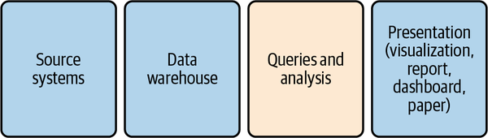
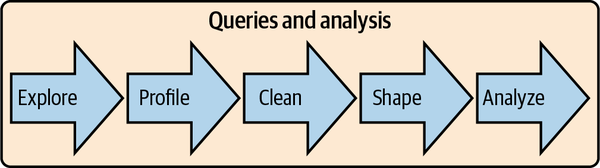
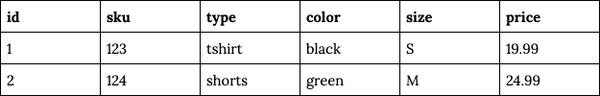
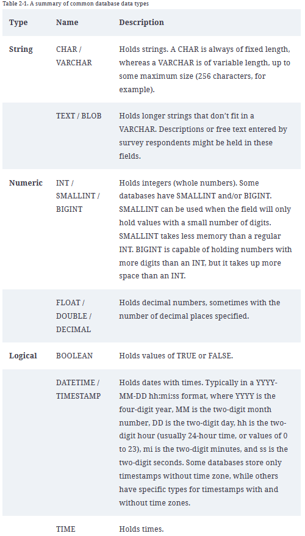
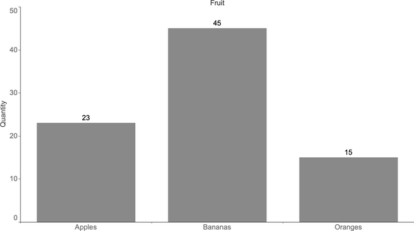
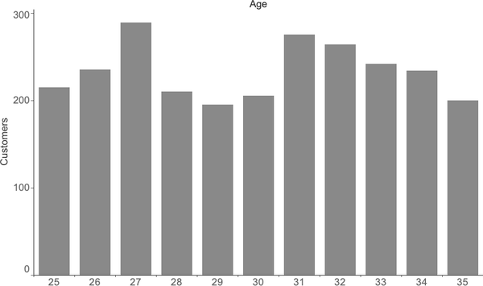
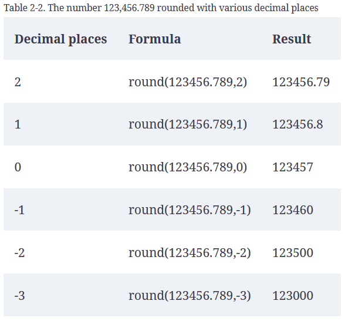
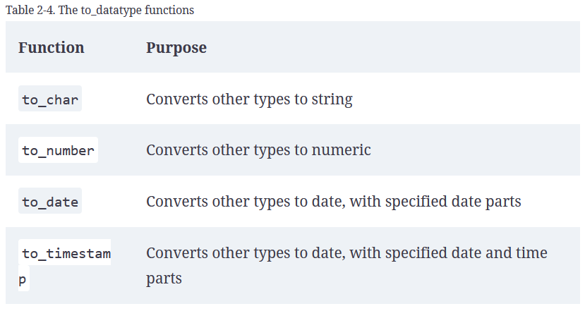

# Sql For Data Analysis

# Table of contents
* [Chapter 1. Analysis with SQL](#Chapter-1.-Analysis-with-SQL)
* [Chapter 2. Preparing Data for Analysis](#Chapter-2.-Preparing-Data-for-Analysis)
* [Chapter 3. Time Series Analysis](#Chapter-3.-Time-Series-Analysis)
* [The Anatomy of Cloud Native Systems](#The-Anatomy-of-Cloud-Native-Systems)
    
* [Setup](#setup)


# Chapter 1. Analysis with SQL
Data analysis is part data discovery, part data interpretation, and part data communication.
Data analysis is by definition done on historical data.

Developing a data-informed mindset is a process, and reaping the rewards is a journey.
In my experience, simple analysis presented persuasively has more impact than sophisticated analysis presented poorly.

To communicate with databases, SQL has four sublanguages for tackling different jobs, and these are mostly standard across database types.

* **DQL, or data query language**. SQL queries are self-contained and, apart from tables, do not reference variables or outputs from previous steps not contained in the query, unlike scripting languages.
* **DDL, or data definition language** (CREATE, ALTER, and DROP) Create and modify tables, views, users, and other objects in the database.  It affects the structure but not the contents.
* **DCL, or data control language** is used for access control (Grant/Revoke)
* **DML, or data manipulation language** is used to act on the data itself (INSERT/UPDATE/DELETE)

## SQL as Part of the Data Analysis Workflow
Once the question is framed, we consider where the data originated, where the data is stored, the analysis plan, and how the results will be presented to the audience.



First, **data is generated by source systems**, a term that includes any human or machine process that generates data of interest.

The second step is moving the data and storing it in a database for analysis. I will use the terms data warehouse, which is a database that consolidates data from across an organization into a central repository, and data store, which refers to any type of data storage system that can be queried. Other terms you might come across are data mart, which is typically a subset of a data warehouse, or a more narrowly focused data warehouse; and data lake, a term that can mean either that data resides in a file storage system or that it is stored in a database but without the degree of data transformation that is common in data warehouses.

Once the data is in a database, the next step is performing queries and analysis.
Exploring the data involves becoming familiar with the topic, where the data was generated, and the database tables in which it is stored. Profiling involves checking the unique values and distribution of records in the data set. Cleaning involves fixing incorrect or incomplete data, adding categorization and flags, and handling null values. Shaping is the process of arranging the data into the rows and columns needed in the result set. Finally, analyzing the data involves reviewing the output for trends, conclusions, and insights.




## Database Types and How to Work with Them
There are two broad categories of databases that are relevant for analysis work: row-store and column-store.

### Row-Store Databases
Row-store databases—also called transactional databases—are designed to be efficient at processing transactions: INSERTs, UPDATEs, and DELETEs. Popular open source row-store databases include MySQL and Postgres

Row-store databases approach this problem by serializing data in a row. Figure 1-4 shows an example of row-wise data storage. When querying, the whole row is read into memory. This approach is fast when making row-wise updates, but it’s slower when making calculations across many rows if only a few columns are needed.



Tables typically have a primary key that enforces uniqueness.Tables also optionally have indexes that make looking up specific records faster and make joins involving these columns faster.

To reduce the width of tables, row-store databases are usually modeled in **third normal form**, which is a database design approach that seeks to store each piece of information only once, to avoid duplication and inconsistencies.
This is efficient for transaction processing but often leads to a large number of tables in the database, each with only a few columns. To analyze such data, many joins may be required, and it can be difficult for nondevelopers to understand how all of the tables relate to each other and where a particular piece of data is stored. When doing analysis, the goal is usually denormalization, or getting all the data together in one place.

### Column-Store Databases
Column-store databases store the values of a column together, rather than storing the values of a row together. This design is optimized for queries that read many records but not necessarily all the columns. Popular column-store databases include Amazon Redshift, Snowflake, and Vertica.

Column-store databases do not enforce primary keys and do not have indexes. Repeated values are not problematic, thanks to compression. As a result, schemas can be tailored for analysis queries, with all the data together in one place as opposed to being in multiple tables that need to be joined. Duplicate data can easily sneak in without primary keys, however, so understanding the source of the data and quality checking are important.

Updates and deletes are expensive in most column-store databases, since data for a single row is distributed rather than stored together
The data can also be slower to read, as it needs to be uncompressed before calculations are applied.

Column-store databases are generally the gold standard for fast analysis work. 

#Chapter 2. Preparing Data for Analysis
Data preparation is easier when a data set has a **data dictionary**, a document or repository that has clear descriptions of the fields, possible values, how the data was collected, and how it relates to other data.

## Types of Data

### Database Data Types
The main types of data are strings, numeric, logical, and datetime.



### Structured Versus Unstructured
Most databases were designed to handle **structured data**, where each attribute is stored in a column, and instances of each entity are represented as rows.
A **data model** is first created, and then data is inserted according to that data model.

**Unstructured data** is the opposite of structured data. There is no predetermined structure, data model, or data types. Unstructured data is often the “everything else” that isn’t database data. Documents, emails, and web pages are unstructured. Photos, images, videos, and audio files are also examples of unstructured data. They don’t fit into the traditional data types, and thus they are more difficult for relational databases to store efficiently and for SQL to query. Unstructured data is often stored outside of relational databases as a result. This allows data to be loaded quickly, but lack of data validation can result in low data quality.

**Semistructured data** falls in between these two categories. Much “unstructured” data has some structure that we can make use of.
Generally, the structured parts of semistructured data can be queried with SQL, and SQL can often be used to parse or otherwise extract structured data for further querying.

### Quantitative Versus Qualitative Data
**Quantitative data** is numeric. It measures people, things, and events. Quantitative data can include descriptors, such as customer information, product type, or device configurations, but it also comes with numeric information such as price, quantity, or visit duration. Counts, sums, average, or other numeric functions are applied to the data.

Qualitative data is usually text based and includes opinions, feelings, and descriptions that aren’t strictly quantitative. Temperature and humidity levels are quantitative, while descriptors like “hot and humid” are qualitative.
Survey feedback, customer support inquiries, and social media posts are qualitative.
n a data analysis context, we usually try to quantify the qualitative. One technique for this is to extract keywords or phrases and count their occurrences.

### First-, Second-, and Third-Party Data
First-party data is collected by the organization itself.

Second-party data comes from vendors that provide a service or perform a business function on the organization’s behalf.

Third-party data may be purchased or obtained from free sources such as those published by governments.

### Sparse Data
Sparse data occurs when there is a small amount of information within a larger set of empty or unimportant information.

## SQL Query Structure
**The GROUP BY clause is required when the SELECT clause contains aggregations and at least one nonaggregated field.**
An easy way to remember what should go in the GROUP BY clause is that it should have every field that is not part of an aggregation.

## Profiling: Distributions
Profiling is the first thing I do when I start working with any new data set. I look at how the data is arranged into schemas and tables.

Another detail I check for is how history is represented, if at all. Data sets that are replicas of production databases may not contain previous values for customer addresses or order statuses, for example, whereas a well-constructed data warehouse may have daily snapshots of changing data fields.

Profiling data is related to the concept of exploratory data analysis.

After checking a few samples of data, I start looking at distributions. Distributions allow me to understand the range of values that exist in the data and how often they occur, whether there are nulls, and whether negative values exist alongside positive ones.

### Histograms and Frequencies
One of the best ways to get to know a data set, and to know particular fields within the data set, is to check the frequency of values in each field.

**Frequency checks** can be done on any data type, including strings, numerics, dates, and booleans.

**A frequency plot is a way to visualize the number of times something occurs in the data set.** 
```
SELECT fruit, count(*) as quantity
FROM fruit_inventory
GROUP BY 1;
```


**A histogram is a way to visualize the distribution of numerical values in a data set.**
```
SELECT age, count(customer_id) as customers
FROM customers
GROUP BY 1;
```


Exercise: hypothetical table called orders, which has a date, customer identifier, order identifier, and an amount, and then ask them to write a SQL query that returns the distribution of orders per customer.

```
select orders, count(user_id) as num_cumstomers from 
(SELECT 
    user_id, COUNT(order_id) AS orders
FROM
    orders
GROUP BY 1) a
group by orders;
-----------------
SELECT 
    average_spending, COUNT(user_id) AS customers
FROM
    (SELECT 
        user_id, AVG(price_usd) AS average_spending
    FROM
        orders
    GROUP BY 1) a
GROUP BY 1
ORDER BY 1 DESC;
```

### Binning
Binning is useful when working with continuous values. Rather than the number of observations or records for each value being counted, ranges of values are grouped together, and these groups are called bins or buckets.
The number of records that fall into each interval is then counted. Bins can be variable in size or have a fixed size, depending on whether your goal is to group the data into bins that have particular meaning for the organization, are roughly equal width, or contain roughly equal numbers of records.
**Bins can be created with CASE statements, rounding, and logarithms.**

A CASE statement is a flexible way to control the number of bins, the range of values that fall into each bin, and how the bins are named.
```
SELECT 
    CASE
        WHEN price_usd <= 80 THEN 'up to 80'
        WHEN price_usd <= 100 THEN 'up to 100'
        ELSE '100+'
    END AS amount_bin,
    CASE
        WHEN price_usd <= 80 THEN 'small'
        WHEN price_usd <= 100 THEN 'medium'
        ELSE 'large'
    END AS amount_category,
    COUNT(user_id) AS customers
FROM
    orders
GROUP BY 1 , 2
ORDER BY 3 DESC;

# amount_bin, amount_category, customers
up to 80, small, 28405
up to 100, medium, 2716
100+, large, 1192
```
**Arbitrary-sized bins** can be useful, but at other times bins of **fixed size** are more appropriate for the analysis. 
Fixed-size bins can be accomplished in a few ways, including with **rounding**, **logarithms**, and **n-tiles**. 

To create equal-width bins, rounding is useful.

```round(value,number_of_decimal_places)```



**Logarithms** are another way to create bins, particularly in data sets in which the largest values are orders of magnitude greater than the smallest values.(distribution of household wealth, web visitators)

While they don’t create bins of equal width, logarithms create bins that increase in size with a useful pattern.
```log(number) = exponent```

### n-Tiles
**median**, or middle value, of a data set this is the **50th percentile value**. Half of the values are larger than the median, and the other half are smaller.
With quartiles, we fill in the 25th and 75th percentile values. Deciles break the data set into 10 equal parts.Making this concept generic, n-tiles allow us to calculate any percentile of the data set: 27th percentile, 50.5th percentile, and so on.


The n-tiles functions are part of a group of SQL functions called **window or analytic functions**. Unlike most SQL functions, which can operate only on the current row of data, window functions perform calculations that span multiple rows.

```function(field_name) over (partition by field_name order by field_name)```

They take an argument that specifies the number of bins to split the data into and, optionally, a PARTITION BY and/or an ORDER BY clause:

```ntile(num_bins) over (partition by... order by...)```

```
select ntilee,
min(price_usd) as lower_bound,
max(price_usd) as upper_bound,
count(order_id) as orders
from (select
user_id, order_id, price_usd, NTILE(4) over (order by price_usd) as ntilee
 from orders
 order by price_usd desc) a
 GROUP BY 1
 order by 1 desc;
```

A related function is **percent_rank**. Instead of returning the bins that the data falls into, percent_rank returns the **percentile**.

```percent_rank() over (partition by... order by...)```

While not as useful as ntile for binning, percent_rank can be used to create a continuous distribution, or it can be used as an output itself for reporting or further analysis.

## Profiling: Data Quality
Profiling is a way to uncover data quality issues early on, before they negatively impact results and conclusions drawn from the data. Profiling reveals nulls, categorical codings that need to be deciphered, fields with multiple values that need to be parsed, and unusual datetime formats. Profiling can also uncover gaps and step changes in the data that have resulted from tracking changes or outages.

### Detecting Duplicates
Fortunately, it’s relatively easy to find duplicates in our data. One way is to inspect a sample, with all columns ordered:
```
SELECT column_a, column_b, column_c...
FROM table
ORDER BY 1,2,3...
;

SELECT records, count(*)
FROM
(
    SELECT column_a, column_b, column_c..., count(*) as records
    FROM...
    GROUP BY 1,2,3...
) a
WHERE records > 1
GROUP BY 1
;
```

### Deduplication with GROUP BY and DISTINCT
```
SELECT distinct a.customer_id, a.customer_name, a.customer_email
FROM customers a
JOIN transactions b on a.customer_id = b.customer_id;

equivalent

SELECT a.customer_id, a.customer_name, a.customer_email
FROM customers a
JOIN transactions b on a.customer_id = b.customer_id
GROUP BY 1,2,3;
```

## Preparing: Data Cleaning
Profiling often reveals where changes can make the data more useful for analysis.  Some of the steps are CASE transformations, adjusting for null, and changing data types.

### Cleaning Data with CASE Transformations

### Type Conversions and Casting
**Type conversion functions** allow pieces of data with the appropriate format to be changed from one data type to another.
```
cast (input as data_type)
input :: data_type

cast (1234 as varchar)
1234::varchar
```
```
concatenation operator || (double pipe) or concat function
```



Sometimes the database automatically converts a data type. This is called type coercion.

### Dealing with Nulls: coalesce, nullif, nvl Functions

Null = a way to represent missing information

There are a few ways to replace nulls with alternate values: CASE statements, and the specialized coalesce and nullif functions.

```
case when num_orders is null then 0 else num_orders end
case when address is null then 'Unknown' else address end

// It takes two or more arguments and returns the first one that is not null:
coalesce(num_orders,0)
coalesce(address,'Unknown')

//nullif function compares two numbers, and if they are not equal, it returns the first number; if they are equal, the function returns null
nullif(6,7)
nullif(6,6)

// mill in where clause
WHERE my_field <> 'apple' or my_field is null
```

### Missing Data
Missing values can also be filled with values from other rows in the data set. Carrying over a value from the previous row is called **fill forward**, while using a value from the next row is called **fill backward**.
These can be accomplished with the **lag** and **lead** window functions, respectively.

Filling with previous, next, or average values involves making some assumptions about typical values and what’s reasonable to include in an analysis.

For data that is available but not at the granularity needed, we often have to create additional rows in the data set

If you’re using a Postgres database, the generate_series function can be used to create a date dimension either to populate the table initially or if creating a table is not an option.

```generate_series(start, stop, step interval)```

## Preparing: Shaping Data
Shaping data refers to manipulating the way the data is represented in columns and rows.

One of the most important concepts in shaping data is figuring out the **granularity** of data that you need.

**Flattening** data is another important concept in shaping. This refers to reducing the number of rows that represent an entity, including down to a single row. Joining multiple tables together to create a single output data set is one way to flatten data. Another way is through aggregation.

### For Which Output: BI, Visualization, Statistics, ML
It’s generally a good idea to output a data set that has as few rows as possible while still meeting your need for granularity

When outputting data to a business intelligence tool for reports and dashboards, it’s important to understand the use case. Data sets may need to be very detailed to enable exploration and slicing by end users. They may need to be small and aggregated and include specific calculations to enable fast loading and response times in executive dashboards

Smaller, aggregated, and highly specific data sets often work best for visualizations.

When creating output for statistics packages or machine learning models, it’s important to understand the core entity being studied, the level of aggregation desired, and the attributes or features needed.

### Pivoting with CASE Statements
A **pivot table** is a way to summarize data sets by arranging the data into rows, according to the values of an attribute, and columns, according to the values of another attribute. At the intersection of each row and column, a summary statistic such as sum, count, or avg is calculated. 

Pivoting data with a combination of aggregation and CASE statements works well when there are a finite number of items to pivot.

### Unpivoting with UNION Statements
Sometimes we have the opposite problem and need to move data stored in columns into rows instead to create tidy data.

UNION is a way to combine data sets from multiple queries into a single result set. There are two forms, **UNION** and **UNION ALL**. When using UNION or UNION ALL, the numbers of columns in each component query must match. The data types must match or be compatible (integers and floats can be mixed, but integers and strings cannot). The column names in the result set come from the first query.

UNION removes duplicates from the result set, whereas UNION ALL retains all records, whether duplicates or not. UNION ALL is faster, since the database doesn’t have to do a pass over the data to find duplicates. It also ensures that every record ends up in the result set. I tend to use UNION ALL, using UNION only when I have a reason to suspect duplicate data.

### pivot and unpivot Functions

# Chapter 3. Time Series Analysis
A time series is a sequence of measurements or data points recorded in time order, often at regularly spaced intervals.

**Time series analysis is a way to understand and quantify how things change over time.**

**Forecasting** is a common goal of time series analysis. Since time only marches forward, future values can be expressed as a function of past values, while the reverse is not true.

## Date, Datetime, and Time Manipulations

### Time Zone Conversions
Many databases are set to **Coordinated Universal Time (UTC)**, the global standard used to regulate clocks, and record events in this time zone. 
It replaced Greenwich Mean Time (GMT), which you might still see if your data comes from an older database. UTC does not have daylight savings time, so it stays consistent all year long.

One drawback to UTC, or really to any logging of machine time, is that we lose information about the local time for the human doing the actions that generated the event recorded in the database.

All local time zones have a UTC offset.
**Timestamps in databases are stored in the format YYYY-MM-DD hh:mi:ss** (for years-months-days hours:minutes:seconds). Timestamps with the time zone have an additional piece of information for the UTC offset, expressed as a positive or negative number.

Converting from one time zone to another can be accomplished with Converting from one time zone to another can be accomplished with **at time zone** followed by the destination time zone’s abbreviation followed by the destination time zone’s abbreviation
```
SELECT '2020-09-01 00:00:00 -0' at time zone 'pst';

timezone
-------------------
2020-08-31 16:00:00


SELECT convert_timezone('pst','2020-09-01 00:00:00 -0');

timezone
-------------------
2020-08-31 16:00:00
```

Time zones are an innate part of working with timestamps.

### Date and Timestamp Format Conversions
```
SELECT current_date;
current_timestamp
localtimestamp
get_date()
now()
current_time
localtime
timeofday()
```

SQL has a number of functions for changing the format of dates and times. To reduce the granularity of a timestamp, use the date_trunc function

Rather than returning dates or timestamps, sometimes our analysis calls for parts of dates or times.
```
SELECT date_part('day',current_timestamp);
SELECT date_part('month',current_timestamp);

SELECT extract('day' from current_timestamp);
SELECT extract('month' from current_timestamp);

SELECT date '2020-09-01' + time '03:00:00' as timestamp;
SELECT to_date(concat(2020,'-',09,'-',01), 'yyyy-mm-dd');
```

### Date Math
SQL allows us to do various mathematical operations on dates. For example, we can use it to find the age or tenure of a customer, how much time elapsed between two events, and how many things occurred within a window of time.

**Date math** involves two types of data: **the dates themselves and intervals**.

We need the concept of intervals because date and time components don’t behave like integers.

**Intervals come in two types: year-month intervals and day-time ones.**

```
// time elapsed
SELECT date('2020-06-30') - date('2020-05-31') as days;

days
----
30 -- Note that the answer is 30 days and not 31. The number of days is inclusive of only one of the endpoints. 

// time elapsed in reverse
SELECT date('2020-05-31') - date('2020-06-30') as days;

days
----
-30

//
SELECT datediff('day',date('2020-05-31'), date('2020-06-30')) as days;
SELECT datediff('month'
                ,date('2020-01-01')
                ,date('2020-06-30')
                ) as months;
// postgres
SELECT age(date('2020-06-30'),date('2020-01-01'));

// add 7 days
SELECT date('2020-06-01') + interval '7 days' as new_date;
```
Any of these formulations can be used in the WHERE clause in addition to the SELECT clause. For example, we can filter to records that occurred at least three months ago:
```WHERE event_date < current_date - interval '3 months'```

### Time Math
Time math works similarly to date math, by leveraging intervals. 
```
SELECT time '05:00' + interval '3 hours' as new_time;

new_time
--------
08:00:00
```

### Joining Data from Different Sources
Dates and timestamps that are in different formats can be standardized with SQL. JOINing on dates or including date fields in UNIONs generally requires that the dates or timestamps be in the same format.


