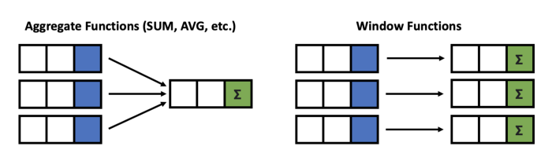
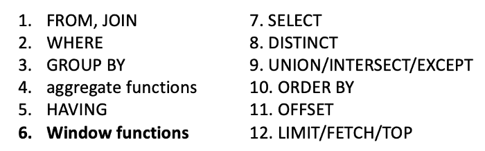
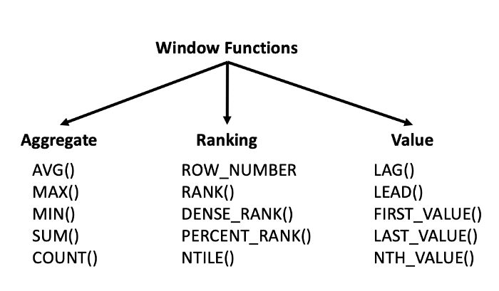

# SQL

# Table of contents

# Advanced SQL Window Functions
Window functions were first introduced to standard SQL in 2003. Per the PostgresSQL documentation:

“A window function performs a calculation across a set of table rows that are somehow related to the current row…Behind the scenes, the window function is able to access more than just the current row of the query result.”

Window functions are similar to the aggregation done in the GROUP BY clause. However, rows are not grouped into a single row, each row retains their separate identity. That is, a window function may return a single value for each row.

**One major advantage of window functions is that it allows you to work with both aggregate and non-aggregate values all at once because the rows are not collapsed together.**

Order of operations in SQL

This is important because based off of this logical order, **window functions are allowed in SELECT and ORDER BY**, but they are not allowed in FROM, WHERE, GROUP BY, or HAVING clauses.

Note: If you really need to have it inside aWHERE clause or GROUP BY clause, you may get around this limitation by using a subquery or a WITH query.

List of window functions

**Aggregate functions**: we can use these functions to calculate various aggregations such as average, total # of rows, maximum or minimum values, or total sum within each window or partition.

**Ranking functions**: these functions are useful for ranking rows within its partition.

**Value functions**: these functions allow you to compare values from previous or following rows within the partition or the first or last value within the partition.

**Using the frame_clause**

ROWS BETWEEN <starting_row> AND <ending_row>

In the <starting_row> and <ending row>, we have the following options at our disposal:

    UNBOUNDED PRECEDING — all rows before the current row in the partition, i.e. the first row of the partition
    [some #] PRECEDING — # of rows before the current row
    CURRENT ROW — the current row
    [some #] FOLLOWING — # of rows after the current row
    UNBOUNDED FOLLOWING — all rows after the current row in the partition, i.e. the last row of the partition

Here’s some examples of how it could be written:

    ROWS BETWEEN 3 PRECEDING AND CURRENT ROW — this means look back the previous 3 rows up to the current row.
    ROWS BETWEEN UNBOUNDED PRECEDING AND 1 FOLLOWING — this means look from the first row of the partition to 1 row after the current row
    ROWS BETWEEN 5 PRECEDING AND 1 PRECEDING — this means look back the previous 5 rows up to 1 row before the current row
    ROWS BETWEEN UNBOUNDED PRECEDING AND UNBOUNDED FOLLOWING — this means look from the first row of the partition to the last row of the partition

One worthy note is that anytime that you add an ORDER BY clause, SQL sets the default window as ROWS BETWEEN UNBOUNDED PRECEDING AND CURRENT ROW.